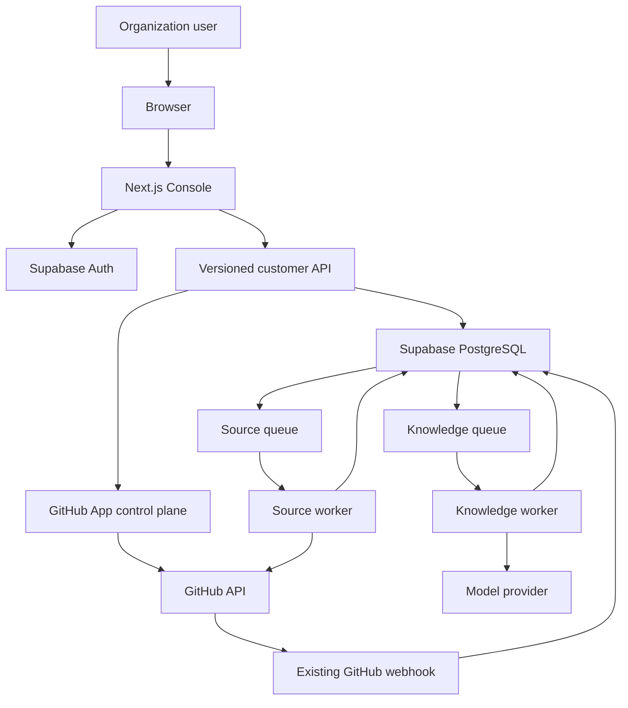
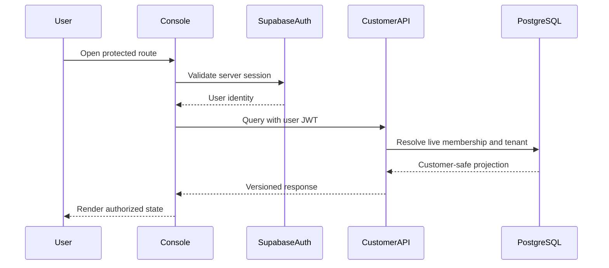
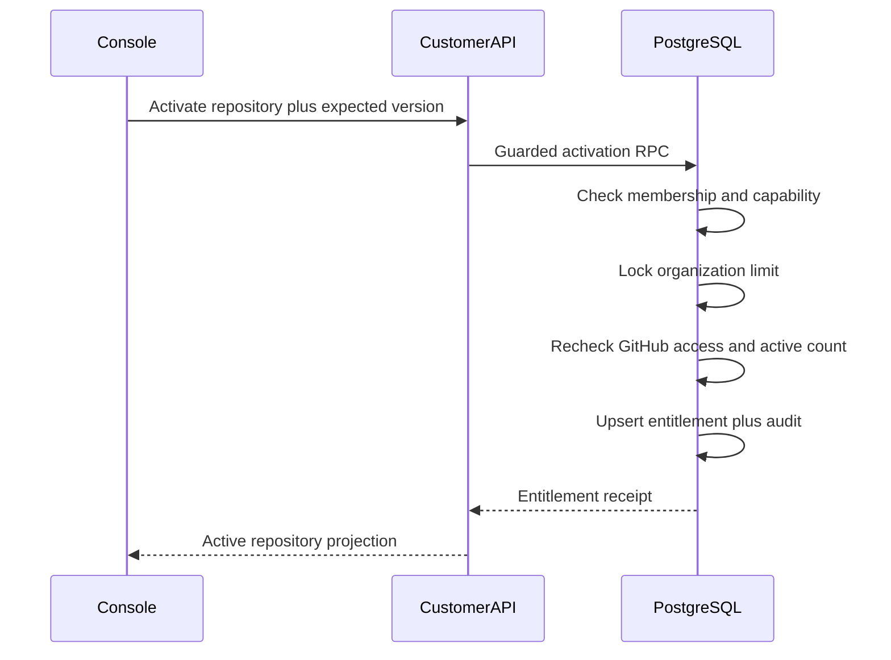
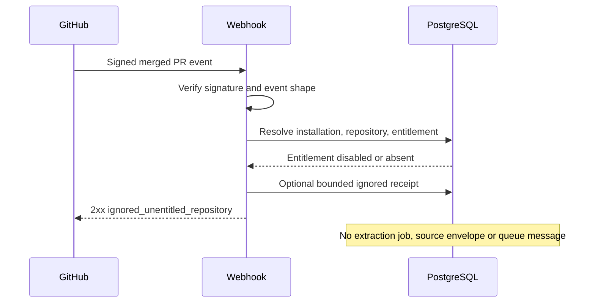
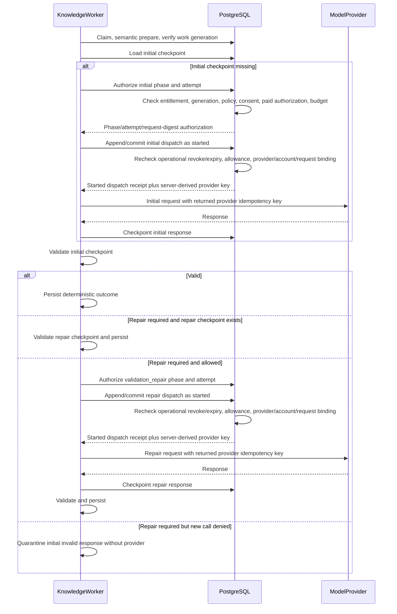
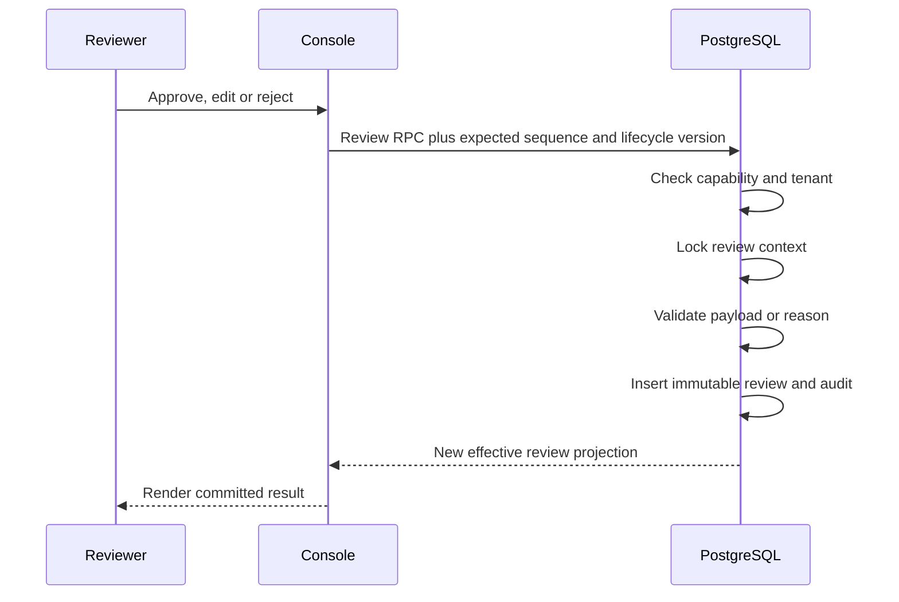

---
aliases:
  - EEM Design Partner Console Architecture
  - EEM Console technical design
tags:
  - evirion
  - eem
  - architecture
  - console
  - security
  - supabase
status: accepted
version: 1.0
updated: 2026-08-27
---

> [!NOTE] Accepted source snapshot
> Migrated for EEM-9/01 from the accepted 2026-08-25 package.
> Vault-relative source: `10 Evirion/Architecture/EEM - Design Partner Console architecture.md`.
> Original source SHA-256: `6b011bfb49d1aa8c0bf7c03474b9ef2990a9902305fcaa1d9688fcf21044ba58`.
> The repository copy is authoritative after the paired EEM-9/01 merges.
> Retained security and operations sources:
> `10 Evirion/Architecture/EEM - OWASP-аудит и модель угроз.md` and
> `10 Evirion/Architecture/EEM - Полный runbook запуска и эксплуатации.md`.


# EEM — Design Partner Console architecture

> [!info] Accepted Dashboard architecture transfer
> Архитектура утверждена пользователем 2026-08-25 и перенесена в
> `Evirion/evirion-engineering-memory-dashboard` под EEM-9/01 для
> version-controlled ADR/spec review. Она становится detailed authority только
> на exact Dashboard commit и authority-package digest после последовательного
> merge Dashboard PR и backend stable-pointer PR. Portable program design и
> backend EEM-4/EEM-6–8 plans сохраняют свои contributor boundaries.
> OWASP note и operations runbook остаются обязательными для EEM-9/07–10 до
> отдельного migration/pointer.
>
> Этот transfer не открывает paid, deployment, migration или production gate.

> [!success] EEM-9/01 prerequisite verified
> Backend EEM-3/13 merged in PR #24 at
> `b23f6ba2b11f583b61200cec63500a782992f1f0`. The merged tree equals the
> reviewed branch tree and the 10-test PostgreSQL 17 catalog/trigger/FK
> attestation passes. Migration 30 remains unapplied remotely and no runtime,
> deployment, provider, paid, or customer-data action is authorized.

Связанные документы:

- [EEM - Design Partner Console requirements](../product/design-partner-console-requirements.md)
- [EEM - Design Partner Console implementation plan](../plans/design-partner-console-implementation.md)
- [EEM - Архитектура базы данных](https://github.com/Evirion/evirion-engineering-memory/blob/b23f6ba2b11f583b61200cec63500a782992f1f0/services/model-orchestration/SUPABASE_DATABASE_ARCHITECTURE.md)
- [EEM - Модель Organization и Repository](https://github.com/Evirion/evirion-engineering-memory/blob/b23f6ba2b11f583b61200cec63500a782992f1f0/docs/architecture/organization-repository-model.md)
- [EEM - OWASP-аудит и модель угроз](obsidian://open?vault=Obsidian%20Vault&file=10%20Evirion%2FArchitecture%2FEEM%20-%20OWASP-%D0%B0%D1%83%D0%B4%D0%B8%D1%82%20%D0%B8%20%D0%BC%D0%BE%D0%B4%D0%B5%D0%BB%D1%8C%20%D1%83%D0%B3%D1%80%D0%BE%D0%B7.md)
- [EEM - Сценарии PR Watcher и Backfill](https://github.com/Evirion/evirion-engineering-memory/blob/b23f6ba2b11f583b61200cec63500a782992f1f0/services/model-orchestration/BACKFILL_RUNBOOK.md)
- [EEM - Полный runbook запуска и эксплуатации](obsidian://open?vault=Obsidian%20Vault&file=10%20Evirion%2FArchitecture%2FEEM%20-%20%D0%9F%D0%BE%D0%BB%D0%BD%D1%8B%D0%B9%20runbook%20%D0%B7%D0%B0%D0%BF%D1%83%D1%81%D0%BA%D0%B0%20%D0%B8%20%D1%8D%D0%BA%D1%81%D0%BF%D0%BB%D1%83%D0%B0%D1%82%D0%B0%D1%86%D0%B8%D0%B8.md)
- Repository locator: `Evirion/evirion-engineering-memory/docs/superpowers/specs/2026-08-25-design-partner-console-program-design.md`
- Repository locator: `Evirion/evirion-engineering-memory/docs/plans/active/eem-9-design-partner-console-dashboard-and-certification.md`

До EEM-9/01 source-controlled EEM-9 execution plan является обязательной
точкой входа: он фиксирует Supabase Auth/runtime stack, browser → BFF → backend
trust flow, UI ownership и OWASP acceptance matrix, а task-specific reading map
указывает точные разделы этой архитектуры. После переноса использовать
digest-pinned Dashboard copy как implementation authority и эту заметку как
parity check.

## 1. Architecture decision

Используется **contract-first two-repository architecture**.

Доставка разделена на пять milestone boundaries: EEM-4 владеет
authentication/tenant access foundation, EEM-6 — entitlement/GitHub/free
paths, EEM-7 — paid authorization/customer commands, EEM-8 —
review/lifecycle/customer-safe reads, EEM-9 — Dashboard и cross-repository
certification. `P01`/`B*`/`C*`/`I*` сохраняются как traceability aliases.

### Backend authority

Repository:

```text
Evirion/evirion-engineering-memory
```

Владеет:

- PostgreSQL/Supabase schema;
- migrations;
- RLS, grants и tenant-aware constraints;
- worker/webhook/backfill logic;
- GitHub App control plane;
- repository entitlement;
- human review и lifecycle persistence;
- customer-safe `api.*` views/RPCs;
- canonical OpenAPI/JSON Schema contract;
- backend verification и staging certification.

### Console authority

Repository:

```text
Evirion/evirion-engineering-memory-dashboard
```

Владеет:

- Next.js App Router application;
- TypeScript UI;
- Supabase Auth session integration;
- BFF routes/server actions;
- generated/pinned backend client;
- UX, accessibility и browser security;
- Console tests и deployment;
- no extraction or persistence source of truth.

### Contract boundary

```text
Browser
   ↓
Next.js Console / BFF
   ↓ user identity + versioned request
Customer-safe backend contract
   ↓
Supabase PostgreSQL / GitHub control plane
   ↓
Existing queues and workers
```

Console никогда не принимает решение:

- разрешён ли paid call;
- retryable ли job;
- является ли repository entitled;
- прошёл ли admission;
- какой backfill state effective;
- можно ли записать lifecycle relation.

Она запрашивает backend capability и отображает committed backend state.

## 2. Why this split

### 2.1 One system of record

Tenant, entitlement, provenance, review и lifecycle остаются в PostgreSQL,
рядом с существующими constraints и admission boundary.

### 2.2 No duplicated extraction logic

Console не импортирует Python extraction engine, не строит Source Envelope и
не вызывает provider.

### 2.3 Independent product delivery

UI может развиваться независимо после стабилизации API, не добавляя Node
runtime и browser dependencies в extraction repository.

### 2.4 Explicit trust boundary

BFF является presentation adapter, а не privileged database owner.

## 3. Current implementation baseline

По состоянию на 2026-08-25 Git authority:

```text
main = a4ae37b62a949367e2813859afae00fba84ef00f
PR #12 / EEM-3 PR05 merged
EEM-3 PR06–PR12 remain unfinished
repository HANDOFF/ROADMAP are synchronized to merged PR05 and the unstarted
EEM-3/06 branch state
```

### Implemented

- `core.organizations`;
- `core.organization_memberships` with
  `owner | admin | member | viewer`;
- `core.github_installations`;
- `core.repositories`;
- `core.pull_requests`;
- immutable Source Envelopes and extraction provenance;
- `ACCEPTED | REJECTED | QUARANTINED`;
- `core.knowledge_objects`;
- `core.evidence`;
- `core.knowledge_relations`;
- `core.knowledge_state_events`;
- repository automation policies;
- repository budgets;
- backfill runs/items;
- GitHub webhook and worker queues;
- tenant-aware constraints, RLS and private capability roles;
- EEM-3 PR05 semantic prepare merged.

### Not implemented

- Console application;
- Console API/BFF;
- product Auth UX and invitations;
- GitHub installation setup/callback for customers;
- accessible-repository synchronization UI flow;
- repository entitlement;
- organization active-repository limit;
- human review records;
- immutable human edit overlay;
- customer-safe processing APIs;
- contract artifact for a separate web repository;
- paid-capable EEM-3 staging runtime.

### Relevant current code authority

Backend concepts must be verified against:

```text
supabase/migrations/20260815000100_evirion_core.sql
supabase/migrations/20260815000200_persist_extraction_bundle.sql
supabase/migrations/20260815173558_harden_provenance_rls_and_indexes.sql
supabase/migrations/20260816110412_production_backfill_pipeline.sql
supabase/migrations/20260819184954_ignore_unsupported_github_events.sql
supabase/migrations/20260824134935_eem3_semantic_prepare.sql
supabase/tests/001_security_invariants.sql
supabase/tests/003_eem3_semantic_prepare.sql
services/model-orchestration/src/model_orchestration/automation/
services/model-orchestration/src/model_orchestration/persistence/
```

No future implementation may treat this note as proof that a named SQL
signature still exists.

## 4. System context



## 5. Deployment units

### 5.1 Console web deployment

Contains:

- Next.js server runtime;
- static/browser assets;
- BFF handlers;
- request-local server-only Supabase Auth session client;
- generated contract client;
- no worker, provider or database owner credential.

### 5.2 Customer API runtime

Owned and deployed from the backend repository as:

```text
supabase/functions/console-api
```

It is the runtime owner of every `/v1` operation in the canonical OpenAPI.

Rules:

- validates the user JWT;
- calls customer-safe `api.*` projections/RPCs with that user identity;
- does not use service-role for normal reads/mutations;
- maps stable SQL/domain outcomes to canonical HTTP status/error;
- enforces request limits, correlation IDs and redacted logs;
- is contract-tested against the same fixtures consumed by Console.

The Next.js BFF is a mechanically tested session/CSRF adapter to this API. It
does not redefine route semantics, enum/error names or authorization.

### 5.3 GitHub control-plane endpoint

Owned by backend repository.

Preferred implementation:

- dedicated Supabase Edge Function or equivalent narrow backend endpoint;
- validates Supabase user session;
- invokes only purpose-built database RPCs;
- owns GitHub App setup state and App credential use;
- never returns installation token;
- never uses webhook payload as authorization.

It may use a privileged runtime credential only inside the server boundary and
only to call a narrow internal function that repeats tenant/capability checks.
Direct arbitrary table writes are forbidden.

### 5.4 Existing automation runtime

Source and knowledge workers remain in the backend repository and receive no
browser requests.

### 5.5 Database

PostgreSQL remains:

- source of truth;
- policy decision point;
- idempotency boundary;
- audit boundary;
- tenant isolation boundary.

## 6. Target Console repository structure

Target, not yet created:

```text
app/
  (auth)/
  (console)/
    onboarding/
    repositories/
    memory/
    processing/
    settings/
  api/
components/
  domain/
  forms/
  layout/
lib/
  auth/
  contracts/
  errors/
  observability/
  security/
server/
  actions/
  adapters/
  queries/
tests/
  unit/
  component/
  contract/
  e2e/
docs/
  architecture/
  plans/
```

Rules:

- `app` handles routing/composition;
- domain components do not call Supabase directly;
- server adapters own contract calls;
- generated contract code isolated under `lib/contracts/generated`;
- no shared mutable singleton tenant context;
- no inline service-role or GitHub credentials.

## 7. Trust boundaries

### TB-01 — Browser

Untrusted.

May hold:

- non-secret CSRF proof bound to the server session;
- non-sensitive view data.

Must not hold:

- service-role key;
- database DSN;
- GitHub App private key;
- installation token;
- provider key;
- Supabase access or refresh token;
- raw model response;
- private worker credentials.

### TB-02 — Next.js BFF

Semi-trusted presentation server.

May:

- validate route/form input;
- maintain the server-only `HttpOnly` Supabase session;
- forward user JWT;
- aggregate customer-safe API responses;
- map stable error codes to UX;
- add correlation/idempotency IDs.

May not:

- bypass RLS as normal flow;
- decide entitlement/policy;
- directly mutate `core` tables;
- call model provider;
- inspect raw response or secrets;
- authorize from a caller-supplied role.

### TB-03 — Customer API

Trusted policy enforcement boundary.

Every mutation:

- derives customer user from `auth.uid()`;
- derives operator from authenticated platform-operator membership, never a
  caller-supplied text/UUID;
- resolves active membership;
- checks capability;
- resolves tenant from trusted relationships;
- validates expected version/idempotency key;
- performs atomic mutation;
- writes audit;
- returns bounded receipt.

### TB-04 — Internal workers

Use narrow capability roles and existing job identity. Console cannot mint
worker claims or leases.

### TB-05 — External providers

GitHub and model provider are untrusted dependencies. Their identifiers,
responses and retry hints are validated and bounded before persistence/use.

## 8. Authentication and session architecture

### 8.1 Alpha authentication

Default:

- invite-only;
- Supabase Auth email OTP;
- verified email;
- no public signup;
- version-controlled local Auth config and hosted config both disable signup;
- passwordless sign-in sets `shouldCreateUser = false`;
- provider allowlist is email OTP plus TOTP MFA;
- Magic/Admin invite links are disabled because Supabase Admin invitations do
  not support PKCE and Alpha accepts no Auth/invitation token in a URL;
- anonymous, password, phone, social/OAuth, SSO and manual identity linking are
  disabled;
- no authorization from user metadata.

### 8.2 Invitation flow

1. Owner/Admin creates durable `requested` invitation through customer API.
2. Backend validates capability/role ceiling and stores no raw token.
3. Invitation worker/control endpoint creates or resolves the Supabase Auth
   user server-side without a password, with `email_confirm = false` and no
   authorization metadata; this pre-provisioning grants no membership access
   and is not proof of email ownership. An existing user is reusable only when
   its exact email identity matches the frozen Alpha provider/identity
   contract; unsupported or linked identity state fails final without
   relinking, OTP send or membership mutation.
4. Guarded database command inserts idempotent `invited` membership; state
   advances `auth_user_created → sent` only after a bounded email OTP request
   succeeds with `shouldCreateUser = false`.
5. Invitee submits email plus OTP to a same-origin BFF route. The BFF calls
   `verifyOtp` server-side and keeps the returned session request-local.
6. BFF calls private idempotent
   `POST /internal/console/v1/session/bootstrap` with that exact access token
   plus a one-time signed BFF proof. The proof binds issuer/audience,
   method/path, token digest, verified `sub`/`session_id`, pre-auth transaction,
   optional invitation selection, nonce, issued/expiry time, idempotency key and
   canonical request digest. For an existing active member, backend registers
   the verified user plus `session_id`. With no active membership, exactly one
   eligible invitation may be selected automatically; multiple eligible rows
   return only post-auth bounded organization labels plus opaque invitation IDs
   and require explicit selection. Backend atomically registers the session and
   activates the selected rechecked membership/invitation. Zero, mismatched,
   disabled or no-access state registers nothing.
7. BFF stores returned tokens only in host-only `__Host-` cookies with
   `HttpOnly; Secure; SameSite=Lax; Path=/` and no `Domain`, clears form state
   and returns `303` to a clean allowlisted URL. If bootstrap failed
   transiently after OTP consumption, only the bootstrap recovery route may
   use those cookies to retry; every other API denies the unregistered session.
   Terminal bootstrap denial clears them and attempts supported provider
   `local` sign-out.
8. Audit event records every committed transition.

No reusable raw invite token is stored in application tables.
Partial Auth/email/DB failure is reconciled from durable invitation state.
Because the provider accepts no application idempotency key, each invitation
generation owns a claim/lease and exactly one automatic send attempt:
`PENDING → STARTED → SENT`; pre-dispatch definite failure may become
`FAILED_RETRYABLE`, while response loss after dispatch becomes
`OUTCOME_UNKNOWN` and is never auto-retried. An explicit cooldown-bound resend
creates a new generation and may supersede a code whose outcome was unknown.
Successful OTP verification may reconcile only that same still-current unknown
generation to `DELIVERED_BY_VERIFICATION` in the acceptance transaction.
Resend/revoke/expire fences older codes even if the provider verifies one.
Lost `verifyOtp` response records `VERIFY_OUTCOME_UNKNOWN` and is never
automatically repeated; any provider session created by that response remains
unregistered/denied, and explicit resend creates a new pre-auth generation.
Organization membership guard is locked for owner promotion/demotion/removal so
concurrent operations cannot leave zero active Owners.

### 8.3 Session validation

Server request:

1. reads server-only host-scoped `__Host-` Supabase session cookies through a
   request-local client;
2. retrieves the raw access token only from `HttpOnly` cookie storage and never
   exposes it to browser JavaScript;
3. BFF validates that exact token online with `getUser(accessToken)`;
4. backend repeats online `getUser(accessToken)` validation for every directly
   callable Console request, allowlists JWT algorithm/issuer/audience, validates
   expiry and `session_id`, handles key rotation, and fails closed without
   mutation on Auth unavailability. It also requires non-anonymous verified
   email identity and only the P01-frozen email-OTP/TOTP `amr`/provider
   combinations; configuration drift or an existing unsupported identity
   denies;
5. backend requires an `ACTIVE` private application-session row keyed by the
   verified `auth_user_id + session_id`; only successful same-origin BFF login
   bootstrap registers a row, and no raw access/refresh token is persisted;
6. backend resolves live membership;
7. route receives bounded organization/capability context.

Stale role in JWT cannot preserve authorization after membership disable.
Supabase access/refresh cookies are `HttpOnly`, `Secure`, `SameSite=Lax`,
`Path=/` and have no `Domain`. Only the BFF refreshes/rotates them; no
session-bearing Supabase browser client exists. Concurrent refresh and lost-
response handling preserve one-session ownership and stay inside the provider's
bounded refresh-reuse contract; stale/replayed refresh material fails closed
without cross-session cookie replacement. Authenticated/session-refresh
responses are
`private, no-store`; routes are force-dynamic, Auth/customer fetches use
`cache: "no-store"`, server refresh/cookie headers are applied, hosting TTL is
zero/disabled, and no request client/user state is module-scoped.
If the selected adapter chunks cookies, every chunk retains the `__Host-`
attributes; rotation/logout clears stale chunks. P01 freezes each chunk value at
3072 bytes maximum, at most four chunks per logical cookie, the aggregate
request `Cookie` header at 8192 bytes, and aggregate response `Set-Cookie`
headers at 16384 bytes. Oversize or excess-chunk state fails closed before
session or domain mutation.

P01 freezes canonical origin as one exact HTTPS origin supplied by the signed
deployment manifest. The local HTTPS origin is
`https://console.evirion.test:3443`; staging and production stay
unprovisioned and fail startup until their separately reviewed release
manifests provide exact origins. TLS 1.2 or newer terminates at one trusted edge
hop. The edge strips inbound `Forwarded`/`X-Forwarded-*`, then writes canonical
values; the application trusts those values only from the configured proxy
network and otherwise uses the direct request. Auth/session responses remain
force-dynamic, `private, no-store`, with hosting cache TTL zero. Local
browser/E2E and DAST preserve production `__Host-`/`Secure` attributes;
development never falls back to weaker session cookies.

`core.console_auth_sessions` is principal-scoped control state, not tenant-owned
business data: it has no `organization_id`, is absent from the Data API, and is
accessible only through self-scoped guarded commands or separately authorized
operator recovery. It stores verified user/session IDs, bounded device/time
labels and status, never a raw token, OTP, IP or User-Agent payload. Revoking
one/current/other/all selected rows makes application denial immediate.
Supported Supabase `local`/`others`/`global` sign-out is a durable reconciled
follow-up effect; because provider access JWTs can remain valid until `exp`,
every BFF/API/RPC authorization checks this registry and live membership.
Before EEM-8/03 removes the compatibility view, direct customer REST/GraphQL
access to `api.trusted_knowledge` is guarded by the same verified
`session_id`→`ACTIVE` lookup. Explicit internal/service callers use a separate
identity path; they never synthesize a customer session.

The bootstrap route is absent from customer OpenAPI and the Supabase Data API.
It accepts only the narrow rotatable BFF signing identity; `service_role`,
Origin/CORS and an unsigned caller header are not authorization. Proof nonce
consumption and the command receipt are atomic. A direct Supabase bearer, stale
or wrong-key proof, or proof replay under another request cannot create a
session or accept an invitation; only a bounded payload-free rejection event is
allowed.

Before `session_id` exists, OTP request/verify and bootstrap selection use a
separate short-lived pre-auth transaction:
`ISSUED → OTP_REQUEST_STARTED → OTP_REQUESTED → OTP_VERIFY_STARTED →
OTP_VERIFIED → BOOTSTRAP_PENDING → CONSUMED`, with request
`OUTCOME_UNKNOWN`, verify `VERIFY_OUTCOME_UNKNOWN` and terminal
`REVOKED | EXPIRED | FAILED` branches. A host-only secure cookie plus signed
double-submit proof binds canonical host/origin, HMAC email identity, nonce,
attempt generation and expiry. Successful bootstrap clears it and rotates to
the live session proof; parallel-tab/session swapping and stale generation deny.

All BFF mutations and Server Actions require a 256-bit HMAC-signed double-submit
CSRF token. Pre-auth routes bind it to the pre-auth transaction; post-auth
routes bind it to live `session_id`. Both require exact production Origin/
canonical Host, `Sec-Fetch-Site: same-origin`, allowlisted content type and
trusted-proxy normalization. Proof rotates at login, privilege/factor change
and logout. CORS denies unlisted origins; command idempotency is separate from
CSRF.

### 8.4 Multi-organization context

Active organization is a navigation preference only.

Every API operation includes an explicit organization path target, then
validates membership server-side. A cookie/local-storage organization value
cannot grant access.

### 8.5 MFA, session and recovery

- Owner/Admin and Evirion operator privileged mutations require backend-
  enforced TOTP `aal2`; browser navigation checks are usability only.
- EEM-9/01 freezes JWT lifetime at `15m`; visible-tab human-activity idle at
  `30m` with a warning `5m` before expiry and successful touch coalesced to
  `1m`; absolute application-session lifetime at `8h`; and at most three
  sessions, where a fourth replaces the oldest with explicit notice. Assets,
  prefetch, polling, an untouched visible tab and token refresh do not count
  as human activity. Refresh-token reuse detection stays enabled.
- Enumerated dangerous operations require one-time application-owned
  reauthentication valid for `10m`. Email OTP lifetime is `10m`, resend
  cooldown is `60s`, and only the latest generation is valid. Successful
  sign-in/reauthentication returns to the previously authorized Knowledge
  route without replaying an unconfirmed mutation.
- Principal-scoped application-session inventory and one/current/other/all
  application-session revocation are supported. Application denial commits
  before any provider sign-out effect; membership disable and offboarding deny
  live authorization immediately and reconcile supported Auth revocation.
- Password recovery is not applicable because Alpha has no password login.
  First TOTP enrollment is the sole exception to prior full reauthentication:
  it starts from the freshly email-OTP-verified AAL1 session and grants no
  privileged capability until challenge/verify plus refreshed current/next AAL
  proves `aal2`. Later factor add/replace/unenroll and email changes require
  recent full reauthentication and terminate other sessions. Compromised-email
  and lost-factor recovery use a state machine with claimant proof, separately
  authenticated AAL2 operator capability, approval/cooldown/notification,
  session/factor revocation, final-owner safety and payload-free audit.
- Recent reauthentication is an application-owned one-time challenge bound to
  application session, action class, required fresh email-OTP plus TOTP,
  nonce/times and consumed version; provider `reauthenticate()` alone is not a
  reusable freshness fact. Replay, session/action mismatch, expiry or factor
  change invalidates it.
- TOTP QR/raw seed is one-time browser-visible privileged material on a dynamic
  `private, no-store` response. It never enters RSC/router cache, prefetch,
  analytics, logs, error capture, audit metadata or later navigation state.
- Factor enroll/unenroll/recovery forces token refresh and compares provider
  current/next AAL. A stale JWT retaining `aal2` moves the application session
  to `REAUTH_REQUIRED`; privileged authorization waits for fresh evidence.
  Admin factor deletion revokes affected application sessions before its global
  provider-session effect. Response loss records `RESET_OUTCOME_UNKNOWN`; the
  reconciler observes factor/session state before a bounded provider-supported
  idempotent retry, otherwise it escalates without restoring access.
- The server-only `HttpOnly` boundary is mandatory for ASVS V10.1.1. A
  browser-readable token or session-bearing Supabase client is an architecture
  change requiring renewed threat-model approval.
- Internal operator Alpha access is headless, not a hidden browser bypass.
  B01A controls operator pre-provision/bootstrap; B02 owns email-OTP,
  TOTP/AAL2, online token/live operator-membership checks and a dedicated
  operator-session bootstrap. The client reads OTP/TOTP from protected TTY/
  stdin, keeps tokens in process memory for one bounded command, and never puts
  them in argv, shell history, environment, files or logs. EEM-7/02 reuses it.

```text
privileged session:
AAL1 -> MFA_ENROLLMENT_REQUIRED -> MFA_ENROLLMENT_PENDING -> AAL2
AAL1 -> MFA_CHALLENGE_REQUIRED -> AAL2
AAL2 -> REAUTHENTICATION_REQUIRED | REVOKED | EXPIRED

application session:
UNREGISTERED -> BOOTSTRAP_PENDING -> ACTIVE
ACTIVE -> REAUTH_REQUIRED | REVOKED | EXPIRED
REAUTH_REQUIRED -> ACTIVE | REVOKED | EXPIRED
REVOKED | EXPIRED -> terminal deny

provider sign-out effect:
PENDING -> STARTED -> SUCCEEDED
PENDING | STARTED -> FAILED_RETRYABLE | FAILED_FINAL
STARTED -> OUTCOME_UNKNOWN
FAILED_RETRYABLE -> STARTED
OUTCOME_UNKNOWN -> SUCCEEDED | STARTED | FAILED_FINAL
PENDING -> NOT_APPLICABLE

account/factor recovery:
REQUESTED -> CLAIMANT_VERIFIED -> APPROVED -> SESSIONS_REVOKED
  -> FACTOR_RESET_STARTED -> FACTOR_RESET -> RECOVERED
FACTOR_RESET_STARTED -> RESET_OUTCOME_UNKNOWN | FAILED
RESET_OUTCOME_UNKNOWN -> FACTOR_RESET | FACTOR_RESET_STARTED | FAILED
REQUESTED/CLAIMANT_VERIFIED/APPROVED -> DENIED | EXPIRED | FAILED
```

Unknown claimant, stale/replayed proof, disabled membership, missing AAL2
operator capability, failed final-owner guard or stale recovery version performs
no factor/session/membership mutation. A committed recovery step is replayed by
durable receipt; retry never repeats a completed external side effect.
For provider sign-out/factor reset, post-dispatch response loss preserves the
already committed application deny. Reconciliation observes provider state
first; it retries only under the P01-frozen safe-idempotency contract and
otherwise records a bounded manual incident.

Database time owns absolute/inactivity expiry. Only an allowlisted versioned
API/RPC transaction that completes both session and domain authorization may
touch activity, after those checks and before commit. Asset loads, prefetch,
non-activity polling, denied/Auth-outage requests and the interim compatibility-
view RLS guard are side-effect free. The backend checks expiry before a
coalesced `last_seen_at` touch at the P01-frozen interval. Provider session loss
or reuse detection transitions to deny. Bootstrap cannot reactivate a terminal
provider `session_id`; cleanup preserves pending effects and payload-free audit.
Provider mapping is explicit: current/others/all application revocation invokes
Supabase `local`/`others`/`global` respectively. A selected non-current session
is application-only because the standard provider API cannot revoke arbitrary
session ID; its effect terminates `NOT_APPLICABLE` rather than retrying forever.

## 9. Capability model

Do not replace current membership role enum.

Target helper:

```text
private.has_organization_capability(
  organization_id,
  capability
) -> boolean
```

Conceptual capabilities:

```text
organization.read
organization.members.manage
github.manage
repository.entitlement.manage
repository.policy.manage
backfill.prepare
backfill.approve_paid
knowledge.read
knowledge.review
knowledge.lifecycle
processing.read
processing.retry
usage.read
```

### 9.1 Platform operator principal

Operator actions use:

```text
core.platform_operator_memberships(
  user_id,
  role,
  status,
  created_at
)
```

The operator endpoint validates a Supabase Auth JWT and derives
`auth.uid()`. Customer roles cannot query or mutate this table. The first
operator roster is provisioned through a separately audited, two-person-
approved deployment-owner bootstrap from an exact security-approved manifest.
It creates passwordless unconfirmed Auth identities without authorization
metadata, is idempotent/audited and is disabled after use. It is never a
public/customer API and never accepts caller-supplied `operator_identity` as
authority. Later add/disable uses a distinct separately approved deployment-
owner command with a final-active-operator guard. Technical Design Partner
Ready requires at least two distinct active operator identities so lost-factor
recovery has another AAL2 principal; disabling an operator denies application
sessions before provider reconciliation.

Operator capabilities:

```text
organization.bootstrap
organization.limit.manage
repository.entitlement.replace
paid_operation.authorize
knowledge.lifecycle.correct
partner.offboard
```

The helper:

- derives user from auth context;
- checks active membership;
- maps role to capability;
- performs indexed lookup;
- uses empty `search_path` if security definer;
- is not executable by unnecessary roles.

Role mapping is tested centrally. Individual RPCs still validate target
ownership and state.

## 10. Persistence design

### 10.0 Command, invitation and workflow foundation

Transactional mutation receipt:

```text
core.console_command_receipts
--------------------------------
id uuid
organization_id uuid nullable only for organization bootstrap
actor_kind text: customer | platform_operator | system
actor_user_id uuid nullable only for system
operation text
target_type text
target_id uuid nullable
idempotency_key uuid
request_sha256 core.sha256
status text: completed | failed
response_code text
response_payload jsonb
created_at timestamptz
```

Constraints:

- unique `(actor_kind, actor_user_id, organization_id, operation,
  idempotency_key)` with explicit null-safe bootstrap handling;
- same key/different hash returns `IDEMPOTENCY_KEY_REUSED`;
- receipt and database mutation commit in one transaction;
- response payload has per-operation strict schema and no customer content;
- update/delete forbidden.

External Auth/GitHub/email operations additionally use durable domain state:

```text
core.organization_invitations
  requested | auth_user_created | sent | accepted | revoked | expired | failed

core.github_setup_intents
  created | consumed | expired | failed

core.github_repository_sync_runs
  queued | running | completed | failed

core.partner_offboarding_operations
  requested | executing | completed | rejected | failed
```

Raw invite/setup tokens are never stored; only one-way hashes/nonces and
provider-safe identifiers are persisted. Reconcilers resume from committed
state and never repeat an already completed external effect.

Offboarding is a resumable operator saga. Its database step atomically disables
memberships/invitations/entitlements/policies/consents/operational
authorizations and increments generations under organization lock. Auth
session revocation and GitHub unbind are separately checkpointed external
effects. Historical provenance/usage remains under retention.

### 10.1 Repository entitlement

Target current-state table:

```text
core.repository_entitlements
--------------------------------
id uuid
organization_id uuid
repository_id uuid
status text: active | disabled
source text: design_partner | plan | manual
version bigint
granted_at timestamptz
granted_actor_kind text: customer | platform_operator
granted_by_user_id uuid
revoked_at timestamptz nullable
revoked_actor_kind text nullable
revoked_by_user_id uuid nullable
authorized_generation bigint
created_at timestamptz
updated_at timestamptz
```

Required constraints:

- primary key `id`;
- unique `(organization_id, id)`;
- unique `(organization_id, repository_id)`;
- composite FK to repository;
- status/source check;
- positive monotonic version;
- active row requires grant fields and null revoke fields;
- disabled row requires revoke fields;
- customer actor has composite `(organization_id, user_id)` membership FK and
  required capability;
- platform-operator actor has active global operator membership and cannot be
  supplied as request identity;
- generation increases on disable/replacement and stamps admitted work;
- tenant-first indexes for active counts and repository lookup.

Direct authenticated writes are revoked.

Current-state mutation is permitted only through guarded functions. Every
transition creates an append-only audit/event record.

### 10.2 Organization repository limit

```text
core.organization_limits
--------------------------------
organization_id uuid primary key
limit_mode text: fixed | unlimited
max_active_repositories integer nullable
replacement_mode text: operator_only | self_service
default_entitlement_source text: design_partner | plan
version bigint
updated_at timestamptz
updated_by_operator_user_id uuid
```

Rules:

- missing row fails `ORGANIZATION_LIMIT_NOT_PROVISIONED`;
- `fixed` requires positive non-null capacity;
- `unlimited` requires null capacity and explicit platform-operator action;
- limited Alpha defaults to `operator_only`;
- only platform operator changes limit/replacement mode;
- only platform operator provisions `default_entitlement_source`; Alpha uses
  `design_partner`, while `plan` remains unavailable until billing authority;
- Owner/Admin activation accepts no source field and derives source from the
  organization row; `manual` is operator-only with reason;
- active count and activation serialize under organization lock;
- Owner/Admin cannot change `operator_only` to `self_service`;
- no hard-coded pricing.

For `operator_only`:

- first slot claim may select any currently GitHub-accessible repository and be
  performed by Owner/Admin;
- a different repository after an existing assignment requires an
  operator-authorized atomic replacement;
- disabling a repository does not silently free a self-service slot;
- prior entitlement and usage history remain queryable.

Fixed capacity is represented explicitly:

```text
core.organization_repository_slot_assignments
--------------------------------
id uuid
organization_id uuid
slot_number integer
repository_id uuid
assignment_generation bigint
assigned_at timestamptz
assigned_by_operator_user_id uuid nullable for first customer claim
released_at timestamptz nullable
released_by_operator_user_id uuid nullable
```

There is at most one effective assignment per organization/slot and repository.
Operator replacement locks organization limit, slot, old entitlement and new
entitlement, then releases old assignment and creates new generation in one
transaction. Historical assignment remains.

### 10.3 Entitlement audit

Prefer existing `core.audit_events` with a strict event schema rather than a
second generic audit table.

Event metadata is payload-free:

```text
entitlement_id
repository_id
previous_status
new_status
source
version
bounded_reason_code
request_id
```

No source text, token or customer payload.

### 10.3.1 Paid-operation and per-call authorization

Repository `AUTO_EXTRACT` and historical-import approval create distinct
customer-consent rows; Evirion operational permission is separate:

```text
core.customer_paid_operation_consents
--------------------------------
id uuid
organization_id uuid
repository_id uuid
backfill_run_id uuid nullable
operation_scope text: live_repository | historical_import
entitlement_generation bigint
policy_version bigint nullable
allowed_model_profiles text[]
maximum_calls integer
maximum_budget numeric
retry_policy text
expires_at timestamptz
status text: active | revoked | expired
approved_by_membership
idempotency_key uuid
request_sha256 core.sha256
created_at timestamptz
revoked_at timestamptz nullable
```

B03 owns live-policy consent create/revoke; B06A owns historical-import
consent. Both require expected version, durable command receipt, same-tenant
membership FK and immutable history. `OFF`/`SOURCE_ONLY`, entitlement disable,
scope change or expiry blocks future dispatch but does not erase consent.

```text
core.paid_operation_authorizations
--------------------------------
id uuid
environment text
organization_id uuid
repository_id uuid nullable
backfill_run_id uuid nullable
operation_scope text: live_repository | historical_import
allowed_model_profile text
allowed_phases text[]
maximum_attempts_per_phase integer
maximum_dispatches_per_logical_operation integer
maximum_calls integer
maximum_budget numeric
retry_policy text
entitlement_generation bigint
expires_at timestamptz
status text: active | consumed | revoked | expired
authorized_by_operator_user_id uuid
idempotency_key uuid
request_sha256 core.sha256
revoked_at timestamptz nullable
revoked_by_operator_user_id uuid nullable
bounded_revoke_reason text nullable
created_at timestamptz
```

Only the authenticated platform-operator boundary can create or revoke these
rows. Creation/revocation uses durable command receipts, composite operator
membership FKs, explicit environment/scope checks and payload-free audit.
Expiry is evaluated from database time. Revocation prevents every
undispatched call; it never erases dispatch/checkpoint history. Customer
consent, a chat approval and repository policy cannot create this row.

B06/EEM-7/01 installs this relation as closed storage together with logical
authorization/dispatch and grants no application create capability. B06B/
EEM-7/02 adds only authenticated operator management APIs/CLI/grants. This
ordering prevents B06 from depending on a relation created by a later PR.

Each logical provider operation has:

```text
core.model_call_authorizations
--------------------------------
id uuid
organization_id uuid
repository_id uuid
extraction_job_id uuid
extraction_execution_id uuid
phase text: initial | validation_repair
attempt_ordinal integer
request_sha256 core.sha256
provider_id text
provider_account_scope_sha256 core.sha256
provider_idempotency_key text nullable -- server-derived
maximum_dispatches integer
dispatch_count integer
entitlement_generation bigint
policy_version bigint
budget_reservation_id uuid
customer_consent_id uuid nullable
paid_operation_authorization_id uuid
status text: authorized | dispatched | checkpointed | expired | outcome_unknown
expires_at timestamptz
created_at timestamptz
```

Unique identity covers execution, phase, attempt and request hash.

Each HTTP dispatch is append-only:

```text
core.model_call_dispatches
--------------------------------
id uuid
organization_id uuid
model_call_authorization_id uuid
dispatch_ordinal integer
provider_id text
provider_account_scope_sha256 core.sha256
provider_idempotency_key text nullable
request_sha256 core.sha256
model_profile text
status text: started | succeeded | failed | outcome_unknown
created_at timestamptz
completed_at timestamptz nullable
```

Rules:

- one authorization represents one logical initial/repair operation;
- every HTTP retry appends a dispatch under that same authorization;
- append + committed `started` state is the dispatch-start linearization point,
  performed immediately before HTTP; there is no pre-start reserved state;
- initial checkpoint does not authorize repair;
- authorization serializes with entitlement generation and operational
  call/budget ceilings;
- expired undispatched rows cannot call;
- worker never supplies an arbitrary provider key: server derives it from
  authorization identity and provider/account scope;
- unique `(provider_id, provider_account_scope_sha256,
  provider_idempotency_key)` binds one request digest/model profile;
- same key with different digest/model fails before dispatch;
- unknown provider outcome may retry only within captured dispatch allowance,
  under the same authorization/key, with verified provider semantics and an
  active operational authorization;
- entitlement disable blocks new logical authorization but does not invent a
  second authorization for an existing bounded retry;
- operational revoke blocks every not-yet-started dispatch/retry and
  linearizes on the rank-11 authorization row;
- otherwise it becomes operator incident;
- checkpoint transition links the immutable response checkpoint.

Every admitted backfill/job/source item also stores entitlement generation.
Disable increments generation, permanently fencing stale work across crash,
lease expiry and later reactivation.

### 10.4 Human review

New append-only table:

```text
core.knowledge_reviews
--------------------------------
id uuid
organization_id uuid
knowledge_object_id uuid
sequence bigint
previous_review_id uuid nullable
decision text: approved | edited | user_rejected
reason_code text nullable
issue_severity text: none | minor | major | critical
effective_payload_source text: original | edited_review | none
effective_payload_sha256 core.sha256 nullable
edited_payload jsonb nullable
edited_payload_sha256 core.sha256 nullable
edit_schema_version text nullable
edit_schema_sha256 core.sha256 nullable
note text nullable
reviewer_user_id uuid
idempotency_key uuid
created_at timestamptz
```

Constraints:

- unique `(organization_id, id)`;
- unique `(organization_id, knowledge_object_id, sequence)`;
- unique `(organization_id, idempotency_key)`;
- composite tenant FK to Knowledge Object;
- composite tenant FK to immutable reviewer membership identity; current
  active status/capability is checked by the guarded RPC, not encoded in the
  historical FK;
- edited requires editable-projection payload/hash/schema version/schema hash
  and forbids reject reason;
- user rejected requires reason and forbids edited payload;
- approved forbids edited payload/reject reason and references original hash;
- edited references its own validated edited payload/hash;
- user rejected has no effective payload;
- canonical hash independently recomputed;
- previous review belongs to same knowledge object and prior sequence;
- update/delete forbidden;
- direct authenticated insert forbidden.

Review mutation locks Knowledge Object review/lifecycle context, verifies
expected review sequence and lifecycle version, then appends the next record
plus audit atomically.

### 10.5 Effective human review

Customer-safe projection selects latest review by explicit monotonic sequence,
not timestamp alone.

```text
no review       -> PENDING
latest approved -> APPROVED
latest edited   -> EDITED
latest rejected -> USER_REJECTED
```

Effective payload:

```text
effective_payload_source == edited_review
  ? validated editable projection from the current edited review
  : effective_payload_source == original
      ? original knowledge_object payload
      : no reviewed payload
```

Original payload remains separately identifiable.
Normal edited state has no generic Approve transition. Explicit
`revert_to_original_and_approve` appends an approved record with original hash;
it never silently discards edit history.

### 10.6 Lifecycle

Reuse:

```text
core.knowledge_state_events
```

Projection:

```text
no effective event -> UNRESOLVED
latest unresolved  -> UNRESOLVED (operator correction only)
latest active       -> ACTIVE
latest superseded   -> SUPERSEDED
latest withdrawn    -> internal WITHDRAWN
```

Alpha does not expose `withdrawn` as reviewer action.

No mutable `knowledge_lifecycle_state` table is added.
An admitted `ACCEPTED` Knowledge Object begins `UNRESOLVED`. Activation requires
an eligible current `APPROVED` or `EDITED` review plus expected review/lifecycle
versions. Review queues may show unresolved candidates, but active/trusted
retrieval exposes only `ACTIVE`. This is the `SEC-2026-010` first-external-write
control; immutable admission/evidence remains unchanged.

### 10.7 Supersession

Reuse:

```text
core.knowledge_relations
```

Canonical fields:

```text
from_knowledge_object_id = newer object
to_knowledge_object_id   = older object
relation_type            = supersedes
```

Add only the missing append-only correction layer:

```text
core.lifecycle_correction_requests(
  id,
  organization_id,
  request_type: retract_supersession | withdraw_active | restore_unresolved,
  relation_id nullable,
  knowledge_object_id,
  requested_by_membership,
  reason_code,
  bounded_note,
  status: requested | executing | executed | rejected | failed,
  expected_relation_version nullable,
  expected_lifecycle_version,
  idempotency_key,
  version,
  decided_by_operator_user_id nullable,
  decision_reason nullable,
  failure_code nullable,
  created_at
)

core.knowledge_relation_state_events(
  organization_id,
  relation_id,
  state: active | retracted,
  reason,
  actor,
  created_at
)
```

Guarded transaction:

1. validates capability;
2. resolves both organization IDs;
3. acquires per-organization relation graph advisory lock;
4. locks both objects in UUID order;
5. rejects self/cross-tenant/non-admitted/unreviewed targets;
6. rejects duplicate/cycle; depth exhaustion fails closed;
7. inserts relation plus active relation-state event;
8. inserts superseded event for old object with mandatory reason;
9. writes audit;
10. commits all or none.

Operator correction holds the same graph lock where a relation participates.
`RETRACT_SUPERSESSION` appends a retracted relation-state event and explicit
unresolved/active lifecycle event atomically. `WITHDRAW_ACTIVE_KNOWLEDGE`
appends the existing internal withdrawn event; `RESTORE_UNRESOLVED` appends an
explicit unresolved correction event. The request and state events commit with
one durable receipt. Reviewer can create/read a request but only a derived
platform-operator principal can execute/reject/retry it. Original
review/relation/lifecycle/admission rows remain.

### 10.8 Existing machine provenance

No Console migration may update:

- source envelopes;
- extraction executions;
- model checkpoints;
- extraction runs;
- model attempts;
- admission records;
- original knowledge objects;
- evidence.

## 11. Entitlement state machine

| Initial state | Action | Preconditions | Result | Side effects forbidden |
|---|---|---|---|---|
| absent | activate | admin, tenant, GitHub access, slot | active v1 | no job/backfill/provider |
| active | activate retry | same target/idempotency | same receipt | no second event/version |
| active | disable | policy permits caller, expected version | disabled v+1 | no provenance deletion |
| disabled | disable retry | same request | same receipt | no new event/version |
| disabled | reactivate same repository | policy permits caller, access, slot | active v+1 | no automatic replay |
| assigned old | replace with new | operator, expected versions, access, slot | old disabled + new active | no history/usage deletion |
| assigned old | self-service different repository under operator_only | admin/owner | conflict | no mutation |
| any | stale version | expected version differs | conflict | no mutation |
| any | malformed/cross-tenant | validation fails | deny | no mutation/audit success |

## 12. Review and lifecycle state machines

### 12.1 Review

Any valid current review may be followed by another review decision when:

- caller has capability;
- expected sequence matches;
- expected lifecycle version matches;
- new payload/reason is valid;
- idempotency key is new.

History is not rewritten.

| Effective state | Action | New effective state |
|---|---|---|
| pending | approve | approved |
| pending | edit | edited |
| pending | reject | user_rejected |
| approved | edit | edited |
| approved | reject | user_rejected |
| edited | edit again | edited |
| edited | reject | user_rejected |
| edited | explicit revert to original and approve | approved with original payload hash |
| user_rejected | approve after reconsideration | approved |
| user_rejected | edit after reconsideration | edited |

UI must display history when state changes after a prior decision.
Normal Reject is allowed only while lifecycle is unresolved; correcting an
active/superseded object uses the operator correction workflow.

### 12.2 Lifecycle

| Effective state | Action | Result |
|---|---|---|
| unresolved + approved/edited | mark active | active event |
| unresolved + approved/edited | supersede | relation + superseded event |
| active | supersede | relation + superseded event |
| active | mark active retry | idempotent receipt |
| superseded | any normal reviewer state change | denied in Alpha |
| any | cross-tenant/self/cycle relation | denied without mutation |

Incorrect supersession remediation is operator-only and uses append-only
relation/lifecycle correction events from Section 10.7.

Supersession input carries both old and new objects’ expected review sequences
and lifecycle versions. The graph transaction locks both objects in UUID order,
then rechecks all four versions and eligible review/lifecycle combinations
before relation/event mutation.

## 13. GitHub control-plane design

### 13.1 Start installation

Canonical external route:

```text
POST /v1/organizations/:organizationId/github/installations/start
```

Input:

- organization target;
- desired return path from allowlist.

Server:

1. validates session and `github.manage`;
2. creates one-time signed state with user, organization, nonce, expiry and
   return-path identifier;
3. always persists setup intent and one-way state hash for atomic replay
   protection;
4. returns GitHub App installation URL.

### 13.2 Callback

```text
GET /v1/github/installations/callback
```

Server:

1. validates state signature, expiry and single use;
2. atomically consumes database-issued setup intent; callback-without-session
   cannot supply a user/organization identity;
3. resolves installation via GitHub App server credential;
4. verifies account and installation status;
5. calls guarded database bind function that leaves exactly one effective
   active installation for Alpha;
6. records audit;
7. redirects only to allowlisted Console URL.

### 13.3 Repository sync

```text
POST /v1/organizations/:organizationId/github/installations/sync
GET  /v1/organizations/:organizationId/github/sync-runs/:syncRunId
```

Server:

1. validates session/capability/tenant and queues one serialized sync generation;
2. returns `syncRunId`, not a long-running HTTP response;
3. control-plane worker mints short-lived installation token;
4. traverses every page with persisted cursor/generation and watchdog bounds;
5. upserts repository metadata and `last_seen_generation`;
6. only after a complete traversal marks older-generation repositories
   inaccessible;
7. partial/failed traversal preserves prior access state;
8. returns counts/status, never token.

### 13.4 Installation events

Current webhook intentionally ignores unsupported lifecycle events before
admission. B04 must add a separately tested control-plane branch for signed
`installation` and `installation_repositories` events:

- no ExtractionJob/SourceEnvelope mutation;
- idempotent access-state update;
- suspended/removed blocks new token/source authorization;
- reconnect/sync can restore access;
- source claim also checks status freshness and fails closed when stale.

## 14. Customer API design

### 14.1 API style

- versioned OpenAPI 3.1;
- JSON Schema 2020-12 components;
- stable machine error codes;
- camelCase external fields;
- UUID/string IDs;
- UTC RFC 3339 timestamps;
- cursor pagination;
- explicit nullability;
- no internal SQL enum leakage without mapping.

### 14.2 Response envelope

Success:

```json
{
  "contractVersion": "1.0",
  "requestId": "uuid",
  "data": {}
}
```

Error:

```json
{
  "contractVersion": "1.0",
  "requestId": "uuid",
  "error": {
    "code": "REPOSITORY_LIMIT_REACHED",
    "message": "No active repository slot is available.",
    "retryable": false,
    "currentVersion": 3
  }
}
```

No SQLSTATE, stack trace, DSN, source text or provider payload.

Minimum stable domain codes include:

```text
AUTHENTICATION_REQUIRED
ORGANIZATION_MEMBERSHIP_REQUIRED
CAPABILITY_REQUIRED
RESOURCE_NOT_FOUND
IDEMPOTENCY_KEY_REUSED
VERSION_CONFLICT
ORGANIZATION_LIMIT_NOT_PROVISIONED
REPOSITORY_NOT_ENTITLED
REPOSITORY_LIMIT_REACHED
REPOSITORY_REPLACEMENT_REQUIRES_OPERATOR
REPOSITORY_ACCESS_CHANGED
ENTITLEMENT_GENERATION_STALE
BACKFILL_NOT_APPROVABLE
NEW_MODEL_CALL_NOT_AUTHORIZED
PAID_OPERATION_NOT_AUTHORIZED
PROVIDER_OUTCOME_UNKNOWN
REVIEW_VERSION_CONFLICT
LIFECYCLE_VERSION_CONFLICT
SUPERSESSION_INVALID
SUPERSESSION_TRAVERSAL_LIMIT
INVITATION_STATE_CONFLICT
GITHUB_SYNC_INCOMPLETE
DEPENDENCY_UNAVAILABLE
UNSUPPORTED_SERVER_RESPONSE
```

### 14.3 Idempotency

Every public HTTP mutation accepts the canonical header:

```text
Idempotency-Key: UUID
```

The key is not duplicated in JSON body. BFF server actions may use an internal
typed command object, but the generated API client maps it to this header.

Server binds key to:

- organization;
- actor;
- operation;
- target;
- normalized request hash.

Same key/same request returns original receipt. Same key/different request is
`409 IDEMPOTENCY_KEY_REUSED`.

Provider callbacks that cannot send this header are the only exception. GitHub
installation callback binds idempotency to the persisted one-time setup-intent
hash and atomically consumes it; webhook delivery uses provider delivery ID.
Replay returns the bounded original outcome and cannot repeat mutation.

### 14.4 Optimistic concurrency

State-changing resources expose version/sequence.

Mutation includes:

```text
expectedVersion
```

Stale mutation returns conflict and bounded current state.

### 14.5 Target API inventory

Session and membership:

```text
GET  /v1/session/context
GET  /v1/sessions
POST /v1/session-revocations
GET  /v1/organizations/:organizationId/members
POST /v1/organizations/:organizationId/invitations
POST /v1/organizations/:organizationId/invitations/:inviteId/resend
POST /v1/organizations/:organizationId/invitations/:inviteId/revoke
POST /v1/invitations/:inviteId/accept
PATCH /v1/organizations/:organizationId/members/:memberId
POST /v1/organizations/:organizationId/offboarding-requests
GET  /v1/organizations/:organizationId/offboarding-requests/:requestId
```

`session-revocations` accepts one of `current | session | others | all`;
target IDs are limited to the caller's own inventory and the command requires
idempotency plus `expectedSessionVersion`.

Private BFF-only interface, intentionally absent from customer OpenAPI/Data API:

```text
POST /internal/console/v1/session/bootstrap
```

It requires both the exact provider bearer and the one-time signed BFF proof;
neither credential substitutes for the other.

GitHub and repositories:

```text
POST /v1/organizations/:organizationId/github/installations/start
GET  /v1/github/installations/callback
POST /v1/organizations/:organizationId/github/installations/sync
GET  /v1/organizations/:organizationId/github/sync-runs/:syncRunId
GET  /v1/organizations/:organizationId/repositories
GET  /v1/organizations/:organizationId/repositories/:repositoryId
POST /v1/organizations/:organizationId/repositories/:repositoryId/activate
POST /v1/organizations/:organizationId/repositories/:repositoryId/disable
POST /v1/organizations/:organizationId/repositories/:repositoryId/request-change
PATCH /v1/organizations/:organizationId/repositories/:repositoryId/processing-policy
```

Backfill:

```text
POST /v1/organizations/:organizationId/repositories/:repositoryId/imports
GET  /v1/organizations/:organizationId/imports/:importId
POST /v1/organizations/:organizationId/imports/:importId/approve
```

Knowledge:

```text
GET  /v1/organizations/:organizationId/knowledge
GET  /v1/organizations/:organizationId/knowledge/:knowledgeObjectId
POST /v1/organizations/:organizationId/knowledge/:knowledgeObjectId/reviews
POST /v1/organizations/:organizationId/knowledge/:knowledgeObjectId/lifecycle/active
POST /v1/organizations/:organizationId/knowledge/:knowledgeObjectId/lifecycle/supersede
POST /v1/organizations/:organizationId/knowledge/:knowledgeObjectId/lifecycle/correction-requests
GET  /v1/organizations/:organizationId/knowledge/:knowledgeObjectId/lifecycle/correction-requests/:requestId
```

Processing:

```text
GET  /v1/organizations/:organizationId/processing
GET  /v1/organizations/:organizationId/processing/:jobId
POST /v1/organizations/:organizationId/processing/:jobId/retry
GET  /v1/organizations/:organizationId/repositories/:repositoryId/pull-requests/:prNumber
GET  /v1/organizations/:organizationId/usage
GET  /v1/organizations/:organizationId/metrics/alpha
```

Authenticated platform-operator routes are a separate non-browser surface:

```text
POST /internal/v1/organizations/bootstrap
POST /internal/v1/organizations/:organizationId/repository-replacements
GET  /internal/v1/organizations/:organizationId/offboarding-requests
POST /internal/v1/organizations/:organizationId/offboarding-requests/:requestId/execute
POST /internal/v1/organizations/:organizationId/offboarding-requests/:requestId/reject
POST /internal/v1/organizations/:organizationId/paid-operation-authorizations
GET  /internal/v1/organizations/:organizationId/paid-operation-authorizations
POST /internal/v1/organizations/:organizationId/paid-operation-authorizations/:authorizationId/revoke
GET  /internal/v1/organizations/:organizationId/lifecycle-correction-requests
POST /internal/v1/organizations/:organizationId/lifecycle-correction-requests/:requestId/execute
POST /internal/v1/organizations/:organizationId/lifecycle-correction-requests/:requestId/reject
```

Operator identity is always derived from the authenticated operator principal.
These routes are absent from the Console client contract and return no provider
secret or customer payload.

These routes are implemented by backend `console-api`. Next.js BFF may expose
same-origin proxy/server actions, but generated conformance tests require exact
status/error/schema parity.

### 14.6 Representation parity

Public product-defined enums use `UPPER_SNAKE_CASE`. Existing internal SQL
states may remain lowercase; one explicit adapter owns the mapping.

| Internal example | API enum | UI example |
|---|---|---|
| entitlement `active` | `ACTIVE` | Active |
| no review row | `PENDING` | Awaiting review |
| review `user_rejected` | `USER_REJECTED` | Rejected by reviewer |
| no lifecycle event | `UNRESOLVED` | Unresolved |
| lifecycle `superseded` | `SUPERSEDED` | Superseded |
| policy disabled | `OFF` | Live processing off |
| backfill `awaiting_approval` | `AWAITING_APPROVAL` | Ready for extraction |
| customer consent active, operational authorization absent/expired/revoked | `AWAITING_OPERATIONAL_AUTHORIZATION` derived substate | Waiting for Evirion authorization |
| cost unresolved | `UNRESOLVED` | Cost pending reconciliation |

Unknown SQL/API enum never maps to success; API emits
`UNSUPPORTED_SERVER_RESPONSE`, UI fails closed and offers no mutation.

## 15. Database API surface

Prefer narrow `api.*` functions/views:

```text
api.console_session_context
api.create_organization_invitation
api.resend_organization_invitation
api.accept_organization_invitation
api.update_organization_membership
api.request_partner_offboarding
api.get_partner_offboarding_request
api.list_console_repositories
api.get_console_repository
api.activate_repository_entitlement
api.disable_repository_entitlement
api.request_repository_entitlement_change
api.update_repository_processing_policy
api.create_console_backfill
api.get_console_backfill
api.approve_console_backfill
api.list_console_knowledge
api.get_console_knowledge
api.record_knowledge_review
api.mark_knowledge_active
api.mark_knowledge_superseded
api.request_lifecycle_correction
api.get_lifecycle_correction_request
api.list_console_processing
api.get_console_processing
api.retry_console_processing
api.list_console_usage
api.get_console_alpha_metrics
```

The internal operator service uses separately granted, non-browser functions:

```text
private.operator_bootstrap_organization
private.operator_replace_repository_entitlement
private.operator_execute_partner_offboarding
private.operator_reject_partner_offboarding
private.operator_create_paid_operation_authorization
private.operator_revoke_paid_operation_authorization
private.operator_execute_lifecycle_correction
private.operator_reject_lifecycle_correction
```

Rules:

- exposed views use `security_invoker = true` where supported;
- security-definer functions set empty search path and fully qualify objects;
- `PUBLIC`, `anon` and unnecessary roles have execute revoked;
- no direct authenticated grants on raw provenance/control tables;
- every query includes explicit organization predicate in addition to RLS;
- every filter/index begins with tenant where appropriate.

B09 inventories every existing `authenticated` read grant. After replacement
API consumers pass, a forward migration revokes obsolete direct reads from
Console-used `core` tables. EEM-8/03 migrates supported
`api.trusted_knowledge` consumers before EEM-9/10; no legacy path may expose an
`UNRESOLVED` external object as active/trusted. Direct PostgREST denial is
tested.

## 16. Main data flows

### 16.1 Sign-in and query



### 16.2 Repository activation



### 16.3 Unentitled webhook



### 16.4 New model call authorization



### 16.5 Human review



## 17. Entitlement enforcement points

### 17.1 Webhook

Check after signature/event validation and trusted repository resolution, but
before ExtractionJob/source queue mutation.

Unentitled:

- 2xx;
- mandatory bounded payload-free ignored receipt;
- zero job;
- zero Source Envelope;
- zero provider usage.

For ACTIVE entitlement:

```text
OFF          -> 2xx policy-off receipt, zero job/envelope/provider
SOURCE_ONLY  -> job/source allowed, automatic model authorization forbidden
AUTO_EXTRACT -> source plus separately gated paid authorization
```

Alpha exposes no live Source Envelope promotion/approval endpoint. SOURCE_ONLY
history remains source provenance; future behavior changes through versioned
policy, while historical extraction uses the guarded import API.

This changes the current webhook behavior, which otherwise admits source work
regardless of the existing auto-extract flag. B05 owns the forward migration
and exact no-side-effect tests.

### 17.2 Backfill create and discovery

Create requires active entitlement. Admission of discovered page rechecks
entitlement generation so a run cannot continue after disable/re-enable.
Customer API fixes mode to `missing_only`; `reextract` remains operator-only.

### 17.3 Source worker

Recheck:

1. current GitHub access/freshness;
2. entitlement generation and live policy;
3. before GitHub token/fetch where possible;
4. inside source claim;
5. before Source Envelope persistence.

If entitlement disables after fetch, persistence rejects new envelope and job
receives controlled non-retryable/paused outcome.

### 17.4 Knowledge worker

Linearization point is durable authorization for each **initial or repair
phase/attempt/request digest**.

Authorization serializes with entitlement disable. An authorization committed
before disable may finish its already-authorized call; no authorization may be
created after disable commit. This is the only technically precise meaning of
“no new paid call after disable” under concurrency.

Checkpoint recovery bypasses authorization only for the exact checkpointed
phase. A later repair remains a new call and requires its own authorization.
Stale entitlement generation never resumes after reactivation.

### 17.5 UI

UI button state is informative only. Direct backend invocation must receive the
same deny.

## 18. Concurrency and lock contract

### 18.1 Global rank order

After EEM-3 completes, the paired backend deliverable of P01/EEM-9/01 must
attest every effective function/trigger against this single increasing rank
order before the first stateful Console migration:

| Rank | Lock/context |
|---:|---|
| 1a | principal application-session rows, principal UUID then session UUID |
| 1b | platform-operator membership rows, operator UUID |
| 1c | organization-membership guard/rows, organization UUID then member UUID |
| 2 | GitHub installation and repository-access rows, installation/repository UUID order |
| 3 | organization limit and repository slot assignment |
| 4 | repository entitlement rows, repository UUID order |
| 5 | semantic fingerprint advisory context where prepare participates |
| 6 | backfill runs, UUID order |
| 7 | backfill items, UUID order |
| 8 | PR-admission advisory context |
| 9 | source-recovery advisory context |
| 10 | extraction/effective job rows, UUID order |
| 11 | customer consent, operational authorization, execution and logical/dispatch authorization |
| 12 | budget/usage reservation and settlement |
| 13 | per-organization knowledge-relation graph advisory lock |
| 14 | Knowledge Object rows, UUID order |
| 15 | review/lifecycle/relation-state/correction-request context |
| 16 | command receipt/audit/outbox append |

Subranks are strict global order, not interchangeable “rank 1.” Every trigger
may acquire only the same rank or a higher rank than its caller already holds.
Multiple rows at one subrank use the table's canonical UUID order. Rechecks
occur immediately after the final prerequisite lock.
Every protected human API/RPC transaction begins with the verified application
session at 1a (shared or update mode as the branch requires); customer branches
then use 1c, while platform-operator branches use 1b then the target 1c guard.
Worker/system reconcilers omit only ranks for principals they genuinely do not
have.

If final EEM-3 code uses a different order, P01 must first produce one
non-contradictory replacement matrix and all participating functions must be
refactored/tested before B03/B05/B06/B08. No stateful coding begins with two
competing lock orders.

### 18.2 Domain restrictions

Entitlement disable/replacement:

- customer activation uses 1a→1c→2→3→4→16; operator replacement uses
  1a→1b→1c→2→3→4→16. Both recheck GitHub access immediately after rank 2;
- customer disable uses 1a→1c→3→4→16;
- never locks job/backfill rows;
- increments generation, letting later claim/authorization fail stale work.

Worker authorization:

- live work performs a bounded rank 2→4→10→11→12 transaction;
- backfill work acquires run/item ranks 6→7 in stable order before
  10→11→12;
- never holds a database transaction during provider HTTP;
- never reacquires ranks 2, 4, 6 or 7 after rank 10.

Customer consent / operator authorization management:

- customer policy consent uses ranks 1a→1c→4→11→16;
- operator authorization create/revoke uses ranks 1a→1b→1c→4→11→16;
- neither locks job/backfill rows or budget settlement;
- revoke versus dispatch linearizes on the rank-11 authorization row.

Partner offboarding:

- human-authorized database phase uses 1a→1b→1c→2→3→4→11→16 and increments every active
  entitlement generation;
- disables only target-organization memberships. Principal application/provider
  sessions remain for another active organization; global session revocation is
  scheduled only when no active membership remains or a separately authorized
  security incident requires it;
- B03A/EEM-6/02 owns the durable saga and all then-existing fences;
  B06/EEM-7/01 forward-extends it to revoke active operational authorizations,
  reject future authorization creation, and test offboarding versus dispatch/
  retry without rewriting logical authorization history;
- no external Auth/GitHub call is made while database locks are held;
- external effects resume from the durable offboarding operation and cannot
  reopen database authorization.

Review:

- customer review uses ranks 1a→1c→14→15→16.

Supersession/correction:

- customer lifecycle/correction request uses 1a→1c→13→14→15→16;
- operator correction execute/reject uses 1a→1b→1c→13→14→15→16;
- graph advisory lock prevents concurrent cycle write-skew;
- traversal-depth exhaustion fails closed.

Owner transitions:

- serialize at 1a→1c before membership row mutation;
- concurrent demotions cannot leave zero active Owners.

Session bootstrap/revocation:

- uses 1a→1c→16; invitation bootstrap atomically registers plus accepts;
- unknown, foreign, revoked, expired, mismatched or stale-version state fails
  without session/membership mutation;
- application denial commits before provider sign-out; no Auth HTTP occurs
  while subrank-1a/1b/1c or rank-16 state is locked.

Operator recovery/factor reset:

- uses 1a→1b→1c→16: target application sessions in UUID order, acting platform
  operator, then affected organization/final-owner guards;
- rechecks operator AAL2/capability, approval/cooldown and target ownership
  immediately before the application deny/factor-effect checkpoint;
- Auth factor deletion/sign-out runs only after commit and reconciles from the
  durable effect; it never reacquires a lower-rank database lock.

GitHub bind/sync/lifecycle:

- uses ranks 1a→1c→2→16;
- never locks entitlement/job rows;
- activation that already holds rank 2 either observes accessible state and
  proceeds upward or fails without entitlement mutation;
- suspend/remove/sync versus activation is proven with exact blocker identity
  and post-rank-2 access recheck.

### 18.3 Required concurrency proofs

Observed-condition tests cover:

- two activations/one slot;
- session bootstrap versus partner offboarding;
- invitation accept versus revoke/expire/resend generation;
- recovery/factor delete versus application-session revocation;
- replacement versus activation/disable;
- owner demotion versus owner transfer;
- prepare/cancel/settle versus model authorization;
- disable versus source claim/persistence;
- disable versus initial/repair authorization;
- crash→lease expiry→reactivation generation fence;
- two reviews/same sequence;
- concurrent disjoint supersession edges forming one cycle;
- supersession versus correction.

Timeouts are watchdogs only; exact backend/process identity and blocker
conditions are asserted.

## 19. Read and mutation matrix

| Operation | Trusted reads | Writes | Explicitly forbidden |
|---|---|---|---|
| Bootstrap session | exact online Auth, BFF proof/pre-auth state, app session, active membership or selected invitation | proof consumption, app session, optional invitation/membership acceptance, receipt/audit | bare bearer, service-role substitution, multi-invite order choice, terminal-session reactivation |
| Revoke session(s) | self principal/session versions, scope mapping | app-session deny, provider-effect state, receipt/audit | foreign session, provider call before deny commit, endless retry for selected non-current |
| List repositories | membership, installation/repository, entitlement, policy | none | token, raw webhook/source |
| Activate repository | membership, installation access, limit, entitlement | entitlement, audit | job/backfill/provider |
| Disable repository | membership, entitlement version | entitlement, audit | delete provenance/usage |
| Request/replace repository | membership, replacement policy, old/new access | request or operator atomic old/new transition, audit | self-service slot bypass |
| Update repository policy | membership, entitlement, policy version | allowlisted policy fields, audit | entitlement mutation/internal fields |
| Prepare import | membership, entitlement, policy | existing backfill state | direct model queue |
| Approve import | capability, entitlement, budget, run state | existing approval transition, audit | direct provider call |
| List memory | membership, accepted KO, review/lifecycle projections | none | rejected/quarantined as KO |
| Review | membership, KO, latest review | review, audit | update KO/admission/run |
| Supersede | membership, two KOs, relation/state | relation, state event, audit | cross-tenant/self/partial |
| Processing read | membership, safe job/run/admission projection | none | raw model/source/secrets |
| Retry | capability, backend retry capability, checkpoint | existing guarded retry transition, audit | frontend retry classification |

## 20. Contract artifact and cross-repository versioning

Canonical backend source:

```text
contracts/console/v1/openapi.yaml
contracts/console/v1/schemas/*.json
```

Delivery:

1. backend PR changes implementation and contract together;
2. backend CI validates examples/schema and backward compatibility;
3. immutable artifact is published as a signed private GitHub Release asset
   tagged `console-contract-v<semver>`, with SHA-256 and build provenance;
4. Console update PR pins artifact version and digest;
5. Console generates TypeScript types/runtime validators;
6. generated output drift check passes;
7. backend deploys additive compatible contract first;
8. Console deploys second;
9. old contract is removed only in a later backend release after usage proof.

Release assets are retained for every supported Console deployment. Do not
fetch mutable `main` contract during Console build.

SHA-256/tag is an address, not a trust root. P01 freezes an artifact-attestation
policy binding subject digest, backend repository, protected signer workflow
path/ref/commit and issuer identity. Prefer GitHub keyless artifact attestations
only after entitlement/support is verified; otherwise security must approve an
equivalent key-custody/rotation/revocation design before work continues.
Consumers use least-privilege short-lived GitHub App/OIDC download identity and
a pinned verifier. Replaced/mutable asset, wrong repository/workflow/ref/issuer,
stale attestation or unprotected release workflow fails closed.

Contract version:

- additive optional field: same major/minor policy as documented;
- new endpoint: additive;
- changed required field/meaning/status: breaking version;
- enum addition is breaking in v1 unless the schema explicitly defines an
  `unsupported` representation;
- generated TypeScript uses literal unions, not `string`;
- runtime unknown maps only to `UNSUPPORTED_SERVER_RESPONSE`, fails closed and
  exposes no mutation action.

## 21. Console rendering and data strategy

### 21.1 Server-first

Protected initial data loads on server with current session. Client components
are limited to interactive forms, filters and polling.

### 21.2 No optimistic business success

Buttons may show pending state, but status becomes success only from backend
receipt/projection.

### 21.3 Polling before Realtime

Alpha uses bounded polling with backoff for backfill/processing. Supabase
Realtime is not required until measured UX/scale need.

### 21.4 Cache safety

Alpha forbids application, Next.js data, ISR and CDN caching for authenticated
tenant responses. Routes are force-dynamic; Auth/customer fetches use
`cache: "no-store"`; all selected server Auth adapter refresh/cookie/cache
headers are copied to the response; hosting/CDN minimum TTL is zero/disabled;
request clients and user/tenant state are never module-scoped. Warm-instance
Admin/Viewer and
two-tenant tests prove no response or `Set-Cookie` leakage.

Any future authenticated cache requires a separately reviewed contract whose
key contains verified user, organization, capability/version and session-safe
context, plus exact mutation invalidation. Shared public tenant caching remains
forbidden.

### 21.5 Forms

Forms use:

- server-side schema validation;
- CSRF protection;
- idempotency key;
- expected version;
- safe error code mapping;
- no secrets in query string.

## 22. Security architecture

### 22.1 Required controls

- per-response CSPRNG nonce CSP with `strict-dynamic`, no `unsafe-inline` or
  `unsafe-eval`, and nonce/header binding;
- `HttpOnly; Secure; SameSite=Lax` Supabase cookies with request-local server
  clients and no session-bearing browser client;
- force-dynamic/no-store authenticated responses, applied refresh headers,
  warm-instance isolation and CDN/ISR exclusion;
- raw HTML and `dangerouslySetInnerHTML` prohibited; Markdown disabled in Alpha;
- TOTP/AAL2 privileged-session and recovery/revocation controls from Section
  8.5;
- HTTPS only;
- HMAC double-submit CSRF bound first to the pre-auth transaction and then to
  live `session_id`, with exact Origin/Host, Fetch-Metadata/content-type and
  trusted-proxy validation;
- frame-ancestors denial;
- referrer policy;
- permissions policy;
- safe redirect allowlist;
- input/body/query limits;
- request plus direct-Auth OTP/IP/email abuse limits, generic anti-enumeration,
  CAPTCHA/risk equivalent and alerts;
- full-SHA Actions, approved registry, deny-by-default install scripts with
  reviewed build allowlist, dependency lock/diff/audit, SBOM/provenance;
- secret scanning;
- SAST;
- baseline and separately authorized authenticated DAST against staging;
- assigned manual security charter and independent full-platform pentest
  including Console/BFF/Auth;
- tenant/BFLA tests;
- no production source maps, debug overlays/routes, diagnostics or internal API
  docs outside a protected upload channel;
- structured redacted logs.

Console CI pins Semgrep through `tools/security/uv.lock`, Gitleaks and OWASP ZAP
by verified digest in `tools/security/toolchain.lock`. Blocking Semgrep
findings, any verified secret, high/critical dependency findings, or an
applicable Critical/High ZAP alert fail their owning gate.

The current backend ASVS evidence file excludes the future UI. EEM-9/01 creates
a Console-specific ASVS v5 Level 2 matrix covering every applicable V1, V3, V4,
V6–V10 and V12–V16 row with one owner, exact evidence/test, environment,
verifier and applicability rationale. Non-pentest UI prerequisites and the
manual security charter pass first; that evidence opens the independent
full-platform pentest including Console/BFF/Auth, whose Critical/High closure
retest gates EEM-9/09 and closes `SEC-2026-002` only if its complete registered
scope is covered.

### 22.2 BFLA/IDOR

Every resource lookup includes:

- active membership;
- organization predicate;
- resource tenant;
- capability for mutation.

Foreign-tenant and missing resource produce indistinguishable `404`.

### 22.3 Security-definer rules

Every required function:

- owner is controlled non-login role;
- `search_path = ''`;
- fully qualified names;
- no dynamic SQL unless strictly required and parameter-safe;
- explicit revoke from `PUBLIC`;
- explicit grants only;
- authorization repeated inside function.

Every new Console-owned tenant table uses FORCE RLS. Existing
`organization_memberships` remains a documented narrow exception unless a
recursion-safe redesign is independently proven; tests attest its owner,
non-bypass runtime grants and membership helper instead of falsely asserting
FORCE RLS.

### 22.4 Data exposure classes

| Class | Examples | Console access |
|---|---|---|
| Customer-safe summary | repository name, status, counts | normal member by capability |
| Customer-safe detail | admitted KO, evidence, PR metadata | normal member by capability |
| Admin operational | bounded error code, cost, latency | owner/admin or scoped member |
| Sensitive provenance | Source Envelope body, raw response | not exposed in Alpha |
| Secret | keys, tokens, DSN | never exposed |

### 22.5 Retention and erasure classification

| Data | Classification | Lifecycle |
|---|---|---|
| Invitation email/state | account PII/control | terminal-state TTL, then minimized audit |
| Command receipt | payload-free control/audit | retained with organization audit policy |
| Entitlement/slot history | commercial/control provenance | retained after disable; erasure follows contract/legal policy |
| Human edited payload/note | customer knowledge content | same or stricter retention/erasure as Knowledge Object |
| Review/lifecycle/relation history | trust provenance | append-only; subject-aware erasure uses existing approved process |
| Paid/model authorization | cost/security provenance | retained with usage/audit policy |
| GitHub setup/sync state | control metadata | token hashes expire; bounded sync history |

Every owning migration updates data-lifecycle documentation and executable
retention/erasure tests. No raw token, email link, source payload or model
response is copied into audit/command receipts.

## 23. Observability

### 23.1 Correlation

Propagate:

```text
request_id
idempotency_key
organization_id
actor_user_id
operation
target_type
target_id
backend_receipt_id
```

Do not log source text, evidence quote, edited payload, raw response, token or
email link.

### 23.2 Metrics

Backend:

- API latency/error by operation/code;
- entitlement deny;
- activation conflict;
- webhook ignored unentitled;
- source claim denied after disable;
- model authorization denied;
- review conflict;
- query latency;
- queue/run health.

Console:

- page/route latency;
- failed form action by stable code;
- client error rate;
- accessibility smoke;
- Core Web Vitals where appropriate.

### 23.3 Audit versus logs

Audit is durable business history. Logs are operational and subject to
retention. A log entry never substitutes for audit.

## 24. Performance and indexes

Minimum target indexes:

- active entitlement count by organization/status;
- entitlement by organization/repository;
- review by organization/knowledge/sequence descending;
- review idempotency;
- knowledge queue by organization/repository/review/lifecycle/created cursor;
- processing by organization/repository/status/updated cursor;
- membership capability lookup;
- relation traversal by organization/from/to/type.

Before release:

- explain representative list/detail queries;
- test noisy/large tenant distribution;
- verify no N+1;
- bound page size;
- measure GitHub sync page/total limits;
- load-test activation concurrency and review conflicts.

Partitioning, Elasticsearch и GraphQL are not Alpha requirements.

## 25. Deployment order

### Backend expand

1. additive migrations;
2. RLS/grants/constraints;
3. database-enforced minimum worker capability and compatibility fence in the
   existing reservation/claim boundary;
4. API v1 projections/RPCs and Console API runtime;
5. contract artifact;
6. local tests, including the previous worker image against the new database;
7. stop/drain pre-entitlement workers;
8. deploy only compatible source/knowledge worker images;
9. seed limits/slots/entitlements for approved staging repositories;
10. enable entitlement generation enforcement;
11. verify no old worker can claim/authorize;
12. source/knowledge canaries.

### Console

1. deploy non-production environment;
2. bind exact backend contract;
3. Auth and security smoke;
4. fixture/local flows;
5. free staging integration;
6. baseline plus separately authorized authenticated DAST/accessibility;
7. paid E2E after explicit approval;
8. Technical Design Partner Ready evidence decision;
9. separately approved first-design-partner invite/outcome.

Schema must precede code that requires it. Console must not precede compatible
API. B05 invalidates every pre-entitlement EEM-5 source observation for the new
authorization/generation contract. Technical Design Partner Ready requires a compatible
post-B05 deployment and fresh source canary; B06 requires another canary when
it changes the shared image/startup/config digest. No destructive
contract/removal in the same release.

## 26. Rollback

### Console rollback

- deploy prior compatible build;
- keep backend API backward compatible;
- revoke/disable external access if session defect;
- no database rollback.

### Backend API defect

- keep previous API version;
- stop new Console mutations;
- apply forward fix;
- never bypass RLS/entitlement as rollback.

### Entitlement enforcement defect

- pause affected workers/webhook admission;
- preserve deny-by-default paid boundary;
- use forward migration/code fix;
- never roll back to a worker image below the database minimum capability;
- do not introduce “allow all repositories” emergency bypass.

### GitHub control-plane defect

- disable connect/sync endpoints;
- existing source workers continue only where current authorization remains
  valid;
- no token exposure in diagnostic response.

### Review/lifecycle defect

- disable mutation actions;
- retain immutable history;
- rebuild projection with forward fix;
- use the append-only operator correction workflow for erroneous supersession;
- do not update/delete erroneous historical rows.

## 27. Architecture verification

### Database

- migration reset;
- lint;
- pgTAP ownership/grants/RLS/constraints;
- cross-tenant database tests;
- concurrency tests with observed blockers/conditions;
- append-only tests;
- query plans.

### Backend

- contract validation;
- Edge negative tests;
- webhook entitlement tests;
- backfill/source/knowledge enforcement;
- checkpoint-after-disable;
- initial/repair/transport-attempt authorization combinations;
- previous worker image rejected by compatibility fence;
- direct authenticated core reads denied where replaced;
- stable errors;
- audit redaction.

### Console

- TypeScript strict mode;
- lint/format;
- unit/component tests;
- generated-contract drift;
- Playwright;
- accessibility;
- email-OTP/signup/MFA/AAL2/server-only-session/recovery/revocation parity;
- CSRF/CORS/redirect/BFLA and direct-Auth abuse;
- force-dynamic/no-store/warm-instance tenant cache isolation;
- stored/reflected/DOM/mutation XSS corpus with raw HTML/Markdown disabled;
- bundle/secret scan;
- supply-chain policy, SBOM/provenance and production source-map/debug-surface
  negatives;
- CSP/security headers;
- browser payload inspection;
- digest-pinned local baseline and separately authorized authenticated staging
  DAST with safe route/method scope and zero provider/paid side effects;
- manual Auth/session/authorization/CSRF/business-logic charter, independent
  full-platform pentest including Console/BFF/Auth and closure retest.

### Cross-system

- active versus locked repositories;
- duplicate requests;
- concurrent activation;
- activation versus GitHub suspend/remove/sync;
- disable during source;
- disable before authorization;
- disable after authorization;
- operational revoke versus logical authorization/transport dispatch;
- initial/repair checkpoint matrix;
- crash, lease expiry and reactivation generation fence;
- admission outcome separation;
- review conflict;
- supersession;
- rollback compatibility.

## 28. Architecture acceptance criteria

- [ ] Two repository ownership is explicit.
- [ ] Backend remains source of truth.
- [ ] Console has no provider/extraction logic.
- [ ] Browser has no privileged secret.
- [ ] Supabase provider allowlist, TOTP/AAL2, session/recovery/revocation and
      exact-token validation are executable.
- [ ] Access/refresh tokens remain server-only in `HttpOnly` cookies and
      authenticated cache/warm-instance tests pass.
- [ ] CSRF, Auth-abuse, per-response nonce CSP and direct backend bypass tests
      pass.
- [ ] Raw HTML/Markdown is disabled and the complete XSS corpus passes.
- [ ] BFF normally acts with user identity, not service-role bypass.
- [ ] GitHub control plane does not return installation token.
- [ ] Membership roles are adapted, not duplicated.
- [ ] Customer and platform-operator principals cannot be spoofed.
- [ ] Every mutation has durable idempotency/reconciliation ownership.
- [ ] Entitlement and policy are independent.
- [ ] Missing limits fail closed and operator-only replacement is enforced.
- [ ] All four pipeline enforcement points are covered.
- [ ] Every initial/repair logical operation has exact authorization and each
      transport attempt has an allowed append-only dispatch.
- [ ] Checkpoint recovery remains valid after disable for each phase.
- [ ] Human review append-only.
- [ ] `ACCEPTED` begins `UNRESOLVED`; active/trusted retrieval requires eligible
      review plus explicit activation and has no legacy bypass.
- [ ] Lifecycle reuses events.
- [ ] Supersession reuses relations and is atomic.
- [ ] Customer API exposes no raw provenance.
- [ ] Contract version/deploy order is explicit.
- [ ] Concurrency has a global lock/linearization contract.
- [ ] Rollback never weakens entitlement, RLS or paid-call safety.
- [ ] Pre-entitlement worker images fail the compatibility fence.
- [ ] A compatible post-B05 EEM-5/source runtime has a fresh canary; any
      shared-image B06 invalidation is recertified.
- [ ] Every product requirement has an implementation/test owner.
- [ ] Every applicable Critical/High finding is independently closed/retested
      and required ASVS rows are evidence-backed pass/not-applicable before
      Technical Design Partner Ready.
- [ ] Technical Design Partner Ready and first-design-partner outcome are
      separate approval/evidence gates.

## 29. Explicitly rejected alternatives

### Direct browser-to-core access

Rejected: expands RLS/BFLA and data-exposure surface.

### Repository policy as entitlement

Rejected: mixes commercial authorization with processing behavior.

### New membership table

Rejected: duplicates current organization identity.

### Mutable Knowledge Object edit

Rejected: destroys extractor provenance.

### New relationship table

Rejected: duplicates `knowledge_relations`.

### Mutable lifecycle current-state table

Rejected: conflicts with append-only `knowledge_state_events`.

### Provider call from Console request

Rejected: bypasses queues, checkpoint, budget and worker reliability.

### Fully separate Console data backend

Rejected: duplicates tenant/policy/data truth and increases operational cost
before Alpha validation.

## 30. Implementation handoff

The executable decomposition, dependency ordering, PR ownership, acceptance
map and release gates are defined in:

[EEM - Design Partner Console implementation plan](../plans/design-partner-console-implementation.md).
