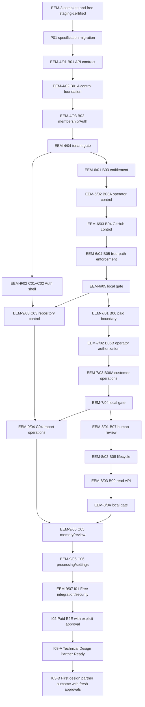

---
aliases:
  - EEM Design Partner Console Implementation Plan
  - EEM Design Partner Alpha delivery plan
tags:
  - evirion
  - eem
  - implementation-plan
  - design-partner
  - console
status: accepted
version: 1.0
updated: 2026-08-27
---

> [!NOTE] Accepted source snapshot
> Migrated for EEM-9/01 from the accepted 2026-08-25 package.
> Vault-relative source: `10 Evirion/Roadmaps/EEM - Design Partner Console implementation plan.md`.
> Original source SHA-256: `ab026e23a4a49c13e304adee9d86819f96291970accae71dea08a6c2f5155e41`.
> The repository copy is authoritative after the paired EEM-9/01 merges.
> Retained security and operations sources:
> `10 Evirion/Architecture/EEM - OWASP-аудит и модель угроз.md` and
> `10 Evirion/Architecture/EEM - Полный runbook запуска и эксплуатации.md`.


# EEM Design Partner Console Implementation Plan

> **For agentic workers:** REQUIRED SUB-SKILL: Use
> `superpowers:subagent-driven-development` (recommended) or
> `superpowers:executing-plans` to implement this plan task-by-task. Steps use
> checkbox syntax for tracking.

**Goal:** Deliver an invite-only, tenant-isolated Design Partner Console that
connects GitHub, activates explicitly entitled repositories, reuses the
existing historical/live pipeline, and lets humans review and manage lifecycle
without weakening provenance, idempotency, checkpoint or paid-call safety.

**Architecture:** Contract-first two-repository delivery. The existing
`evirion-engineering-memory` repository owns PostgreSQL, RLS, GitHub control
plane, workers and the canonical customer API contract. The separate
`evirion-engineering-memory-dashboard` repository owns the Next.js UI/BFF and
pins a published immutable backend contract.

**Tech Stack:** PostgreSQL 17, Supabase migrations/Auth/Edge Functions, current
Python orchestration stack, OpenAPI 3.1 and JSON Schema 2020-12, Next.js App
Router, TypeScript strict mode, pnpm, Supabase Auth behind a server-only
`HttpOnly` BFF session broker, runtime schema validation, Vitest/React Testing
Library, Playwright and automated accessibility/security checks. P01 pins the
bootstrap baseline in `docs/architecture/toolchain-baseline.json`: Node
`24.20.0` LTS, pnpm `11.24.0`, Next.js `16.3.3`, TypeScript `7.0.2`, React
`19.2.8`, `@supabase/ssr` `0.12.5`, `@supabase/supabase-js` `2.112.4`, Vitest
`4.1.11`, Playwright `1.62.1`, PostgreSQL `17`, and Cosign `3.1.3`. Runtime
lockfiles remain owned by the later scaffold task.

Related specifications:

- [EEM - Design Partner Console requirements](../product/design-partner-console-requirements.md)
- [EEM - Design Partner Console architecture](../architecture/design-partner-console.md)
- [EEM - Архитектура базы данных](https://github.com/Evirion/evirion-engineering-memory/blob/b23f6ba2b11f583b61200cec63500a782992f1f0/services/model-orchestration/SUPABASE_DATABASE_ARCHITECTURE.md)
- [EEM - OWASP-аудит и модель угроз](obsidian://open?vault=Obsidian%20Vault&file=10%20Evirion%2FArchitecture%2FEEM%20-%20OWASP-%D0%B0%D1%83%D0%B4%D0%B8%D1%82%20%D0%B8%20%D0%BC%D0%BE%D0%B4%D0%B5%D0%BB%D1%8C%20%D1%83%D0%B3%D1%80%D0%BE%D0%B7.md)
- [EEM - Полный runbook запуска и эксплуатации](obsidian://open?vault=Obsidian%20Vault&file=10%20Evirion%2FArchitecture%2FEEM%20-%20%D0%9F%D0%BE%D0%BB%D0%BD%D1%8B%D0%B9%20runbook%20%D0%B7%D0%B0%D0%BF%D1%83%D1%81%D0%BA%D0%B0%20%D0%B8%20%D1%8D%D0%BA%D1%81%D0%BF%D0%BB%D1%83%D0%B0%D1%82%D0%B0%D1%86%D0%B8%D0%B8.md)
- repository portable authority:
  `docs/superpowers/specs/2026-08-25-design-partner-console-program-design.md`
- repository locator:
  `Evirion/evirion-engineering-memory/docs/plans/active/eem-9-design-partner-console-dashboard-and-certification.md`

До EEM-9/01 новый агент начинает с source-controlled EEM-9 execution plan и
использует его task-specific reading map для перехода к нужным C/I task,
requirement rows, архитектурным state machines и security gates в этом
документе. После EEM-9/01 authoritative implementation plan находится в
Dashboard repository и должен совпадать с зафиксированным source digest.

## Global Constraints

- Do not start EEM-9/01 until EEM-3/12 is merged and free
  staging-recertified, the separate EEM-3/13 lock-order PR is merged, backend
  `main` is updated, and the merged migration plus attestation are verified.
- Do not claim Technical Design Partner Ready until EEM-5 or equivalent source-
  runtime deployment is free staging-observed and applicable Critical/High UI/
  platform findings plus required ASVS evidence pass the I03-A gate.
- Technical Design Partner Ready does not authorize first-partner work; I03-B
  requires separate partner/data/legal and per-workload paid approvals.
- Paid E2E, paid backfill, provider calls and external design-partner data
  require explicit approval for the exact run and budget.
- Customer consent and Evirion operational paid authorization are distinct;
  every initial/repair logical operation has one durable authorization and
  every bounded transport attempt has an append-only dispatch under it.
- Backend schema, RLS, entitlement and pipeline enforcement stay in
  `Evirion/evirion-engineering-memory`.
- Console UI/BFF stays in
  `Evirion/evirion-engineering-memory-dashboard`.
- Start every PR from updated `main`; no stacked branches unless explicitly
  approved.
- Use forward-only CLI-generated migrations; never edit historical migrations.
- Preserve organization isolation, tenant-aware composite foreign keys and
  forced RLS.
- Preserve immutable source/model/run/admission/knowledge provenance.
- Preserve checkpoint-before-validation and no-second-paid-call semantics.
- Do not expose service-role, DSN, GitHub App key/token, provider key, raw
  response or Source Envelope body to the browser.
- `REJECTED` and `QUARANTINED` are processing outcomes, not Knowledge Objects.
- Human review and lifecycle never rewrite AdmissionRecord or original
  Knowledge Object.
- Reuse `organization_memberships`, `knowledge_relations` and
  `knowledge_state_events`.
- Keep RepositoryEntitlement independent from repository automation policy and
  budget.
- Every stateful/concurrent backend PR requires a state-transition table,
  read/mutation matrix, one global lock order, representation-parity matrix and
  executable acceptance map before implementation.
- Use focused RED/GREEN TDD, one batched remediation wave, one complete free
  gate after product bytes freeze, and exact-tree final reviews.
- No code, migration, deployment or provider operation is authorized by this
  document alone.
- The user accepted the written requirements/architecture/implementation
  package on 2026-08-25. P01 must preserve that decision in version control and
  mark the downloaded source plan superseded where it conflicts.

---

## 1. Program scope and decomposition

This is a coordinated program composed of independently reviewable backend,
Console and certification PRs. Each PR must produce working, testable software
and may be rejected without forcing acceptance of an unrelated subsystem.

The accepted milestone decomposition is:

```text
EEM-4 — Customer Access and Tenant Isolation
EEM-6 — Repository Entitlements and GitHub Control
EEM-7 — Paid-call Authorization and Customer Operations
EEM-8 — Customer-safe API, Review and Lifecycle
EEM-9 — Dashboard and Cross-repository Certification
```

Existing EEM-5 remains the independent source-runtime deployment/observation
track. Original identifiers `P01`, `B01`–`B09`, `C01`–`C06` and `I01`–`I03`
remain immutable acceptance/traceability aliases. Source-controlled active EEM
plans own the branch names, PR grouping, prerequisites and Definition of Done.

### 1.1 Repositories

Backend:

```text
Evirion/evirion-engineering-memory
session-local root: $EEM_BACKEND_ROOT
```

Console after clone:

```text
Evirion/evirion-engineering-memory-dashboard
session-local root: $EEM_DASHBOARD_ROOT
```

Remote Console repository already exists and initially contains only
`LICENSE`.

### 1.2 Program streams

Backend stateful stream:

```text
B01 contract
→ B01A command/operator/API foundation
→ B02 capabilities/invitations
→ B03 entitlement
→ B03A operator organization bootstrap/replacement
→ B04 GitHub control plane
→ B05 free-path enforcement
→ B06 paid-call authorization
→ B06B operator paid-authorization control
→ B06A customer import/retry API
→ B07 human review
→ B08 lifecycle
→ B09 read APIs/metrics
```

Console stream:

```text
C01 secure bootstrap
→ C02 auth/onboarding
→ C03 repositories
→ C04 historical import
→ C05 memory/review
→ C06 processing/settings
```

Integration:

```text
I01 free integration/security
→ I02 separately approved paid E2E
→ I03-A Technical Design Partner Ready
→ I03-B separately approved first design partner outcome
```

### 1.2.1 Accepted EEM ownership and branch map

| Traceability alias | Owning EEM subtask |
|---|---|
| `B01` | `EEM-4/01-contract-baseline` |
| `B01A` | `EEM-4/02-control-foundation` |
| `B02` | `EEM-4/03-membership-capabilities` |
| cross-cutting tenant certification | `EEM-4/04-tenant-isolation-certification` |
| `B03` | `EEM-6/01-repository-entitlements` |
| `B03A` | `EEM-6/02-operator-organization-control` |
| `B04` | `EEM-6/03-github-control-plane` |
| `B05` | `EEM-6/04-entitlement-free-paths` |
| EEM-6 final local gate | `EEM-6/05-local-verification` |
| `B06` | `EEM-7/01-entitlement-paid-boundary` |
| `B06B` | `EEM-7/02-operator-paid-authorization` |
| `B06A` | `EEM-7/03-customer-operations-api` |
| EEM-7 final local gate | `EEM-7/04-local-verification` |
| `B07` | `EEM-8/01-human-review` |
| `B08` | `EEM-8/02-knowledge-lifecycle` |
| `B09` | `EEM-8/03-console-read-api` |
| EEM-8 final local gate | `EEM-8/04-local-verification` |
| `P01` | `EEM-9/01-dashboard-repo-bootstrap` |
| `C01` + `C02` | `EEM-9/02-auth-shell` |
| `C03` | `EEM-9/03-repository-control` |
| `C04` | `EEM-9/04-import-operations` |
| `C05` | `EEM-9/05-memory-review-lifecycle` |
| `C06` | `EEM-9/06-processing-settings-metrics` |
| `I01-B` + `I01-C` | paired repository branches named `EEM-9/07-free-integration` |
| `I02` | `EEM-9/08-paid-certification` |
| `I03-A` | paired repository branches named `EEM-9/09-design-partner-ready` |
| `I03-B` | `EEM-9/10-first-design-partner-outcome` |

`C01` and `C02` share one EEM subtask because bootstrap/Auth/session code is
one coupled shell, with separate phase commits/gates. `C05` and `C06` remain
separate because their memory-review and processing/settings slices are
independently reviewable.
`I03` remains the immutable source traceability umbrella. `I03-A` and `I03-B`
are qualified execution phases that prevent Technical Design Partner Ready
evidence from authorizing real partner data or paid work; they do not renumber
or replace the original alias.
The detailed source-controlled EEM plans supersede every legacy `EEM-6/*`
branch label later in this note.

Backend migrations remain sequential. Console work may proceed against a
published contract fixture after the corresponding backend contract is frozen.

### 1.3 Dependency graph



The sequential EEM branch order in this graph is authoritative even where two
product slices are logically independent. It enforces the repository rule that
each subtask starts from updated `main`; no Dashboard branch is stacked or
started from an unmerged prior Dashboard subtask.

## 2. Program preflight

Run once immediately before Task P01.

### 2.1 Backend preflight

- [ ] Confirm EEM-3 completion in `docs/HANDOFF.md`, `docs/ROADMAP.md` and Git.
- [x] Reconcile current evidence: EEM-3/12 is merged, deployed, and free
  source-only staging-certified through PR #23. EEM-3/13 is merged through
  PR #24 at `b23f6ba2b11f583b61200cec63500a782992f1f0`; its reviewed tree and
  merged tree are identical and its PostgreSQL 17 lock attestation passes.
  Migration 30 remains unapplied remotely.
- [ ] Confirm no active EEM-3 branch is being stacked.
- [ ] Record final migration count and latest migration.
- [ ] Verify the final EEM-3 worker, checkpoint, backfill, preflight, health and
  cost interfaces from code/tests.
- [ ] Enumerate initial, validation-repair and transport-attempt provider call
  paths and all partial checkpoint states.
- [ ] Build one exact function/trigger lock-rank matrix from final EEM-3 code;
  no stateful Console PR starts until it is non-contradictory.
- [ ] Inventory every existing `authenticated` table/view grant and consumer.
- [ ] Verify `supabase`, PostgreSQL client, Python and Compose pinned versions.
- [ ] Verify live-call flags are false.
- [ ] Run the current complete free gate with an explicit clean environment.
- [ ] Record baseline test counts, timings and runtime fingerprint once.

Expected stop conditions:

- EEM-3 not merged;
- staging reset/free recert incomplete;
- paid path not fail-closed by default;
- dirty working tree;
- missing local PostgreSQL/Supabase environment;
- unreviewed migration drift;
- missing exact lock matrix or provider-phase inventory;
- secret or runtime artifact in Git.

### 2.2 Console preflight

- [ ] Clone `Evirion/evirion-engineering-memory-dashboard`.
- [ ] Verify `main` contains only expected repository bootstrap history.
- [ ] Inspect raw commit messages for attribution policy.
- [ ] Select latest stable mutually supported Node active-LTS, Next.js,
  TypeScript, React, Supabase Auth/server session library and pnpm versions.
- [ ] Pin Node and pnpm versions.
- [ ] Record hosting assumption, callback origin and staging origin without
  storing secrets.
- [ ] Confirm no production or customer environment is used.
- [ ] Confirm written specification package has explicit user approval and
  source-plan disposition.

### 2.3 Gate definitions

Focused gate:

- tests for the exact changed contract;
- lint/type check for changed package;
- migration/contract parse where applicable.

Affected-suite gate:

- all tests for touched subsystem and adjacent authorization/state paths.

Complete free gate:

- full backend Python/DB/Edge/spec/security/runtime gate;
- full Console lint/type/unit/component/e2e/security/a11y gate;
- no paid/provider operation.

Owning PRs create and maintain exact wrappers:

```bash
./scripts/check_console_backend.sh focused <slice>
./scripts/check_console_backend.sh affected <slice>
./scripts/check_console_backend.sh full

pnpm verify:focused -- <slice>
pnpm verify:affected -- <slice>
pnpm verify
```

Backend slice names are fixed in
`scripts/console_backend_test_slices.toml`:

```text
contract
control-foundation
membership
entitlement
operator-organization
github-control
entitlement-free-paths
model-call-authorization
operator-paid-authorization
customer-operations
human-review
knowledge-lifecycle
customer-reads
```

Console slice names are fixed in `scripts/console_test_slices.json`:

```text
bootstrap
auth
repositories
imports
memory-review
processing-settings
```

Each registry row stores exact lint/type/test/contract files and expected zero
exit status. Unknown or empty slice fails. The backend wrapper executes through
`env -i` with only `HOME`, pinned tool `PATH`, locale, explicitly supplied local
test DSN and forced-false provider/live flags. The Console wrapper accepts only
documented public test origins and fixture credentials. Neither inherits
Compose, staging, provider or paid-run variables.

The backend wrapper starts from an explicit environment allowlist and forces
all paid/live flags false. The Console wrapper pins install/lint/type/unit/build/
Playwright/a11y/security commands in `package.json`; no task may leave
“run focused tests” as an undocumented ad-hoc command.

Rerun triggers:

- product/migration code invalidates affected and complete gates;
- API schema change invalidates backend contract and all Console contract tests;
- UI-only copy/style change invalidates Console visual/a11y tests, not backend;
- docs-only change invalidates link/consistency checks only.

## 3. Target file map

### 3.1 Backend repository

New target areas:

```text
contracts/console/v1/openapi.yaml
contracts/console/v1/schemas/
contracts/operator/v1/openapi.yaml
scripts/check_console_backend.sh
scripts/console_backend_test_slices.toml
scripts/console_operator.py
docs/decisions/<console ADRs>.md
docs/plans/active/<EEM-4 or EEM-6–9 plan>.md
supabase/functions/github-installation-control/
supabase/functions/console-api/
supabase/migrations/<generated>_console_membership_capabilities.sql
supabase/migrations/<generated>_console_command_operator_foundation.sql
supabase/migrations/<generated>_repository_entitlements.sql
supabase/migrations/<generated>_operator_organization_control.sql
supabase/migrations/<generated>_console_pipeline_entitlement.sql
supabase/migrations/<generated>_operator_paid_authorization.sql
supabase/migrations/<generated>_console_customer_operations.sql
supabase/migrations/<generated>_knowledge_human_review.sql
supabase/migrations/<generated>_knowledge_lifecycle_api.sql
supabase/migrations/<generated>_console_read_api.sql
supabase/tests/<console pgTAP files>.sql
services/model-orchestration/tests/database/<console live tests>.py
```

Existing backend files likely modified after EEM-3 verification:

```text
supabase/functions/github-webhook/index.ts
services/model-orchestration/src/model_orchestration/automation/backfill.py
services/model-orchestration/src/model_orchestration/automation/jobs.py
services/model-orchestration/src/model_orchestration/automation/source_processor.py
services/model-orchestration/src/model_orchestration/automation/processor.py
services/model-orchestration/src/model_orchestration/cli.py
services/model-orchestration/SUPABASE_DATABASE_ARCHITECTURE.md
services/model-orchestration/SUPABASE_RUNBOOK.md
services/model-orchestration/BACKFILL_RUNBOOK.md
docs/security/ui-security-gate.md
docs/CHANGELOG.md
docs/HANDOFF.md
docs/ROADMAP.md
```

Do not assume these interfaces remain at their PR05 signatures; reread final
EEM-3 code before each plan.

### 3.2 Console repository

```text
AGENTS.md
README.md
SECURITY.md
package.json
pnpm-lock.yaml
pnpm-workspace.yaml
.nvmrc
next.config.ts
tsconfig.json
vitest.config.ts
playwright.config.ts
src/app/
src/components/
src/lib/auth/
src/lib/contracts/generated/
src/lib/errors/
src/lib/observability/
src/lib/security/
src/server/actions/
src/server/adapters/
src/server/queries/
tests/unit/
tests/component/
tests/contract/
tests/e2e/
docs/architecture/
docs/plans/
```

## 4. Public contract conventions

### 4.1 TypeScript response types

```typescript
export type ApiSuccess<T> = {
  contractVersion: "1.0";
  requestId: string;
  data: T;
};

export const API_ERROR_CODES = [
  "AUTHENTICATION_REQUIRED",
  "ORGANIZATION_MEMBERSHIP_REQUIRED",
  "CAPABILITY_REQUIRED",
  "RESOURCE_NOT_FOUND",
  "IDEMPOTENCY_KEY_REUSED",
  "VERSION_CONFLICT",
  "ORGANIZATION_LIMIT_NOT_PROVISIONED",
  "REPOSITORY_NOT_ENTITLED",
  "REPOSITORY_LIMIT_REACHED",
  "REPOSITORY_REPLACEMENT_REQUIRES_OPERATOR",
  "REPOSITORY_ACCESS_CHANGED",
  "ENTITLEMENT_GENERATION_STALE",
  "BACKFILL_NOT_APPROVABLE",
  "NEW_MODEL_CALL_NOT_AUTHORIZED",
  "PAID_OPERATION_NOT_AUTHORIZED",
  "PROVIDER_OUTCOME_UNKNOWN",
  "REVIEW_VERSION_CONFLICT",
  "LIFECYCLE_VERSION_CONFLICT",
  "SUPERSESSION_INVALID",
  "SUPERSESSION_TRAVERSAL_LIMIT",
  "INVITATION_STATE_CONFLICT",
  "GITHUB_SYNC_INCOMPLETE",
  "DEPENDENCY_UNAVAILABLE",
  "UNSUPPORTED_SERVER_RESPONSE",
] as const;

export type ApiErrorCode = (typeof API_ERROR_CODES)[number];

export type ApiError = {
  contractVersion: "1.0";
  requestId: string;
  error: {
    code: ApiErrorCode;
    message: string;
    retryable: boolean;
    currentVersion?: number;
  };
};
```

### 4.2 Mutation command

```typescript
export type MutationCommand<TPayload> = {
  idempotencyKey: string;
  expectedVersion?: number;
  payload: TPayload;
};
```

`idempotencyKey` is BFF/client metadata and is serialized only as the canonical
`Idempotency-Key` HTTP header, never duplicated in the JSON body.

### 4.3 Page

```typescript
export type CursorPage<T> = {
  items: T[];
  nextCursor: string | null;
};
```

### 4.4 Stable error minimum

```text
AUTHENTICATION_REQUIRED
ORGANIZATION_MEMBERSHIP_REQUIRED
CAPABILITY_REQUIRED
RESOURCE_NOT_FOUND
IDEMPOTENCY_KEY_REUSED
VERSION_CONFLICT
ORGANIZATION_LIMIT_NOT_PROVISIONED
REPOSITORY_NOT_ENTITLED
REPOSITORY_LIMIT_REACHED
REPOSITORY_REPLACEMENT_REQUIRES_OPERATOR
REPOSITORY_ACCESS_CHANGED
ENTITLEMENT_GENERATION_STALE
BACKFILL_NOT_APPROVABLE
NEW_MODEL_CALL_NOT_AUTHORIZED
PAID_OPERATION_NOT_AUTHORIZED
PROVIDER_OUTCOME_UNKNOWN
REVIEW_VERSION_CONFLICT
LIFECYCLE_VERSION_CONFLICT
SUPERSESSION_INVALID
SUPERSESSION_TRAVERSAL_LIMIT
INVITATION_STATE_CONFLICT
GITHUB_SYNC_INCOMPLETE
DEPENDENCY_UNAVAILABLE
UNSUPPORTED_SERVER_RESPONSE
```

Each code gets one OpenAPI example and one backend/Console contract test.

---

### Task P01: Migrate approved specification and establish program governance

**Repositories:** both.

Merge order:

1. Dashboard `EEM-9/01-dashboard-repo-bootstrap`;
2. backend `EEM-9/01-dashboard-repo-bootstrap`.

**Branch:** `EEM-9/01-dashboard-repo-bootstrap`

**Files:**

- Create: `AGENTS.md`
- Create: `README.md`
- Create: `SECURITY.md`
- Create: `docs/product/design-partner-console-requirements.md`
- Create: `docs/architecture/design-partner-console.md`
- Create: `docs/plans/design-partner-console-implementation.md`
- Create: `docs/plans/active/README.md` with copy-ready `/01`–`/10` requests
  and task-specific reading-map locators
- Create: `docs/decisions/README.md`
- Create: `docs/decisions/0001-two-repository-contract-boundary.md`
- Create: `docs/security/asvs-v5.0.0-l2-console-evidence.yaml`
- Create: `scripts/check_docs.py`
- First Dashboard edit: add `.idea/` to `.gitignore`; do not commit IDE
  metadata.
- Backend create/update: final EEM-3 global row/advisory/trigger/recheck lock
  attestation and executable check.
- Create cross-repository artifact-attestation trust policy and negative
  fixtures for repository/workflow/ref/issuer/digest/replacement verification.
- Backend replace: temporary EEM-9 plan at the same path with a durable
  bootstrap pointer pinned to Dashboard repository/commit/path/package digest,
  retaining Obsidian fallbacks plus task/read-map/catalog locators.
- Backend create: machine-readable Dashboard authority manifest and update
  AGENTS/docs indexes/HANDOFF/ROADMAP in the same paired PR.

**Consumes:**

- the portable source-controlled accepted package plus the five linked Obsidian
  requirements, architecture, implementation, OWASP and operations notes; the
  first three are migration sources and the latter two remain mandatory gate
  sources until explicitly migrated;
- final EEM-3 `main` status and backend docs.

**Produces:**

- version-controlled product and architecture authority;
- Console-specific ASVS evidence ownership instead of reusing the backend-only
  matrix that excludes UI;
- repository-specific agent rules;
- program branch/PR convention;
- one final non-contradictory backend global-lock matrix before EEM-4/02;
- a non-diverging backend pointer to the Dashboard authority;
- the same copy-ready numbered catalog and reading-map locator from either
  repository;
- no runtime code.

**Acceptance map:** all requirement sections, architecture Sections 1–30.

- [ ] **Step 1: Verify prerequisite**

Confirm EEM-3 completion and record exact backend commit SHA in the migrated
architecture evidence boundary.
EEM-3/12 is merged as backend PR #23 at
`8c2c2194a06ccea2bf69754eaf041b0d8758d832`. EEM-3/13 is merged as backend
PR #24 at `b23f6ba2b11f583b61200cec63500a782992f1f0`; its reviewed and merged
trees are identical. Its local gate replayed 30 migrations, passed 295 pgTAP
assertions and 341 database tests, produced runtime fingerprint
`5974d4b04834a585a786e1245b324411cdc4798b066b136203b6ac46eaf6b294`, and
the merged 10-test PostgreSQL 17 lock attestation passes.
Open the existing Dashboard repository as the primary Cursor workspace before
any Dashboard-owned edit; preserve its history and pre-existing governance.

Record the already approved 2026-08-25 package decision, preserve
`status: accepted`, and mark the downloaded source plan superseded only for
rows in the source-disposition matrix.

- [ ] **Step 2: Create documentation structure**

Copy the requirements, architecture and implementation notes without changing
semantic decisions. Convert their internal Obsidian links to repository-relative
Markdown links, and preserve verified `obsidian://` plus vault-relative
fallbacks to the OWASP note and operations runbook for EEM-9/07–10. Never
publish an absolute local user path.

Verify the already-defined ordinal acceptance-row suffixes (`AUTH-001.A1`,
`.A2`, and so on), preserve tombstones and materialize them into
`docs/requirements/acceptance-map.yaml`. Each row inherits the sole primary
PR/test named in Section 5 and gets one named test parameter/case. P01 may not
change ownership without renewed package approval.

Create the Console-specific ASVS v5 Level 2 matrix for every applicable V1, V3,
V4, V6–V10 and V12–V16 row. Each row names one owner, exact test/evidence,
environment, verifier and applicability rationale. Resolve V10.1.1 through the
server-only `HttpOnly` BFF token boundary.

In the paired backend PR, rerun and pin the merged EEM-3/13 executable
function/trigger/FK/advisory/recheck attestation against Architecture Section
18. Stop on any catalog digest drift or lower rank after a higher one; do not
silently rewrite the accepted manifest to match unexpected state. Pin the
stable-path backend pointer/manifest to the exact merged
Dashboard repository, commit, path and package digest; retain authority,
Obsidian, reading-map and Start/Plan catalog locators and update every backend
agent/index/handoff reference in the same PR. No unnamed later cleanup PR is
allowed.

Before C01/C02, freeze the Supabase Auth threat model, email-OTP-only provider
allowlist, server-only `HttpOnly` session model and TOTP/AAL2 rules. The
approved application profile is JWT `15m`; visible-tab human-activity idle
`30m`; warning `5m`; successful touch coalesced to `1m`; absolute session
`8h`; maximum three sessions with oldest replacement and explicit notice;
one-time dangerous-operation reauthentication `10m`; OTP lifetime `10m`;
resend cooldown `60s`; and return to the previously authorized Knowledge route
without replaying an unconfirmed mutation. Assets, prefetch, polling, an
untouched tab and token refresh do not count as human activity. Also freeze
active-session inventory/termination, private application-session registry and provider
sign-out reconciliation, BFF bootstrap signing/proof/key-rotation policy,
cookie chunk/header budget, account/factor recovery, CSRF/Auth-abuse and
canonical origin/trusted-proxy/TLS/local-HTTPS harness plus hosting cache
policy. Preserve the existing Dashboard repository history,
`LICENSE` and any pre-existing governance file.

Freeze artifact-attestation policy: use public keyless Sigstore/Fulcio signing
and Rekor transparency logging for the immutable authority package because
GitHub Free private-repository artifact attestations are unavailable. Pin the
subject digest, backend repository, signer workflow path/ref/commit, OIDC
issuer/identity, Rekor entry/inclusion proof, verifier version, least-privilege
short-lived download identity and replacement/revocation response. Never sign
or upload secrets, customer payload, source payload, or generated private
runtime output. Digest/tag alone is not trust evidence.

Repository-governance enforcement remains temporarily waived under open
`SEC-2026-012`; record the waiver and compensating signed-evidence checks in
the Dashboard ASVS/acceptance map. It must be closed before Technical Design
Partner Ready and does not weaken required local/PR gates.

- [ ] **Step 3: Write ADR 0001**

Record:

```text
Decision: backend owns persistence/policy/API; dashboard owns UI/BFF.
Rejected: direct core access, duplicate Console database, provider calls from UI,
Supabase Admin invite-link/PKCE and browser-readable Auth tokens.
Consequences: versioned cross-repository contract and ordered deployments.
```

- [ ] **Step 4: Add repository rules**

`AGENTS.md` must require:

- no service-role/provider/GitHub App secrets in browser/repo;
- strict TypeScript;
- exhaustive union handling;
- server-side auth;
- accessible UI;
- contract pinning;
- TDD and final review;
- no commit attribution trailer.

- [ ] **Step 5: Self-review docs**

Run:

```bash
rg -n 'T[B]D|T[O]DO|PLACE[H]OLDER|FIX[M]E|later deci[d]e|to be deci[d]ed' docs AGENTS.md README.md SECURITY.md
```

Expected: no unresolved requirement marker.

- [ ] **Step 6: Verify links**

Run:

```bash
python3 scripts/check_docs.py
```

Expected: zero broken internal links.

- [ ] **Step 7: Commit**

Commit title:

```text
EEM-9: Establish accepted Console specification governance
```

**Exit criteria:**

- docs reviewed by user;
- both repository PRs merged in order and the lock attestation passes;
- artifact-attestation negative fixtures reject replaced asset, mutable tag,
  wrong repository/workflow/ref/issuer, stale evidence and unpinned verifier;
- no implementation claim;
- exact backend baseline recorded;
- PR merged before Console code.

---

### Task B01: Establish backend Console contract baseline

**Repository:** `evirion-engineering-memory`

**Branch:** `EEM-4/01-contract-baseline`

**Files:**

- Create: `contracts/console/v1/openapi.yaml`
- Create: `contracts/console/v1/schemas/error.json`
- Create: `contracts/console/v1/schemas/pagination.json`
- Create: `contracts/console/v1/schemas/session-context.json`
- Create: `scripts/check_console_contract.py`
- Create: `scripts/check_console_backend.sh`
- Create: `scripts/console_backend_test_slices.toml`
- Create: `services/model-orchestration/tests/unit/test_console_contract.py`
- Modify: `services/model-orchestration/pyproject.toml`
- Modify: `services/model-orchestration/uv.lock`
- Create: `docs/decisions/0010-console-contract-and-control-plane.md`
- Modify: `docs/ROADMAP.md`
- Modify: `docs/HANDOFF.md`
- Modify: `docs/CHANGELOG.md`

**Interfaces:**

- Consumes: existing API schema conventions and final EEM-3 types.
- Produces: contract version `1.0`, response/error envelope, cursor format and
  compatibility checker.

- [ ] **Step 1: Write failing contract tests**

Tests assert:

- OpenAPI 3.1;
- exact version;
- no `serviceRoleKey`, DSN, raw response or Source Envelope schema;
- every customer/operator mutation requires idempotency key;
- provider callbacks that cannot set the header require a persisted
  provider/setup-event replay key and atomic single-use proof;
- every versioned mutation supports conflict response;
- every error has stable code/retryable fields.

- [ ] **Step 2: Run RED**

```bash
cd services/model-orchestration
uv run pytest tests/unit/test_console_contract.py -q
```

Expected: fail because contract files/checker do not exist.

- [ ] **Step 3: Add minimum contract**

Include only:

- session context;
- standard response;
- standard error;
- cursor page;
- operation security schemes;
- empty tagged endpoint groups to be expanded by owning PRs.

- [ ] **Step 4: Add compatibility checker**

Checker rejects:

- removed endpoint/schema;
- newly required response field;
- narrowed enum;
- widened enum unless the old schema has an explicit unsupported variant;
- changed field type/nullability;
- error code removal;
- contract version mismatch.

Add the latest stable OpenAPI/YAML validation dependency through `uv add` in
the appropriate development group; do not hand-edit a version.

- [ ] **Step 5: Run GREEN**

```bash
./scripts/check_console_backend.sh focused contract
./scripts/check_console_backend.sh affected contract
```

Expected: both exit `0`; the affected slice includes current specification,
prompt, contract and secret/artifact checks with all paid/live flags false.

- [ ] **Step 6: Update ADR/roadmap**

Document signed private GitHub Release artifact publication, retention,
attestation trust root, protected signer workflow/CODEOWNERS, short-lived
download identity, replacement/revocation handling and backend-first deployment
order. A mutable tag or SHA-256 without verified attestation is insufficient.

- [ ] **Step 7: Commit**

```text
EEM-4: Establish the Console API contract
```

**Exit criteria:**

- valid immutable contract baseline;
- no runtime endpoint;
- compatibility checker executable;
- Console can generate fixtures/types.

---

### Task B01A: Add command, operator and Console API security foundation

**Repository:** `evirion-engineering-memory`

**Branch:** `EEM-4/02-control-foundation`

**Files:**

- Generate migration suffix: `console_command_operator_foundation`
- Create: `supabase/functions/console-api/index.ts`
- Create: `supabase/functions/console-api/index_test.ts`
- Create: `scripts/check_console_backend.sh`
- Create the next available pgTAP file after EEM-3.
- Create: `services/model-orchestration/tests/database/test_console_control_foundation_live.py`
- Modify: `supabase/config.toml`
- Expand: `contracts/console/v1/openapi.yaml`
- Update security/operator/data-lifecycle docs.

**Interfaces:**

- Produces immutable `core.console_command_receipts`.
- Produces `core.platform_operator_memberships`.
- Produces authenticated `console-api` middleware for JWT, correlation,
  canonical errors, rate limits and redacted logs.
- Defines separately controlled initial-platform-operator roster bootstrap and
  later deployment-owner roster-change command.

**Contract packet before code:**

- principal-kind/trust matrix;
- command receipt state/request-hash matrix;
- initial operator-roster bootstrap and later add/disable mutation/no-side-
  effect matrix;
- RLS/role/grant matrix;
- correlation/log redaction acceptance map.

- [ ] **Step 1: Write RED database tests**

Cover same-key/same-request receipt replay, same-key/different-request conflict,
transaction rollback, cross-tenant key reuse, direct writes, spoofed operator
identity and inactive platform operator. Cover exact approved roster, dual
approval, passwordless/unconfirmed/no-authorization-metadata pre-provision,
bootstrap closeout/replay, later approved add/disable and final-active-operator
guard.

- [ ] **Step 2: Write RED Edge tests**

Cover missing/invalid JWT, correlation ID, body/query limits, rate limit,
canonical error envelope, SQLSTATE/stack redaction and customer role invoking
operator route.

- [ ] **Step 3: Disable public signup**

Version-control local Auth config, document hosted setting, set passwordless
flows to `shouldCreateUser = false`, and add direct Auth-endpoint negative
tests. Version and canonical-digest the email subject/body template containing
`{{ .Token }}` and no `ConfirmationURL`, `TokenHash` or credential-bearing
link; verify the actual local synthetic email plus expiry/resend/redirect
settings. Do not model magic-link and OTP as separate provider endpoints.

- [ ] **Step 4: Generate and implement migration**

All new tenant rows use FORCE RLS. Document and attest the existing narrow
non-FORCE membership exception rather than changing it implicitly.

- [ ] **Step 5: Implement Console API shell**

Normal routes forward user JWT and never use service-role. Privileged external
side effects use a separate server-only client after a user/operator
authorization intent has committed.

- [ ] **Step 6: Define platform-operator roster bootstrap and lifecycle**

Use a two-person-approved deployment-owner runbook with exact immutable roster,
explicit confirmation, durable receipt/audit and no customer/public endpoint
or caller-supplied operator authority. Bootstrap is disabled after the initial
roster. A distinct approved deployment-owner command handles later add/disable
with a final-active-operator guard. Technical Design Partner Ready requires at
least two distinct active operator identities; B02 later extends disable to
deny affected application sessions before provider reconciliation.

- [ ] **Step 7: Run focused and security gates**

```bash
./scripts/check_console_backend.sh focused control-foundation
./scripts/check_console_backend.sh affected control-foundation
```

Expected: command/Edge/Auth negative tests green; no raw token, email link,
payload, DSN or secret in responses/logs.

The new wrapper must run every Edge Function owning test/type check, not only
the pre-existing GitHub webhook.

- [ ] **Step 8: Commit**

```text
EEM-4: Add the Console command and operator boundary
```

**Exit criteria:**

- every later mutation can reuse one durable receipt contract;
- API runtime owner is concrete;
- operator identity is derived, not supplied;
- initial and later operator-roster paths are non-public, dual-controlled,
  idempotent and final-active-operator safe;
- public signup is closed.

---

### Task C01: Bootstrap a security-hardened Console

**Repository:** `evirion-engineering-memory-dashboard`

**Branch:** `EEM-9/02-auth-shell`

**Files:**

- Create: `package.json`, `pnpm-lock.yaml`, `pnpm-workspace.yaml`, `.nvmrc`,
  `.npmrc`
- Create: `next.config.ts`, `tsconfig.json`, `vitest.config.ts`
- Create: `playwright.config.ts`
- Create: `src/app/layout.tsx`, `src/app/page.tsx`
- Create: `src/app/error.tsx`, `src/app/not-found.tsx`
- Create: `src/lib/env/server.ts`, `src/lib/env/client.ts`
- Create: `src/lib/security/headers.ts`
- Create: `src/lib/contracts/generated/`
- Create: `tests/unit/env.test.ts`
- Create: `tests/contract/no-browser-secrets.test.ts`
- Create: `tests/contract/supply-chain-policy.test.ts`
- Create: `tests/security/release-surface.spec.ts`
- Create: `tests/security/headers-cache-isolation.spec.ts`
- Create: `tools/security/pyproject.toml`, `tools/security/uv.lock`
- Create: `tools/security/semgrep.yml`, `tools/security/toolchain.lock`
- Create: `scripts/security/verify-toolchain.sh`
- Create: `.github/workflows/ci.yml`

**Interfaces:**

- Consumes: B01 contract artifact and B01A Console API boundary.
- Produces: deployable empty shell with no customer functionality.

- [ ] **Step 1: Pin runtime/toolchain**

Use Corepack and pnpm. Pin selected stable versions in package manager and
`.nvmrc`; commit lockfile. Pin the approved registry, deny lifecycle scripts by
default, and explicitly allow only reviewed packages that require a build.

- [ ] **Step 2: Scaffold Next.js**

Enable:

- App Router;
- TypeScript;
- strict mode;
- source under `src`;
- linting;
- no experimental prerelease feature.

- [ ] **Step 3: Write RED env tests**

Tests prove:

- missing server-only Supabase URL/publishable key fails server startup;
- `SUPABASE_SERVICE_ROLE_KEY`, provider keys and GitHub private key are not
  accepted as `NEXT_PUBLIC_*`;
- client env exposes no Supabase session configuration and only allowlisted
  non-sensitive variables.

- [ ] **Step 4: Implement env boundary**

Separate server/client validation modules. No direct `process.env` outside
them.

- [ ] **Step 5: Write RED security-header tests**

Assert per-response CSPRNG nonce CSP, nonce/header binding, nonce uniqueness
across warm instances, HSTS, frame ancestors, content type, referrer and
permissions policies. Static/adversarial tests prohibit raw HTML,
`dangerouslySetInnerHTML`, Markdown renderers and unsafe URL protocols.

- [ ] **Step 6: Implement headers**

Use `strict-dynamic` and a per-response nonce that supports Next.js without
`unsafe-inline` or `unsafe-eval` in production.

Also assert authenticated responses are `private, no-store` and cannot enter
Next.js data, CDN or ISR cache. Authenticated routes are force-dynamic,
Auth/customer fetches use `cache: "no-store"`, the server session layer applies
refresh/cookie headers, hosting minimum TTL is zero/disabled, and no Supabase
client/user state is module-scoped.

- [ ] **Step 7: Import pinned contract**

Generate TypeScript and runtime schemas from the exact B01 artifact digest.
Store digest in `src/lib/contracts/contract-lock.json`.

- [ ] **Step 8: Add CI**

Commands:

```bash
pnpm install --frozen-lockfile
pnpm lint
pnpm typecheck
pnpm test
pnpm build
pnpm audit --audit-level high
pnpm security:sast
pnpm security:secrets
```

Expose the same commands as `verify:focused`, `verify:affected` and `verify`
scripts so later tasks use one stable gate.

`security:sast` runs Semgrep from the committed `uv.lock` with
`uv run --frozen --project tools/security semgrep scan --config
tools/security/semgrep.yml --error`. `security:secrets` verifies the
digest-pinned Gitleaks binary from `toolchain.lock` and scans the full tracked
history. Any Semgrep blocking finding or any verified secret fails CI.
Dependency audit fails on high/critical findings. I01 owns the digest-pinned
OWASP ZAP DAST wrapper because it requires a running application.

All third-party Actions are pinned to full commit SHAs. CI verifies approved
registry, manifest/lock consistency, lifecycle-script allowlist, dependency
diff, CycloneDX SBOM/provenance and immutable security-tool digests. The
production build test proves source maps, debug overlays/routes, diagnostics
and internal API docs return `404/403`; any separately approved source-map
upload is protected and absent from public assets.

- [ ] **Step 9: Run Playwright smoke**

Assert root page, headers, no console error and no secret-shaped browser data.

```bash
pnpm verify:focused -- bootstrap
pnpm verify:affected -- bootstrap
```

- [ ] **Step 10: Commit**

```text
EEM-9: Bootstrap the secure Console application
```

**Exit criteria:**

- no product mutation;
- strict build and tests green;
- browser secret scan green;
- `SEC-WEB-006`/`SEC-WEB-007` header/cache/supply-chain policy tests green and
  production debug/source-map surfaces absent;
- contract digest pinned.

---

### Task B02: Add capability authorization and invitation boundaries

**Repository:** `evirion-engineering-memory`

**Branch:** `EEM-4/03-membership-capabilities`

**Files:**

- Create CLI migration with suffix:
  `console_membership_capabilities`
- Create the next available pgTAP file with suffix:
  `console_membership.sql`
- Create: `services/model-orchestration/tests/database/test_console_membership_live.py`
- Create: `supabase/functions/organization-invitations/index.ts`
- Create: `supabase/functions/organization-invitations/index_test.ts`
- Create: `scripts/eem_operator_session.py`
- Create: `services/model-orchestration/tests/test_operator_auth_session.py`
- Expand: `contracts/console/v1/openapi.yaml`
- Create schemas: `member.json`, `invitation.json`, `session.json`,
  `session-revocation.json`
- Modify security/runbook/data-lifecycle/changelog/handoff docs.

**Interfaces:**

- Produces:
  `private.has_organization_capability(organization_id, capability)`;
  customer-safe member/invitation endpoints;
  session capability projection;
  dedicated headless operator-session bootstrap/client.
- Preserves existing role enum.

```text
POST /v1/organizations/:organizationId/invitations
POST /v1/organizations/:organizationId/invitations/:inviteId/resend
POST /v1/organizations/:organizationId/invitations/:inviteId/revoke
POST /v1/invitations/:inviteId/accept
PATCH /v1/organizations/:organizationId/members/:memberId
GET /v1/sessions
POST /v1/session-revocations

POST /internal/console/v1/session/bootstrap

api.create_organization_invitation
api.resend_organization_invitation
api.accept_organization_invitation
api.bootstrap_self_session
api.list_self_sessions
api.revoke_self_sessions
api.update_organization_membership
```

`POST /v1/session-revocations` accepts exactly one of
`current | session | others | all`; `session` requires a target ID from the
caller's own inventory. Actor, user and target ownership are server-derived;
the command requires `Idempotency-Key` and `expectedSessionVersion`.
`POST /internal/console/v1/session/bootstrap` is absent from customer OpenAPI/
Data API. It validates the exact bearer token online and independently verifies
a one-time BFF proof bound to issuer/audience, method/path, token digest,
verified `sub`/`session_id`, pre-auth transaction, optional invitation
selection, nonce/times, idempotency key and request digest. It either registers
an existing active-member session or atomically registers the session and
accepts the selected matching live invitation. Exactly one eligible invitation
may auto-select; multiple rows return only post-auth bounded labels plus opaque
IDs and require explicit selection. Every zero/mismatch/no-access branch has no
domain mutation. Proof consumption and command receipt commit atomically;
same-key retry replays the receipt. `service_role`, Origin/CORS, unsigned header
or bare provider token is insufficient.

**Contract packet before code:**

- role→capability matrix;
- email-OTP provider/signup, server-only session and TOTP/AAL2 matrix;
- privileged-session, reauthentication, logout/revocation and account/factor
  recovery state/mutation matrix;
- application session `unregistered/bootstrap_pending/active/reauth_required/
  revoked/expired` and provider sign-out
  `pending/started/succeeded/failed_retryable/failed_final/not_applicable`
  matrices;
- bootstrap-pending/reauth-required, database-clock absolute/inactivity expiry,
  activity-touch/no-touch and retention-cleanup matrices;
- exact-token algorithm/issuer/audience/expiry/session-id/key-rotation/Auth-
  outage validation matrix for both BFF and direct backend access;
- fresh Auth `is_anonymous`/verified-email/identity/provider/`amr` allowlist and
  configuration-drift matrix;
- retained `api.trusted_knowledge` REST/GraphQL customer versus internal caller
  application-session matrix;
- invitation
  `requested/auth_user_created/sent/accepted/revoked/expired/failed`
  transition table;
- per-generation OTP effect
  `pending/started/sent/outcome_unknown/failed_retryable/failed_final`,
  claim/lease and explicit-resend matrix;
- membership invited/active/disabled and owner-transfer table;
- invite read/mutation matrix;
- Auth user/membership parity matrix;
- command-receipt/reconciliation matrix;
- acceptance tests for stale JWT and concurrent last-owner changes.

- [ ] **Step 1: Write RED pgTAP**

Assert:

- helper signature/owner/search path/grants;
- only required roles execute;
- no direct authenticated membership writes;
- every new invitation table uses FORCE RLS;
- existing non-FORCE `organization_memberships` exception retains exact
  owner/grants/non-bypass protections.
- retained `api.trusted_knowledge` customer access invokes the active-session
  helper; internal/service access remains an explicitly separate principal.

- [ ] **Step 2: Write RED live tests**

Cover:

- owner/admin/member/viewer matrix;
- real headless operator email-OTP/TOTP login, AAL1 deny/AAL2 allow, online
  expiry/revocation and lost-factor recovery by another AAL2 operator;
- B01A operator disable immediately denies affected application sessions before
  provider reconciliation; B02 cannot mutate the deployment-owner roster;
- stale JWT after disabled membership;
- cross-tenant member ID;
- final owner removal denied;
- two concurrent owner demotions/removals cannot leave zero owner;
- ownership transfer requires accepted successor;
- duplicate invitation;
- same idempotency key/different invitation conflict;
- wrong email acceptance;
- expired/revoked invite;
- resend issues a new bounded provider OTP without storing an application token
  or duplicating membership;
- one automatic provider send per generation; response loss after dispatch
  records outcome unknown, competing reconcilers do not resend, and explicit
  cooldown-bound resend advances generation;
- acceptance is same-key idempotent and wrong-key conflicting;
- Auth-created/DB-failed and email-failed reconciliation;
- public/direct Auth signup and unknown-user OTP denied;
- new invitee pre-provision has no password, `email_confirm = false`, no
  authorization metadata or membership/session; unsupported/linked existing
  identity causes no relink, OTP send or membership mutation;
- anonymous/password/phone/social/SSO/manual-linking paths and Admin-invite
  usage denied; the shared email-OTP endpoint is tested with the pinned
  code-only template so it cannot emit a magic/confirmation link;
- Owner/Admin/operator privileged AAL1 denied and AAL2 accepted;
- exact forwarded token validated online without trusting `session.user`;
- wrong project/issuer/audience/algorithm, unknown/rotated key, direct backend
  bypass and Auth outage fail closed without domain mutation;
- anonymous flag and every unsupported password/phone/OAuth/recovery/linked
  identity, `amr` or provider/configuration drift fail closed;
- BFF login bootstrap alone registers verified user plus `session_id`; provider-
  valid unregistered/revoked/expired sessions fail every API/RPC path;
- valid bearer without BFF proof, wrong/retired key, expiry, replay and token/
  path/body/idempotency substitution fail bootstrap without domain mutation;
- zero/one/many eligible invitations, opaque post-auth selection, expired/
  revoked/resend generation and concurrent accept-versus-revoke/expire have
  deterministic results; iteration order never chooses among multiple rows;
- bootstrap/invitation paths acquire 1a→1c; recovery/session-revocation paths
  acquire 1a→1b→1c; human-authorized offboarding fences under 1a→1b→1c
  and schedules any
  conditional global-session revoker as a separate transaction beginning at
  1a. Race tests observe exact backend/row blockers and immediate rechecks;
  timeout is watchdog only;
- bounded active-session inventory and one/current/other/all application-session
  revocation; application deny commits before supported provider sign-out, and
  provider JWT validity until `exp` cannot restore access;
- only an allowlisted versioned API/RPC transaction that completes session and
  domain authorization touches activity, after expiry/auth checks and before
  commit; asset/prefetch/non-activity polling, compatibility-view RLS,
  denied/Auth-outage and terminal-session bootstrap cases have exact
  no-mutation assertions;
- recent reauthentication, factor-change session termination, lost-factor and
  compromised-email recovery;
- direct RPC bypass.
- real REST and enabled-GraphQL `api.trusted_knowledge` calls deny
  unregistered/revoked/expired customer sessions without breaking the explicit
  internal caller fixture.

- [ ] **Step 3: Generate migration**

```bash
supabase migration new console_membership_capabilities
```

Implement capability helper, durable invitation states, organization
membership guard, private principal-scoped application-session registry,
guarded membership/invitation/session functions, durable provider sign-out
effects and backend AAL2 enforcement for privileged customer/operator actions.
Add the interim active-session guard to retained `api.trusted_knowledge`;
EEM-8/03 owns its later removal. Reuse B01A command receipts. Store no raw Auth
token, OTP, IP or User-Agent.

The operator client reads OTP/TOTP from protected TTY/stdin, keeps tokens only
in process memory for one bounded command, invokes dedicated operator-session
bootstrap after live platform-operator/AAL2 validation, and signs out. Tokens
are forbidden in argv, shell history, environment, repository files and logs.

- [ ] **Step 4: Implement invitation Edge boundary**

It validates user JWT and delegates authorization intent to guarded SQL. A
separate server-only Auth admin client performs create/revoke side effects,
creates new users only passwordless with `email_confirm = false` and no
authorization metadata, issues email OTP with `shouldCreateUser = false`,
advances durable state and reconciles partial failure; Auth-user creation alone
never activates membership or supplies the trusted customer actor. Existing
users are reusable only when their exact email identity matches the frozen
provider contract; unsupported/linked identities fail without relinking or
membership mutation.
The provider has no application idempotency key. Persist a per-generation
effect claim before the network call; `OUTCOME_UNKNOWN` after response loss is
not auto-retried. Only an explicit cooldown-bound resend starts the next
generation. Revoke/expire fences every old generation.

- [ ] **Step 5: Expand API contract**

Add the exact session/member/create/resend/revoke/accept paths above, their
capabilities, `Idempotency-Key`, bounded errors and examples.

- [ ] **Step 6: Run focused GREEN**

```bash
./scripts/check_console_backend.sh focused membership
```

The slice runs the exact pgTAP file, live membership/concurrency tests,
Edge/Auth negative tests and contract tests.

- [ ] **Step 7: Run affected security suite**

```bash
./scripts/check_console_backend.sh affected membership
```

The affected slice includes all existing membership/RLS tests.

- [ ] **Step 8: Commit**

```text
EEM-4: Add live membership capabilities and invitations
```

**Exit criteria:**

- role mapping is server-authoritative;
- no duplicate membership model;
- no browser admin credential;
- `AUTH-007` backend online-token/MFA/session/recovery contract is executable;
- exact negative matrix green.

---

### Task C02: Implement sign-in, invitation and organization context

**Repository:** `evirion-engineering-memory-dashboard`

**Branch:** `EEM-9/02-auth-shell`

Re-estimated after explicitly naming OTP-verify/sign-out/factor-reset unknown
outcomes and first TOTP enrollment: unchanged because response-loss and
MFA/recovery adversarial cases were already included.

**Files:**

- Create: `src/lib/auth/server.ts`, `src/lib/auth/session-cookies.ts`
- Create: `src/lib/security/csrf.ts`, `src/lib/security/request-origin.ts`
- Create: `src/server/queries/session-context.ts`
- Create: `src/app/(auth)/sign-in/page.tsx`
- Create: `src/app/(auth)/invite/page.tsx`
- Create: `src/app/(auth)/verify/page.tsx`
- Create: `src/app/api/auth/verify-otp/route.ts`
- Create: `src/app/api/auth/logout/route.ts`
- Create: `src/app/(console)/settings/sessions/page.tsx`
- Create: `src/app/(auth)/mfa/enroll/page.tsx`
- Create: `src/app/(auth)/mfa/challenge/page.tsx`
- Create: `src/app/(auth)/recovery/page.tsx`
- Create: `src/app/(console)/layout.tsx`
- Create: `src/app/(console)/onboarding/page.tsx`
- Create: `src/components/layout/organization-switcher.tsx`
- Create tests under `tests/unit/auth`, `tests/component/auth`,
  `tests/e2e/auth.spec.ts`
- Create: `tests/security/auth-session-recovery.spec.ts`
- Create: `tests/security/csrf-origin.spec.ts`
- Create: `tests/security/redirect-url-boundary.spec.ts`
- Expand: `tests/security/headers-cache-isolation.spec.ts`

**Interfaces:**

- Consumes: B02 session/invitation API.
- Produces: server-validated session and capability-aware shell.

- [ ] **Step 1: Write RED route tests**

Cover unauthenticated redirect, disabled membership, invite success/failure,
multi-org switch, tenant-obscured response, CSRF failure, session-refresh cache
headers, pre-auth login-CSRF/session-swapping/parallel-tab/stale-generation
cases and direct unknown-user signup. Also cover disabled anonymous/password/
phone/social/SSO/manual-linking paths, prohibited Admin-invite usage, synthetic
email proving the shared OTP endpoint emits only the pinned code template,
exact-token online validation without trust in `session.user`, wrong project/
issuer/audience/algorithm, unknown/rotated key, direct backend bypass, Auth outage,
anonymous flag, unsupported `amr`/identity/provider and configuration drift,
existing-member/invited-member session bootstrap, post-OTP transient retry,
terminal bootstrap cleanup, current-generation unknown-delivery reconciliation,
stale-generation verify deny, lost-`verifyOtp` response with no automatic
verify retry, unregistered-session deny, first TOTP enrollment from fresh
email-OTP AAL1, later-factor reauthentication, challenge/verify/unenroll,
privileged AAL1 deny/AAL2 allow,
recent reauthentication, active-session inventory, one/other/all-session
logout, factor-change other-session termination, revoked/expired sessions,
stale post-factor `aal2`, forced refresh/current-next AAL,
`REAUTH_REQUIRED`, Admin factor-delete response loss,
reauth session/action/nonce/expiry replay, TOTP seed post-navigation/log absence,
concurrent refresh/lost response/stale refresh reuse, cookie chunk rotation/
header overflow/collision/gap/duplicate/reorder/corruption/mixed generation/
stale excess/deletion headers, lost-factor/compromised-email recovery and
final-owner safety.

- [ ] **Step 2: Implement the server-only Supabase session broker**

Use a request-local server client with custom cookie storage. Access/refresh
tokens are stored only in host-scoped `__Host-` cookies with
`HttpOnly; Secure; SameSite=Lax; Path=/` and no `Domain`, and refreshed only by
the BFF; browser JavaScript never initializes a session-bearing Supabase client.
Concurrent refresh and lost-response handling preserves exact session ownership
and rejects stale/replayed cross-session replacement. Validate the exact token
online with `getUser(accessToken)` before forwarding it. Authenticated/session-
refresh responses and every nonce-bearing pre-auth/Auth/MFA/recovery response
are force-dynamic and `private, no-store`, apply every refresh/cookie header and
are excluded from application/Next.js/router/hosting cache, including redirects,
errors, `304` and RSC prefetch.
Deterministic chunking preserves every `__Host-` attribute, rotation/logout
clears stale chunks, and browser/proxy cookie or header-budget overflow fails
closed. Unchunked/chunked collision, gaps, duplicates, reorder, corruption,
mixed generations, excessive/stale chunks and aggregate deletion-header
overflow clear every bounded slot and perform no refresh/bootstrap/domain
effect.
Local browser/E2E uses the P01-pinned HTTPS origin/proxy harness and proves the
same `__Host-`/`Secure` behavior as staging; no development branch weakens
cookie attributes to make tests pass.

- [ ] **Step 3: Implement protected layout**

Load `session/context`; route components receive immutable bounded context.

- [ ] **Step 4: Implement invite-only email OTP verification**

The owner-created backend invitation pre-provisions the Auth user without a
password, with `email_confirm = false` and no authorization metadata, then
issues a bounded email OTP with `shouldCreateUser = false`. An existing Auth
user is reusable only when its exact email identity matches the P01-frozen
Alpha provider/identity contract; unsupported or linked identity state fails
final without relinking, OTP send, session registration or membership
mutation. Invitee submits email plus OTP to the same-origin BFF; `verifyOtp`
runs server-side and activates only the selected matching live invitation
through the private idempotent backend session bootstrap. The BFF signs a
one-time proof over token/principal/session/
pre-auth/selection/request state; no browser, service-role or caller header can
mint it. It writes the host-only `__Host-` session cookies, clears form state
and returns immediate `303` to a clean allowlisted path. Existing active members
bootstrap without a new invitation. Exactly one eligible invitation may
auto-select; multiple rows render post-auth bounded organization labels plus
opaque choices and require a signed explicit selection. A transient post-OTP
bootstrap failure retries only from the server cookies; all other API routes
deny that unregistered session. A terminal denial clears cookies and attempts
supported local provider sign-out.
Successful verification reconciles only the same current invitation generation
from delivery `OUTCOME_UNKNOWN`; resend/revoke/expire fences old codes. Lost
`verifyOtp` response records `VERIFY_OUTCOME_UNKNOWN`, never automatically
repeats verification and leaves any resulting provider session unregistered/
denied until an explicit cooldown-bound resend starts a new generation.
OTP/access/refresh/invite credentials never enter an application URL, browser
storage, logs, analytics or third-party requests.

- [ ] **Step 5: Implement organization switcher**

Switching changes navigation preference and triggers server reload; it does not
mint capability.

- [ ] **Step 6: Add capability-driven navigation**

Hide actions for usability, while tests confirm direct URL/action still denied
by backend.

Every state-changing BFF route and Server Action validates a 256-bit HMAC-signed
double-submit CSRF proof. OTP request/verify/bootstrap selection use a distinct
short-lived pre-auth transaction bound to host/origin, HMAC email identity,
nonce, attempt generation and expiry. Successful bootstrap consumes it and
rotates to live `session_id` binding. Exact Origin/canonical Host,
`Sec-Fetch-Site: same-origin`, allowed content type and trusted-proxy
normalization are checked before forwarding token plus canonical
`Idempotency-Key`. Test login CSRF/session swapping, replay, parallel tabs,
stale OTP generation, cross-site forms, sibling subdomains, null/malformed
Origin, forged forwarding headers and stale post-logout proof. Idempotency is a
separate control.

- [ ] **Step 7: Implement MFA, session and recovery UX**

Implement TOTP enrollment/challenge/verification/unenrollment and require
backend-enforced `aal2` for Owner/Admin actions. Implement active-session
inventory and one/current/other/all application-session revocation; application
denial precedes provider reconciliation. Map current/others/all to Supabase
`local`/`others`/`global`; selected non-current revocation is application-only
with terminal `NOT_APPLICABLE`. First TOTP enrollment begins from the freshly
email-OTP-verified AAL1 session but grants no privileged capability until
challenge/verify plus refreshed current/next AAL proves `aal2`. Later factor
add/replace/unenroll and email changes require recent full reauthentication and
terminate other sessions. Factor changes force token refresh/current-next AAL
comparison; stale `aal2` sets `REAUTH_REQUIRED`.
Admin factor deletion revokes application sessions before the global provider
effect. Sign-out/factor-delete response loss records `OUTCOME_UNKNOWN`/
`RESET_OUTCOME_UNKNOWN`; reconciliation observes provider state before any
bounded provider-supported idempotent retry and otherwise escalates without
restoring access.
Implement a consumed application reauth challenge bound to session, action
class, fresh email-OTP+TOTP, nonce/times and version; provider
`reauthenticate()` alone is not sufficient. Treat TOTP QR/raw seed as one-time
browser-visible privileged material on dynamic `private, no-store` responses
with no RSC/router cache, prefetch, analytics, logs or error capture.
Bounded operator/support recovery requires claimant proof, AAL2 operator
capability, approval, notification/cooldown, final-owner guard and session/
factor revocation; no password/self-service bypass exists. Use the exact
thresholds frozen by P01.

- [ ] **Step 8: Implement direct-Auth abuse and enumeration controls**

Freeze and test OTP expiry/resend cooldown, per-IP/per-email quotas, generic
responses, CAPTCHA/risk equivalent, lockout recovery and alerts. Test direct
Supabase Auth endpoints as well as BFF routes.

- [ ] **Step 9: Run full Console focused gate**

```bash
pnpm verify:focused -- auth
pnpm verify:affected -- auth
```

- [ ] **Step 10: Commit**

```text
EEM-9: Add invite-only Console authentication
```

**Exit criteria:**

- `AUTH-008`, `SEC-WEB-002`, `SEC-WEB-003` and their C02 acceptance rows pass;
- no browser JavaScript can read an Auth access/refresh token;
- session bootstrap/retry and one/current/other/all application revocation pass
  with unregistered/provider-valid tokens denied;
- local Auth manifest and direct-endpoint tests are ready for I01-C hosted
  parity (`AUTH-009`);
- no remote Auth setting is changed without its separate authorization.

---

### Task B03: Add repository entitlement and organization limits

**Repository:** `evirion-engineering-memory`

**Branch:** `EEM-6/01-repository-entitlements`

**Files:**

- Generate migration suffix: `repository_entitlements`
- Create the next available pgTAP file with suffix:
  `repository_entitlements.sql`
- Create: `services/model-orchestration/tests/database/test_repository_entitlements_live.py`
- Expand contract schemas/endpoints for repository projection, entitlement and
  allowlisted policy.
- Update architecture, runbook, changelog and data-lifecycle docs.

**Interfaces:**

```text
api.activate_repository_entitlement(
  repository_id uuid,
  expected_version bigint nullable,
  idempotency_key uuid
) -> receipt

api.disable_repository_entitlement(
  repository_id uuid,
  expected_version bigint,
  idempotency_key uuid,
  reason_code text
) -> receipt

api.request_repository_entitlement_change(
  current_repository_id uuid,
  requested_repository_id uuid,
  expected_version bigint,
  idempotency_key uuid,
  reason_code text
) -> request receipt

api.update_repository_processing_policy(
  repository_id uuid,
  expected_policy_version bigint,
  idempotency_key uuid,
  live_processing_mode text,
  customer_consent jsonb nullable
) -> policy receipt
```

Exact SQL may use JSONB receipt only if key set/type is contract-tested.

**Contract packet before code:**

- entitlement state-transition table from architecture Section 11;
- activation/disable mutation matrix;
- operator-only versus self-service replacement matrix;
- fixed/unlimited/missing-limit and slot-assignment matrix;
- live `off/source_only/auto_extract` policy parity matrix;
- AUTO_EXTRACT customer-consent create/revoke/expiry matrix;
- global lock subranks 1a/1b/1c then ranks 2–4 and 16;
- current row/event/audit parity;
- acceptance map including concurrent one-slot activation.

- [ ] **Step 1: Write RED pgTAP**

Assert table columns/types, tenant keys, constraints, indexes, RLS, grants,
function security and direct write denial.

- [ ] **Step 2: Write RED live tests**

Cover:

- accessible but locked repository;
- activation;
- duplicate activation;
- stale version;
- disable/retry;
- reactivation;
- missing limit fails closed;
- explicit operator-provisioned unlimited;
- default `operator_only` limited policy;
- limit reached;
- two exact concurrent activations for one slot;
- rotate-abuse sequence A disable → B activate is denied to Owner/Admin;
- bounded change request is idempotent;
- source values cannot be customer-selected;
- first activation derives `DESIGN_PARTNER` from the operator-provisioned
  organization program and may select any currently accessible repository;
- disable increments entitlement generation;
- policy mapping and inability to authorize unentitled repository;
- allowlisted policy fields, hidden/internal-field rejection, stale policy
  version and duplicate idempotency;
- policy OFF does not release slot;
- AUTO_EXTRACT without complete model/call/budget/retry/expiry consent fails;
- AUTO_EXTRACT consent is scoped to entitlement generation/policy version;
- OFF/SOURCE_ONLY revoke future consent without deleting history;
- customer consent creates no operational authorization;
- cross-tenant repository and actor;
- audit/event content;
- no job/backfill/provider side effect.

- [ ] **Step 3: Observe concurrency**

Use exact backend IDs and blocker/lock observations. Timeout is watchdog only.

- [ ] **Step 4: Generate and implement migration**

Create current-state tables, immutable slot assignments/events, generation
fence, live customer-consent history, guarded RPCs, repository safe projection
and audit integration. Keep
repository policy as a separate existing concept.

- [ ] **Step 5: Expand API contract**

Add repository projection, entitlement, policy resources, versions, receipts
and stable errors through the backend Console API.

- [ ] **Step 6: Run focused GREEN and affected RLS suite**

```bash
./scripts/check_console_backend.sh focused entitlement
./scripts/check_console_backend.sh affected entitlement
```

- [ ] **Step 7: Run fresh database reset/lint**

No new unexplained lint warnings.

- [ ] **Step 8: Commit**

```text
EEM-6: Add tenant-safe repository entitlement
```

**Exit criteria:**

- concurrent limit proven;
- limited Alpha self-service replacement denied; B03A owns operator execution;
- no processing enforcement yet;
- no existing repository auto-entitled;
- deployment notes state required seeding order.

---

### Task B03A: Add operator organization bootstrap and replacement control

**Repository:** `evirion-engineering-memory`

**Branch:** `EEM-6/02-operator-organization-control`

**Files:**

- Generate migration suffix: `operator_organization_control`
- Create next pgTAP/live-test files for operator organization control.
- Add operator handlers under `supabase/functions/console-api/`.
- Create: `services/model-orchestration/automation/operator_console.py`
- Create operator CLI tests and runbook.
- Expand contract only for customer change-request status; internal operator
  routes remain a separate authenticated contract.

**Interfaces:**

```text
private.bootstrap_design_partner_organization(
  organization_input,
  first_owner_email,
  limit_mode,
  repository_capacity,
  replacement_mode,
  default_entitlement_source,
  idempotency_key
) -> bootstrap receipt

private.replace_repository_entitlement(
  organization_id,
  change_request_id,
  expected_old_version,
  expected_new_version,
  idempotency_key,
  reason_code
) -> replacement receipt

api.request_partner_offboarding(
  organization_id,
  expected_organization_version,
  idempotency_key,
  reason_code
) -> request receipt

private.operator_execute_partner_offboarding(
  offboarding_request_id,
  expected_request_version,
  idempotency_key,
  reason_code
) -> operation receipt
```

Operator identity is derived from authenticated
`core.platform_operator_memberships`; neither function accepts an actor field.

**Contract packet before code:**

- bootstrap, change-request and
  `requested/executing/completed/rejected/failed` offboarding state machines;
- operator/customer principal matrix;
- organization/first-owner/limit/slot atomicity matrix;
- subranks 1a/1b/1c then ranks 2–4, 11 and 16 lock order;
- Auth/DB external-side-effect reconciliation;
- multi-organization membership/session blast-radius and conditional Auth-
  revoke/GitHub-unbind offboarding reconciliation;
- anti-rotation acceptance map.

- [ ] **Step 1: Write RED bootstrap tests**

Cover first Organization/Owner/limit/slot/default entitlement source, first
customer slot claim deriving `DESIGN_PARTNER`, same command replay, different
request hash, missing/inactive/spoofed operator, Auth success + DB failure,
duplicate organization and partial rollback.

- [ ] **Step 2: Write RED change/replacement tests**

Cover requested/approved/rejected/completed states, Owner/Admin request,
operator atomic old-disable/new-activate, concurrent activation, failure
rollback, access lost, stale versions and preserved usage/history.

- [ ] **Step 3: Write RED offboarding tests**

Cover Owner request, unauthorized execution, operator execute/reject, concurrent
retry, stale version, Auth revoke failure, GitHub unbind failure, zero new work,
generation fence, all paid authorizations revoked and immutable
provenance/usage retained. A user with another active organization keeps the
principal/provider session but loses the target organization; no-active-
membership and separately authorized incident cases schedule global revocation.

- [ ] **Step 4: Implement operator API/CLI**

CLI reuses the EEM-4/03 headless operator session client, shows exact
organization/old/new repository/limit diff and requires explicit confirmation.
It cannot accept an operator identity argument or token in argv/environment/
files/logs; it never mints a synthetic JWT.

Add customer Owner request/status plus operator list/execute/reject commands.
Execution disables invitations/memberships/entitlements/policies/consents and
operational authorizations, increments entitlement generations and checkpoints
GitHub-unbind and conditionally required Auth-session effects. Target
membership denial is immediate; another active organization retains the
principal session. It never deletes provenance or usage.

- [ ] **Step 5: Implement migration and reconciliation**

Use B01A command receipts and B03 slot/generation model. No customer route can
change capacity, replacement mode, default entitlement source or operator
decision. Failed offboarding resumes from durable effect checkpoints without
repeating completed effects.

- [ ] **Step 6: Run focused/affected security and concurrency gates**

```bash
./scripts/check_console_backend.sh focused operator-organization
./scripts/check_console_backend.sh affected operator-organization
```

- [ ] **Step 7: Commit**

```text
EEM-6: Add audited Design Partner provisioning
```

**Exit criteria:**

- invite-only product has a secure first-organization path;
- limited Alpha cannot rotate without operator;
- old/new replacement is atomic and audited.
- partner offboarding is operator-executed, resumable, audited and fail-closed.

---

### Task B04: Add GitHub installation control plane

**Repository:** `evirion-engineering-memory`

**Branch:** `EEM-6/03-github-control-plane`

**Files:**

- Create: `supabase/functions/github-installation-control/index.ts`
- Create: `supabase/functions/github-installation-control/index_test.ts`
- Generate migration suffix: `github_installation_control_plane`
- Create pgTAP/live tests for bind/sync projections.
- Expand OpenAPI GitHub/repository endpoints.
- Update GitHub/security/onboarding/data-lifecycle runbooks and changelog.

**Interfaces:**

```text
POST /v1/organizations/:organizationId/github/installations/start
  -> installationUrl, expiresAt
GET  /v1/github/installations/callback
  -> allowlisted safe redirect
POST /v1/organizations/:organizationId/github/installations/sync
  -> syncReceipt
GET  /v1/organizations/:organizationId/github/sync-runs/:syncRunId
  -> queued | running | completed | failed
GET  /v1/organizations/:organizationId/repositories
  -> cursor page
```

**Contract packet before code:**

- setup state lifecycle;
- one-effective-installation Alpha cardinality;
- async sync-generation/cursor state machine;
- installation/repository access-state matrix;
- global rank 1a→1c→2→16 bind/sync/lifecycle order and activation recheck;
- installation bind/rebind transitions;
- token/private-key trust matrix;
- sync mutation/no-side-effect matrix;
- callback/sync threat cases.

- [ ] **Step 1: Write RED Edge tests**

Cover missing/expired/reused/mismatched state, wrong user/org, foreign
installation, unsafe redirect, removed installation, pagination, GitHub
transient error, partial sync, token redaction and callback without browser
session.

- [ ] **Step 2: Write RED database tests**

Cover tenant binding, duplicate install, repository metadata upsert, removed
access, one effective installation, sync generation, no tombstone after partial
traversal, lifecycle suspended/removed events, no entitlement creation and no
processing side effect. Add observed activation-versus-suspend/remove/sync
cases proving the rank-2 access recheck and no split state.

- [ ] **Step 3: Implement signed one-time state**

Use server-only signing key/managed secret. Always persist hash/nonce in a
one-time setup intent and atomically consume it.

- [ ] **Step 4: Implement GitHub App adapter**

Reuse existing App auth primitives where possible. Sync runs asynchronously
and serialize per installation. Installation token remains
in memory/cache boundary and never enters response/log.

- [ ] **Step 5: Implement guarded bind/sync SQL**

Repeat membership/capability/tenant checks inside database boundary. Mark
repositories inaccessible only after complete successful generation.

- [ ] **Step 6: Add installation lifecycle handling**

Handle signed `installation` and `installation_repositories` events as
control-plane-only updates. They create no extraction work. Source authorization
also checks current/fresh access.

- [ ] **Step 7: Expand contract and generated fixtures**

- [ ] **Step 8: Run Edge, database, security and contract gates**

```bash
./scripts/check_console_backend.sh focused github-control
./scripts/check_console_backend.sh affected github-control
```

- [ ] **Step 9: Commit**

```text
EEM-6: Add the GitHub installation control plane
```

---

### Task C03: Implement onboarding and repository management

**Repository:** `evirion-engineering-memory-dashboard`

**Branch:** `EEM-9/03-repository-control`

**Files:**

- Create onboarding GitHub components/routes.
- Create `src/app/(console)/repositories/page.tsx`
- Create `src/app/(console)/repositories/[repositoryId]/page.tsx`
- Create activation, request-change, policy and allowed-disable forms/actions.
- Add repository contract adapters and create
  `tests/e2e/repositories.spec.ts`.

**Interfaces:**

- Consumes B03/B04.
- Produces accessible-versus-active UI and activation receipts.

- [ ] **Step 1: Write component/e2e RED tests**

Cover existing installation, connect flow, locked/active distinction, counts,
activation confirm, limit conflict, stale version, access removed, direct URL
tampering, duplicate click, operator-only replacement, partial/failed sync and
every access × entitlement × policy product state. AUTO_EXTRACT cases cover
missing/expired consent, explicit model/call/budget/expiry warning and switching
back to SOURCE_ONLY.

- [ ] **Step 2: Implement onboarding state**

No client-created installation identity. Start/callback handled by backend
control plane. Sync UI polls durable async receipt and never infers access
removal from a partial traversal.

- [ ] **Step 3: Implement repository list**

Server-render cursor page. Display GitHub access, entitlement and policy as
three separate fields. Render `INACCESSIBLE`, `AVAILABLE_LOCKED`,
`ENTITLEMENT_DISABLED`, `ACTIVE_LIVE_OFF`, `ACTIVE_SOURCE_ONLY`,
`ACTIVE_AUTO_EXTRACT` and `CHANGE_REQUESTED` distinctly.

- [ ] **Step 4: Implement entitlement and policy actions**

Use idempotency key and expected version. Limited Alpha renders
`Request repository change` instead of unrestricted disable/rotate. Policy
form changes only contract-allowlisted processing fields. AUTO_EXTRACT requires
explicit customer-consent confirmation with model profile, call/budget ceiling,
retry policy and expiry; it states that Evirion operational authorization is
still separate. SOURCE_ONLY offers no live-envelope promotion action in Alpha;
historical extraction stays in the import workflow. No optimistic final
success.

- [ ] **Step 5: Implement repository overview shell**

Render contract-driven processing/memory counters; unavailable counters show
explicit unavailable state, not fabricated zero.

- [ ] **Step 6: Run accessibility and ID tampering tests**

```bash
pnpm verify:focused -- repositories
pnpm verify:affected -- repositories
```

- [ ] **Step 7: Commit**

```text
EEM-9: Add GitHub onboarding and repository management
```

---

### Task B05: Enforce entitlement on webhook, backfill and source work

**Repository:** `evirion-engineering-memory`

**Branch:** `EEM-6/04-entitlement-free-paths`

**Files:**

- Generate migration suffix: `console_pipeline_entitlement`
- Modify latest effective webhook SQL/API through forward migration.
- Modify: `supabase/functions/github-webhook/index.ts`
- Modify final EEM-3 backfill/source claim functions through forward migration.
- Modify Python backfill/source adapters only if stable errors need transport.
- Add Edge, pgTAP, unit and live concurrency tests.
- Update architecture/source/backfill/security/data-lifecycle runbooks and
  changelog.

**Interfaces:**

- Produces `IGNORED_UNENTITLED_REPOSITORY` and
  `REPOSITORY_NOT_ENTITLED`, `ENTITLEMENT_GENERATION_STALE`,
  `REPOSITORY_ACCESS_CHANGED` and policy-off/source-only outcomes.
- Persists current entitlement generation on every admitted job, source
  queue/claim/persistence record, backfill run/item and later authorization
  input.
- Enforces a database minimum worker capability at reservation, claim and
  persistence so a pre-entitlement worker cannot process generation-less work.
- Does not implement paid model authorization; B06 owns it.

**Contract packet before code:**

- webhook/backfill/source state tables;
- exact no-side-effect counts;
- final global lock-rank matrix;
- GitHub access × entitlement generation × live-policy parity;
- disable race matrix;
- stop/drain -> compatible image -> seed/verify generation -> enable
  enforcement rollout and rollback matrix;
- error parity across SQL/Python/Edge.

- [ ] **Step 1: Write RED webhook tests**

Unentitled signed merged event:

- returns 2xx;
- creates no ExtractionJob;
- creates no source queue message;
- creates no Source Envelope;
- creates bounded ignored receipt only;
- duplicate delivery remains idempotent;
- activation does not replay old delivery.

For entitled repositories additionally prove:

- `OFF` creates no automatic live job/envelope; an active entitled repository
  may still prepare a separate historical `missing_only` import through B06A;
- `SOURCE_ONLY` creates source work but cannot auto-authorize a model;
- `AUTO_EXTRACT` creates eligible source work;
- duplicate delivery creates no duplicate work.

- [ ] **Step 2: Write RED backfill tests**

Cover create denied, customer mode forced to `missing_only`, direct `reextract`
injection denied, page admission generation recheck, disable during discovery
and tenant bypass. Current internal `private.create_backfill_run` remains
non-idempotent and is not exposed to customers; B06A owns idempotency in the
customer command wrapper and receipt.

- [ ] **Step 3: Write RED source tests**

Cover access freshness, deny before token/fetch, disable after claim, deny
before persistence, controlled terminal/paused outcome, zero provider call and
disable→crash→lease expiry→reactivate remaining fenced by stale generation.
Run the immediately previous source and knowledge worker images against the new
database and prove capability rejection before reservation/claim/persistence.

- [ ] **Step 4: Generate forward migration**

Never edit historical webhook/backfill/source migrations.
Document and test deployment order: stop/drain incompatible workers, deploy the
compatible image, seed/verify generation stamps, then enable enforcement.

- [ ] **Step 5: Implement Edge/Python stable error transport**

No source/customer payload in error.

- [ ] **Step 6: Run focused GREEN**

```bash
./scripts/check_console_backend.sh focused entitlement-free-paths
```

- [ ] **Step 7: Run complete source/backfill/webhook affected suite**

```bash
./scripts/check_console_backend.sh affected entitlement-free-paths
```

- [ ] **Step 8: Commit**

```text
EEM-6: Enforce entitlement before source work
```

**Exit criteria:**

- all free-path bypasses closed;
- no paid-path behavior changed;
- EEM-5/source canary migration and entitlement seeding documented;
- every pre-B05 source-worker observation is marked stale for entitlement and
  generation behavior; a B05-compatible worker digest requires a fresh canary.
  B06 also invalidates that evidence when it changes the shared image,
  startup/config contract or source-worker digest.

---

### Task B06: Enforce entitlement at the new model-call boundary

**Repository:** `evirion-engineering-memory`

**Branch:** `EEM-7/01-entitlement-paid-boundary`

**Files:**

- Generate migration suffix: `authorize_entitled_model_calls` owning closed
  `paid_operation_authorizations`, model-call authorization and dispatch
  storage. Operational authorization storage has zero application create grants
  and zero production rows until B06B.
- Modify final EEM-3 job/budget execution adapters.
- Modify final knowledge processor ordering if required.
- Add unit/database/concurrency/checkpoint tests.
- Update cost/security/data-lifecycle/runbook/changelog docs and API errors.

**Interface target:**

```text
private.authorize_new_model_call(
  job_id,
  lease_token,
  execution_id,
  phase,
  attempt_ordinal,
  canonical_request_sha256,
  provider_id,
  provider_account_scope_sha256,
  expected_entitlement_generation,
  paid_operation_authorization_id,
  requested_reservation
) -> durable authorization receipt
```

The exact arguments must align with final EEM-3 execution/budget contracts.

**Contract packet before code:**

- initial/repair logical-authorization, bounded transport-dispatch and
  partial-checkpoint branches;
- customer-consent versus Evirion operational-authorization matrix;
- authorization/disable linearization table;
- offboarding fence/revoke versus authorization/dispatch/retry table;
- reads/writes/no-side-effects;
- global entitlement/job/execution/authorization/budget lock ranks;
- execution/reservation/entitlement parity;
- paid-call acceptance map.

- [ ] **Step 1: Write RED processor tests**

Prove call order:

```text
claim/prepare
→ load initial checkpoint
→ if missing: authorize exact initial phase/attempt/digest
→ atomically append/commit exact initial transport dispatch as started
→ provider initial
→ checkpoint initial
→ validate initial
→ if valid: persist
→ if repair required: load repair checkpoint
→ if repair missing: authorize exact repair phase/attempt/digest
→ atomically append/commit exact repair transport dispatch as started
→ provider repair
→ checkpoint repair
→ validate/persist or quarantine
```

- [ ] **Step 2: Write RED database tests**

Cover active, disabled, stale entitlement generation, policy deny, budget deny,
missing customer consent, missing/expired/revoked operational authorization,
call-count ceiling, model mismatch, duplicate exact authorization, same
attempt/different digest, same provider key with different request/model,
provider-account scope collision, offboarded organization and cross-tenant job.

- [ ] **Step 3: Write exact concurrency tests**

Cover:

- disable wins before authorization → no authorization/provider;
- authorization commits before disable → one durable permitted call;
- no authorization after disable commit;
- initial checkpoint valid after disable → no provider, persistence completes;
- initial checkpoint requires repair after disable → no repair call and
  deterministic quarantine;
- repair checkpoint after disable → no provider, persistence completes;
- authorization expires before dispatch → no call;
- provider timeout after acceptance appends a bounded dispatch under the same
  logical authorization and server-derived provider/account-scoped key, or
  becomes `PROVIDER_OUTCOME_UNKNOWN`;
- entitlement disable after authorization permits only captured dispatch
  allowance; operational revoke before retry blocks retry;
- concurrent retry/revoke consumes at most one rank-11 dispatch slot;
- offboarding first fences new work, revokes active operational authorization
  at rank 11, blocks not-yet-started dispatch/retry, and preserves logical/
  dispatch/checkpoint history;
- disable→crash→lease expiry→reactivate cannot authorize stale generation.

- [ ] **Step 4: Implement short transaction**

Never hold DB transaction across provider HTTP request. Exact
phase/attempt/request-digest logical authorization is the paid-permission
linearization point; append-only committed `started` dispatch, immediately
before HTTP, is the attempt-start linearization point. There is no pre-start
reserved state. Worker cannot submit its own provider idempotency key.

Forward-extend the B03A offboarding saga in this migration. B03A remains the
primary `OPS-002` owner; B06 is mandatory secondary evidence for future paid
authorization/revoke behavior.

- [ ] **Step 5: Update worker adapter/order**

Fail closed on unknown authorization outcome. Preserve EEM-3 semantic
execution links. Enforce the same check from the existing budget/reservation
boundary so a pre-entitlement worker image cannot bypass it.

- [ ] **Step 6: Add runtime compatibility fence**

Worker startup/claim advertises minimum schema capability. Test the immediately
previous worker image against the new database: it must fail closed before any
paid claim/call. Rollback may pause workers only, never restore a bypassing
image.

- [ ] **Step 7: Run focused/affected GREEN**

```bash
./scripts/check_console_backend.sh focused model-call-authorization
./scripts/check_console_backend.sh affected model-call-authorization
```

- [ ] **Step 8: Run paid-path closure test with fake provider**

Exercise every initial/repair/retry/checkpoint branch. No real provider call.

- [ ] **Step 9: Commit**

```text
EEM-7: Gate new model calls by repository entitlement
```

**Exit criteria:**

- direct pending jobs cannot bypass entitlement;
- initial and repair checkpoint recovery proven;
- old worker image fenced;
- budget/policy/customer/operational approval composed without bypass;
- no paid operation executed.

---

### Task B06B: Add operator paid-authorization control

**Repository:** `evirion-engineering-memory`

**Branch:** `EEM-7/02-operator-paid-authorization`

**Files:**

- Generate migration suffix: `operator_paid_authorization` extending the closed
  B06 storage with operator management APIs/CLI and grants; do not create a
  second authorization relation.
- Create: `contracts/operator/v1/openapi.yaml`
- Create/extend: `scripts/console_operator.py`
- Create schema-only local fixtures under
  `services/model-orchestration/tests/fixtures/operator_paid_authorization/`.
- Extend backend `console-api` internal operator routes.
- Add pgTAP, CLI/unit, operator-auth and live concurrency tests.
- Update paid-operation/security/operations/data-lifecycle/changelog docs.

**Canonical interfaces:**

```text
POST /internal/v1/organizations/:organizationId/paid-operation-authorizations
GET  /internal/v1/organizations/:organizationId/paid-operation-authorizations
POST /internal/v1/organizations/:organizationId/paid-operation-authorizations/:authorizationId/revoke

private.operator_create_paid_operation_authorization(...)
private.operator_revoke_paid_operation_authorization(...)
```

Create input fixes environment, operation scope, organization/repository or
import, model profile, allowed phases, per-phase attempts, maximum calls,
maximum transport dispatches per logical operation, maximum budget, retry
policy, entitlement generation and expiry. Identity is derived from the
authenticated platform-operator principal; no actor field is accepted.

**Contract packet before code:**

- requested/active/consumed/revoked/expired transition table;
- create/list/revoke read/mutation/no-side-effect matrix;
- operator principal and tenant trust matrix;
- exact 1a→1b→1c→4→11→16 operator create/revoke lock order and worker
  authorization/budget placement;
- create/revoke versus dispatch concurrency table;
- command receipt and audit acceptance map.

- [ ] **Step 1: Write RED operator-boundary tests**

Prove browser/customer JWT, caller-supplied actor, wrong environment/tenant,
expired scope, unsupported model/phase, stale generation and over-ceiling
requests fail without authorization or provider side effect.

- [ ] **Step 2: Write RED idempotency/concurrency tests**

Cover same-key/same-request replay, same-key/different-request conflict,
concurrent create, revoke before dispatch, dispatch before revoke, expiry from
database time, operational revoke versus unknown-outcome retry and exact
logical-operation/dispatch consumed counters.

- [ ] **Step 3: Implement additive authorization management**

Use forward migration, composite operator/tenant constraints, durable command
receipts and payload-free audit. Revocation does not rewrite dispatched or
checkpointed call history.

- [ ] **Step 4: Implement internal API and CLI**

```bash
uv run --project services/model-orchestration python \
  scripts/console_operator.py paid-authorization create \
  --request-file services/model-orchestration/tests/fixtures/operator_paid_authorization/create.json
uv run --project services/model-orchestration python \
  scripts/console_operator.py paid-authorization list \
  --request-file services/model-orchestration/tests/fixtures/operator_paid_authorization/list.json
uv run --project services/model-orchestration python \
  scripts/console_operator.py paid-authorization revoke \
  --request-file services/model-orchestration/tests/fixtures/operator_paid_authorization/revoke.json
```

The checked-in example files contain schema-only zero-value fixtures; real
organization/environment/budget values come from the separately approved
operator invocation and are never committed.
The CLI reuses the EEM-4/03 headless email-OTP/TOTP/AAL2 session client.
OTP/TOTP arrives through protected TTY/stdin; tokens stay in process memory for
one bounded command and never appear in argv, shell history, environment,
request files or logs. Tests use the real online-validation/session path, not a
synthetic JWT.

- [ ] **Step 5: Run focused and affected gates**

```bash
./scripts/check_console_backend.sh focused operator-paid-authorization
./scripts/check_console_backend.sh affected operator-paid-authorization
```

- [ ] **Step 6: Prove paid path remains closed**

Create/list/revoke against the deterministic local harness. No provider
transport, worker start, remote mutation or budget consumption occurs.

- [ ] **Step 7: Commit**

```text
EEM-7: Add durable operator paid authorization
```

**Exit criteria:**

- every operational authorization has authenticated operator provenance;
- create/revoke/expiry/idempotency and dispatch races are executable;
- B06 consumes only this durable authorization type;
- I02 has an executable provisioning path;
- no paid call executed.

---

### Task B06A: Add customer-safe import and processing command APIs

**Repository:** `evirion-engineering-memory`

**Branch:** `EEM-7/03-customer-operations-api`

**Files:**

- Generate migration suffix: `console_customer_operations`
- Add import/processing handlers under `supabase/functions/console-api/`.
- Add pgTAP, live database and Edge contract tests.
- Expand OpenAPI import, processing capability and retry operations.
- Update backfill/security/data-lifecycle/runbook/changelog docs.

**Interfaces:**

```text
api.create_console_backfill(
  organization_id,
  repository_id,
  date_range,
  idempotency_key
) -> backfill receipt

api.approve_console_backfill(
  organization_id,
  backfill_run_id,
  expected_version,
  customer_budget_ceiling,
  idempotency_key
) -> customer-consent receipt

api.retry_console_processing(
  organization_id,
  job_id,
  expected_version,
  idempotency_key
) -> retry receipt
```

Read endpoints return import/processing status, action capability and cost
completeness plus backend-derived
`paidAuthorizationStatus = NOT_REQUIRED |
AWAITING_CUSTOMER_CONSENT | AWAITING_OPERATIONAL_AUTHORIZATION | AUTHORIZED |
EXPIRED | REVOKED`.

**Amended 2026-09-04.** EEM-7/03 merged without `api.retry_console_processing`
and without any action capability on the processing surface. Only the two
import operations were built, and `PROC-002` is amended to match rather than
served; see
[ADR-0006](../decisions/0006-no-customer-retry-of-a-live-extraction.md).
The retry rows below therefore describe import retry only.

**Contract packet before code:**

- customer import/retry state transitions;
- capability/tenant/entitlement/policy/generation reads;
- exact mutation/no-side-effect branches;
- command-receipt and existing backfill idempotency parity;
- retry/checkpoint/paid-authorization acceptance map.

- [ ] **Step 1: Write RED import tests**

Cover active/locked/cross-tenant, customer mode forced to `missing_only`,
direct `reextract` injection, duplicate create, status read, awaiting approval,
customer consent scope/budget, missing/expired/revoked operational
authorization, zero dispatch while waiting, fresh authorization recovery,
stale version and disable before approval.

- [ ] **Step 2: Write RED retry tests**

Backend supplies the import `recoveryAction`; direct request cannot override
it. Cover checkpoint reuse, stale generation, non-retryable
contract/entitlement error, duplicate command and no direct provider call.
There is no live-extraction retry to test.

- [ ] **Step 3: Implement guarded API/RPCs**

Adapt existing backfill/retry state machines; do not create a second state
machine. Persist B01A command receipt and audit in the same transaction.

- [ ] **Step 4: Implement Console API handlers**

Use explicit organization path scope, user JWT and exact contract errors. No
service-role for normal commands.

- [ ] **Step 5: Run focused/affected backfill, queue and contract gates**

```bash
./scripts/check_console_backend.sh focused customer-operations
./scripts/check_console_backend.sh affected customer-operations
```

- [ ] **Step 6: Commit**

```text
EEM-7: Expose guarded customer processing commands
```

**Exit criteria:**

- C04/C06 have owned backend operations;
- customer approval never calls provider inside HTTP request;
- retry capability remains backend-authoritative.

---

### Task C04: Implement historical import and progress

**Repository:** `evirion-engineering-memory-dashboard`

**Branch:** `EEM-9/04-import-operations`

**Files:**

- Create import route, range form, approval panel and progress components.
- Create backfill adapters/server actions.
- Add unit/component tests and create `tests/e2e/import.spec.ts`.

**Interfaces:**

- Consumes B03/B04 repository-policy context, B05/B06/B06A and existing
  backfill states.

- [ ] **Step 1: Write RED state-mapping tests**

Exhaustively map:

```text
planning
discovering
paused
awaiting_approval
processing
completed
failed
cancelled
```

Default branch must assert `never`.
Separately exhaust the derived paid-authorization status enum; a
`processing` run with no active operational authorization renders
`Waiting for Evirion authorization`, not `Extracting`.

- [ ] **Step 2: Write RED flow tests**

Prepare, reload, duplicate click, entitlement disabled, awaiting approval,
approve, conflict, direct `reextract` injection, progress, cost completeness
and terminal outcome. Include missing/expired/revoked operational
authorization, no customer Retry/Authorize CTA and recovery after fresh
operator authorization. Import-specific response-loss replay reuses the exact
command receipt. No generic processing-job call to action exists in any task;
amended `PROC-002` makes the processing surface read-only.

- [ ] **Step 3: Implement range form**

Validate entire history, last 12 months and bounded custom range server-side.

- [ ] **Step 4: Implement status polling**

Bounded exponential polling; stop at terminal/background route; no Realtime
dependency.

- [ ] **Step 5: Implement paid approval**

Show workload/repository/budget warning. Require explicit confirmation and
idempotency key. Copy identifies this as customer consent; model work also
depends on separate Evirion operational authorization.

- [ ] **Step 6: Implement progress**

Use backend aggregate only. Separate accepted/rejected/quarantined/failed and
`RESERVED/MEASURED/UNRESOLVED/NOT_APPLICABLE` cost. Display
`Waiting for Evirion authorization` until the backend projects `AUTHORIZED`.

- [ ] **Step 7: Run Playwright/accessibility tests**

```bash
pnpm verify:focused -- imports
pnpm verify:affected -- imports
```

- [ ] **Step 8: Commit**

```text
EEM-9: Add guarded historical import
```

---

### Task B07: Add immutable human review persistence

**Repository:** `evirion-engineering-memory`

**Branch:** `EEM-8/01-human-review`

**Files:**

- Generate migration suffix: `knowledge_human_review`
- Add dedicated edited-payload JSON Schema under contract/spec authority.
- Create pgTAP and live review tests.
- Expand OpenAPI review resources.
- Update data lifecycle/security/changelog docs.

**Interface target:**

```text
api.record_knowledge_review(
  knowledge_object_id,
  expected_sequence,
  expected_lifecycle_version,
  idempotency_key,
  decision,
  reason_code,
  issue_severity,
  edited_payload,
  note
) -> review receipt and effective projection
```

**Contract packet before code:**

- review transition table;
- allowed review × lifecycle matrix;
- branch mutation matrix;
- global ranks 1a→1c→14→15→16;
- original/edit JSON hash/schema parity;
- test map for every decision/conflict.

- [ ] **Step 1: Write RED pgTAP**

Assert schema, constraints, immutable triggers, RLS, grants, indexes and
function security.

- [ ] **Step 2: Write RED live tests**

Cover approve original/edit/reject/explicit revert, issue severity, reason
matrix, edited payload/schema hashes, original/evidence preservation, latest
sequence, stale review/lifecycle conflict, duplicate idempotency, same
key/different payload,
cross-tenant, non-admitted object, invalid review/lifecycle combinations and
direct insert/update/delete. Disable a reviewer after a committed review and
prove historical FK/projection remains valid while new review is denied.

- [ ] **Step 3: Add deterministic review payload schema**

Edited payload contains the exact v1 allowlist from REV-002, stores schema
version/SHA and cannot alter source/evidence/provenance/status/scoring IDs.

- [ ] **Step 4: Generate migration and guarded RPC**

Reviewer is derived from the 1a-locked verified application session and
1c-locked active same-tenant membership before KO/review locks. Audit and B01A
command receipt commit in the same transaction.

- [ ] **Step 5: Add contract schemas/examples**

Include first-review versus current-state metric fixtures and prove existing
`api.trusted_knowledge` semantics are unchanged.

- [ ] **Step 6: Run focused/affected GREEN**

```bash
./scripts/check_console_backend.sh focused human-review
./scripts/check_console_backend.sh affected human-review
```

- [ ] **Step 7: Commit**

```text
EEM-8: Add immutable human knowledge review
```

---

### Task B08: Add lifecycle and atomic supersession

**Repository:** `evirion-engineering-memory`

**Branch:** `EEM-8/02-knowledge-lifecycle`

**Files:**

- Generate migration suffix: `knowledge_lifecycle_api`
- Modify existing relation/state constraints only through forward migration.
- Add durable `core.lifecycle_correction_requests`.
- Add pgTAP/live lifecycle tests.
- Expand OpenAPI lifecycle resources.
- Update architecture/security/data-lifecycle/runbook/changelog docs.

**Interface targets:**

```text
api.mark_knowledge_active(
  knowledge_object_id,
  expected_review_sequence,
  expected_lifecycle_version,
  idempotency_key,
  note
)

api.mark_knowledge_superseded(
  older_knowledge_object_id,
  newer_knowledge_object_id,
  expected_older_review_sequence,
  expected_older_lifecycle_version,
  expected_newer_review_sequence,
  expected_newer_lifecycle_version,
  idempotency_key,
  note
)

api.request_lifecycle_correction(
  knowledge_object_id,
  relation_id,
  request_type,
  expected_relation_version,
  expected_review_sequence,
  expected_lifecycle_version,
  idempotency_key,
  reason_code,
  note
)

api.get_lifecycle_correction_request(
  knowledge_object_id,
  correction_request_id
)

private.operator_execute_lifecycle_correction(
  correction_request_id,
  expected_request_version,
  compensating_lifecycle_state,
  expected_lifecycle_version,
  idempotency_key,
  reason_code
)

private.operator_reject_lifecycle_correction(
  correction_request_id,
  expected_request_version,
  idempotency_key,
  reason_code
)

POST /v1/organizations/:organizationId/knowledge/:knowledgeObjectId/lifecycle/correction-requests
GET  /v1/organizations/:organizationId/knowledge/:knowledgeObjectId/lifecycle/correction-requests/:requestId
GET  /internal/v1/organizations/:organizationId/lifecycle-correction-requests
POST /internal/v1/organizations/:organizationId/lifecycle-correction-requests/:requestId/execute
POST /internal/v1/organizations/:organizationId/lifecycle-correction-requests/:requestId/reject
```

**Contract packet before code:**

- lifecycle transition table;
- correction-request
  `requested/executing/executed/rejected/failed` transition table;
- supersession read/mutation matrix;
- customer 1a→1c→13→14→15→16 and operator
  1a→1b→1c→13→14→15→16 lock ranks, including per-organization graph and
  ordered two-KO acquisition;
- relation direction parity;
- correction-event parity;
- cycle/tenant/admission/review-state test map.

- [ ] **Step 1: Write RED tests**

Cover unresolved derivation, active, idempotent active, supersede unresolved,
supersede active, self, cross-tenant, non-admitted, duplicate relation, bounded
cycle, depth exhaustion, mandatory canonical reasons, stale version,
partial-failure rollback, superseded terminal behavior, Reviewer correction
request, duplicate request, unauthorized customer execution and authenticated
operator execute/reject/retry. Cover retract-supersession, withdraw-active and
restore-unresolved request types plus customer-visible status.

For mark-active/supersede/correction, vary every expected review sequence and
lifecycle/relation version independently; stale input must produce no
relation/event/request mutation.

Add a deterministic concurrency case where two disjoint edge inserts would
jointly close one cycle; per-organization graph serialization permits at most
one.

- [ ] **Step 2: Generate migration**

Reuse `knowledge_state_events` and `knowledge_relations`; add only durable
correction requests and append-only relation-state correction events, not
duplicate current-state/relationship tables. Request failure persists a
bounded resumable status; no duplicate lifecycle/relation event is possible.

- [ ] **Step 3: Implement atomic RPCs**

Lock/recheck the verified application session and customer membership, or
application session/platform operator/target organization guard for operator
execution, before the organization graph advisory lock; then lock both KOs in
UUID order.
Relation, active relation-state and old-object event commit together; new
object stays unresolved. Correction appends retracted relation-state plus
explicit unresolved/active lifecycle event atomically, or appends the existing
withdrawn/unresolved correction event for non-relation requests. Request uses
`MEMORY_REVIEW`; execute/reject/retry uses only the derived platform-operator
principal.

- [ ] **Step 4: Expand contract**

- [ ] **Step 5: Run focused/affected GREEN**

```bash
./scripts/check_console_backend.sh focused knowledge-lifecycle
./scripts/check_console_backend.sh affected knowledge-lifecycle
```

- [ ] **Step 6: Commit**

```text
EEM-8: Add reviewed knowledge lifecycle
```

---

### Task B09: Add customer-safe read APIs and Alpha metrics

**Repository:** `evirion-engineering-memory`

**Branch:** `EEM-8/03-console-read-api`

**Files:**

- Generate migration suffix: `console_read_api`
- Add `api.*` security-invoker views/guarded read functions.
- Add pgTAP/live query/RLS/performance tests.
- Inventory/revoke obsolete direct authenticated read grants after consumer
  proof.
- Complete OpenAPI v1.
- Add contract examples/fixtures for all screens.
- Update architecture/security/data-lifecycle/runbook/changelog/handoff docs.

**Produces:**

- repositories/overview;
- knowledge queue/detail/evidence;
- PR detail;
- processing list/detail;
- usage;
- Alpha metrics.

**Contract packet before code:**

- field allowlist per endpoint/role;
- tenant read and direct-grant matrix;
- owner/admin/Reviewer/viewer field matrix;
- review/lifecycle projection parity;
- pagination cursor representation;
- exact UTC cohort/first-review/current-state/lifecycle/cost formulas;
- shared review/lifecycle as-of cutoff semantics;
- query-plan acceptance map.

- [ ] **Step 1: Write RED exposure tests**

Assert responses omit raw response, Source Envelope body, token, DSN, internal
stack/SQL and unrestricted validation payload.

- [ ] **Step 2: Write RED tenant/RLS tests**

Every list/detail/filter/ID path includes same-tenant positive and cross-tenant
negative case.

- [ ] **Step 3: Write RED semantic tests**

Cover:

- REJECTED/QUARANTINED absent from KO;
- pending/approved/edited/rejected projections;
- unresolved/active/superseded;
- effective edited payload plus separately identified original;
- exact evidence;
- processing outcome separation;
- `api.trusted_knowledge` machine semantics unchanged;
- review/lifecycle combination precedence;
- cost completeness and divide-by-zero metrics.

- [ ] **Step 4: Write RED pagination/performance tests**

Stable cursor ordering, page boundaries, no duplicates/missing rows and
representative EXPLAIN plans.

- [ ] **Step 5: Write RED grant and metric fixture tests**

Inventory current direct `authenticated` consumers. Prove replacement API
coverage, then require direct PostgREST reads of superseded `core` tables to
fail. Preserve and regression-test `api.trusted_knowledge` machine semantics.

Use fixed datasets for first review, re-review, lifecycle, zero denominator,
multiple Knowledge Objects per PR, deduplicated runs and
reserved/measured/unresolved costs with exact expected aggregates. Cover
active/superseded/unresolved counts, terminal disposition counts,
dead-letter-without-run failed jobs, effective-job alias deduplication,
distinct-execution cost attribution, per-PR mean/p50/p95 latency,
quarantine/critical-overclaim/evidence-validity rates and deterministic
evidence sample manifest. Add post-cutoff review/lifecycle events and prove
they cannot change the earlier snapshot denominator/state.

- [ ] **Step 6: Generate migration and implement product API**

Prefer focused query functions or security-invoker views. Revoke obsolete
direct grants only after consumer inventory and compatibility proof. Never
broad-grant raw tables for convenience.

- [ ] **Step 7: Complete contract and fixtures**

Every endpoint has success, empty permitted state, forbidden, not found,
conflict where relevant and pagination examples.

- [ ] **Step 8: Run focused/affected GREEN**

```bash
./scripts/check_console_backend.sh focused customer-reads
./scripts/check_console_backend.sh affected customer-reads
```

- [ ] **Step 9: Run contract compatibility**

- [ ] **Step 10: Commit**

```text
EEM-8: Expose the customer-safe Console read model
```

---

### Task C05: Implement Engineering Memory review experience

**Repository:** `evirion-engineering-memory-dashboard`

**Branch:** `EEM-9/05-memory-review-lifecycle`

**Files:**

- Create memory queue/filter/pagination routes.
- Create Knowledge detail/evidence/source/technical sections.
- Create approve/edit/reject forms and history.
- Create lifecycle/supersession search/confirm flow.
- Add unit/component/a11y tests and create
  `tests/e2e/memory-review.spec.ts`.

**Interfaces:**

- Consumes B07–B09.

- [ ] **Step 1: Write RED queue tests**

Default pending, all filters, cursor persistence, no machine rejected/quarantine
cards, explicit superseded/history behavior.

- [ ] **Step 2: Implement queue**

Server-render first page; URL-owned filters; bounded client pagination.

- [ ] **Step 3: Write RED detail/evidence tests**

Original versus effective edited payload, exact quote/author/location, safe
GitHub URL, edit-schema label, immutable original evidence, optional fields and
no empty artificial sections.

- [ ] **Step 4: Implement detail**

Evidence remains visible before actions. Technical details collapsed.

- [ ] **Step 5: Write RED review tests**

Approve-original/edit/reject/explicit-revert, issue severity, reason
validation, invalid review/lifecycle combination, independently stale expected
review sequence/lifecycle version, duplicate submission, history and capability
deny.

- [ ] **Step 6: Implement review actions**

Forward expected review sequence, expected lifecycle version and idempotency
key from the rendered projection; render only committed receipt.

- [ ] **Step 7: Write RED lifecycle tests**

Unresolved, active, supersede search, direction confirmation, stale/cycle/self,
depth-limit/concurrent-cycle errors, all three correction request types,
requested/executing/executed/rejected/failed status, unavailable normal Reject
after active/superseded and new-object unresolved.

- [ ] **Step 8: Implement lifecycle UX**

Make `NEW supersedes OLD` explicit in copy. Customer can create/read correction
requests but never execute/reject them; failed requests show bounded support
status without exposing operator internals.
Supersession forwards both objects’ expected review sequences/lifecycle
versions; mark-active and correction forward the target review/lifecycle
versions.

- [ ] **Step 9: Run Playwright/a11y/browser-payload tests**

```bash
pnpm verify:focused -- memory-review
pnpm verify:affected -- memory-review
```

- [ ] **Step 10: Commit**

```text
EEM-9: Add evidence-backed knowledge review
```

---

### Task C06: Implement Processing, PR detail, settings and metrics

**Repository:** `evirion-engineering-memory-dashboard`

**Branch:** `EEM-9/06-processing-settings-metrics`

**Files:**

- Create Processing list/detail/filter routes.
- Create PR detail route.
- Complete repository overview processing/memory counters.
- Create members, GitHub and usage settings.
- Create Owner offboarding request/status surface.
- Create Alpha metrics view.
- Create `tests/e2e/processing-settings.spec.ts` plus focused unit/component/
  accessibility tests.

**Interfaces:**

- Consumes B02 member/session, B03A offboarding, B04 GitHub, B06A
  processing/retry and B09 read/metrics contracts.

- [ ] **Step 1: Write exhaustive state/error tests**

Every backend job/admission/error variant mapped explicitly; default branch is
compile-time `never` plus runtime unsupported-state fail closed.
Include every paid-authorization substate and prove
`AWAITING_OPERATIONAL_AUTHORIZATION` has no Retry/Authorize customer action.
Cover offboarding request/status, non-Owner deny and absence of customer
execute/reject controls.

- [ ] **Step 2: Implement Processing Activity**

Separate rejected admission, quarantine and infrastructure failure. Show cost
amount plus completeness, never unresolved as zero.
Render no retry, resume or replay control: amended `PROC-002` makes this
surface read-only, and a support direction is static copy rather than a
rendered backend capability. C04 remains the only recovery surface, limited to
import-run/item response-loss recovery.
Operational authorization missing/expired/revoked is a waiting state, not
extracting, infrastructure failure or customer-retryable work.

- [ ] **Step 3: Implement PR detail**

Use safe projection; show admitted KOs and processing outcome; no GitHub UI
duplication.

Complete the repository overview with B09 processing and Engineering Memory
aggregates; REJECTED/QUARANTINED remain outside Knowledge Object counts.

- [ ] **Step 4: Implement member settings**

Capability-aware invite/revoke/role operations; protect final owner.
Apply the exact owner/admin/Reviewer/viewer field matrix to member email,
validation details, cost and usage.

- [ ] **Step 5: Implement GitHub/usage settings**

Separate accessible/active counts. Show sync freshness/status. Label usage as
operational, not invoice, and include cost completeness.

Add Owner-only offboarding request with destructive confirmation and durable
status. Console cannot execute/reject offboarding and does not imply immediate
data deletion.

- [ ] **Step 6: Implement Alpha metrics**

Show exact definitions/time window and unavailable denominator correctly.

- [ ] **Step 7: Run Playwright/a11y/security tests**

```bash
pnpm verify:focused -- processing-settings
pnpm verify:affected -- processing-settings
```

- [ ] **Step 8: Commit**

```text
EEM-9: Add processing visibility and Console settings
```

---

### Task I01: Freeze bytes and run complete free integration/security gate

**Repositories:** both

**Branches and merge order:**

1. backend `EEM-9/07-free-integration`;
2. publish exact backend contract;
3. Console `EEM-9/07-free-integration`.

Traceability identifiers are `I01-B` for the backend PR and `I01-C` for the
Console PR. They are separate reviewable/mergeable owners; combined gate name
I01 never serves as a primary-owner shortcut.

**Files:**

- Backend and Console integration fixtures.
- Threat model and security runbooks.
- Deployment/rollback runbooks.
- Contract lock update.
- CI workflows and evidence docs.
- Backend: `scripts/rehearse_console_rollback.sh`
- Console: `scripts/rehearse_console_rollback.sh`
- Payload-free profile: `docs/evidence/console-free-canary-profile.json`
- Backend create: `services/model-orchestration/tests/database/test_console_free_integration_live.py`
- Backend create: `services/model-orchestration/tests/database/test_console_adversarial_free_live.py`
- Backend create: `services/model-orchestration/tests/database/test_console_rls_tenant_isolation_live.py`
- Backend create: `services/model-orchestration/tests/database/test_console_concurrency_live.py`
- Backend create: `services/model-orchestration/tests/database/test_console_release_security_live.py`
- Backend create: `services/model-orchestration/tests/database/test_console_async_operations_live.py`
- Backend create: `services/model-orchestration/tests/database/test_console_free_business_logic_live.py`
- Backend create: `services/model-orchestration/tests/database/test_console_security_events_live.py`
- Backend create: `services/model-orchestration/tests/operations/test_console_rollback_rehearsal.py`
- Console create: `tests/e2e/free-integration.spec.ts`
- Console create: `tests/e2e/accessibility.spec.ts`
- Console create: `tests/security/auth-hosted-parity-abuse.spec.ts`
- Console create: `tests/security/web-boundary.spec.ts`
- Console create: `tests/security/tenant-capability-matrix.spec.ts`
- Console create: `tests/security/xss-corpus.spec.ts`
- Console create: `tests/security/abuse-bounds.spec.ts`
- Console expand: `tests/security/release-surface.spec.ts`

**Remote authorization gate:**

Steps 1–6 are local/free. Before Step 7 the user must explicitly authorize the
named staging project, exact backend/Console artifacts and migrations, false
live/model flags, source-only canary, rollback owner, stop conditions and
evidence window. This authorization excludes destructive reset, knowledge
worker/model claim, provider calls, paid E2E and production.
Any hosted Supabase Auth change additionally requires the exact local and
expected-hosted manifest digests; signup/provider/email-template/OTP/MFA/
session/redirect/CAPTCHA/rate-limit delta; synthetic canary identities/mailbox;
rollback procedure and Auth-specific stop conditions. Planning that delta is
not authorization.

- [ ] **Step 1: Run requirement coverage audit**

Verify, rather than first create, the row-level traceability map for every
`G/J/AUTH/GH/ENT/REPO/BF/MEM/KD/REV/LIFE/PR/PROC/SET/MET/BR/NFR` requirement.
Verify `SEC-WEB-001`–`SEC-WEB-012` and every applicable Console ASVS row
likewise has one exact owner/evidence path. Missing primary ownership blocks
integration.

- [ ] **Step 2: Run adversarial variants**

At minimum:

- cross-tenant every ID;
- stale membership/JWT;
- revoked/global-logout token, wrong issuer/audience/algorithm, key rotation,
  direct backend bypass and Auth outage;
- invite replay;
- OTP resend/enumeration/rate-limit abuse and recovery proof replay;
- GitHub state replay/open redirect;
- concurrent one-slot activation;
- disable races;
- duplicate webhook/backfill/review;
- malformed contract enum;
- checkpoint-after-disable;
- initial checkpoint requiring repair after disable;
- previous worker image compatibility fence;
- stale generation after crash/lease expiry/reactivation;
- review conflict;
- concurrent supersession cycle and correction;
- pagination edge;
- XSS in customer text/note;
- CSRF cross-site form, sibling subdomain, null/malformed Origin, forged
  forwarding headers and stale post-logout proof;
- warm-instance nonce/cache/session cross-user and cross-tenant leakage;
- public source-map/debug/diagnostic/internal-API exposure;
- dependency lifecycle-script/registry/lockfile/Action-pin drift;
- browser secret/source/raw-response exposure.

- [ ] **Step 3: Batch remediation**

One remediation wave per repository. Product/backend changes invalidate the
appropriate broad gate.

- [ ] **Step 4: Freeze product/migration/contract bytes**

Record exact commits. Publish the retained signed private Release asset tagged
`console-contract-v<semver>` with SHA-256 and source/build provenance. Verify an
attestation binding subject digest, backend repository, protected workflow
path/ref/commit and issuer with the pinned verifier; use only a short-lived
least-privilege GitHub App/OIDC download credential. Dashboard pins those bytes
rather than mutable `main`; wrong/replaced asset, repository/workflow/ref/
issuer or stale evidence fails. No docs counts before freeze.

- [ ] **Step 5: Run complete backend free gate once**

```bash
./scripts/check_console_backend.sh full
```

Expected: exact clean-environment backend gate exits `0`; wrapper rejects every
staging/provider/paid flag and records only payload-free command/version/timing
evidence.

- [ ] **Step 6: Run complete Console gate once**

```bash
pnpm install --frozen-lockfile
pnpm lint
pnpm typecheck
pnpm test
pnpm build
pnpm exec playwright test
pnpm audit --audit-level high
pnpm security:sast
pnpm security:secrets
pnpm security:supply-chain
pnpm security:release-surface
pnpm security:asvs
pnpm security:dast:baseline
```

`security:dast:baseline` starts the production build on the P01-pinned loopback
HTTPS origin, verifies the digest-pinned OWASP ZAP image from
`tools/security/toolchain.lock`, runs baseline rules against public/auth
boundaries without customer data, and fails on any applicable Critical/High
alert. Also run the pinned accessibility scanner.

- [ ] **Step 7: Run free staging canary**

Scenarios:

- connect test installation;
- one active and one locked repository;
- locked merged event creates zero job/envelope;
- active source-only flow;
- prepare backfill to awaiting approval;
- stop before provider.

After the staging deployment and source-only canary are healthy, run:

```bash
pnpm security:dast:authenticated -- \
  --profile docs/evidence/console-free-canary-profile.json
```

The signed profile names the exact staging origin/artifact and allowlisted
routes/methods/mutations. Synthetic Owner/Admin/Reviewer/Viewer sessions enter
from approved external secret files, never CLI arguments/repository/logs. The
ZAP context excludes provider/worker/operator endpoints, live/model flags stay
false, raw reports remain in the protected evidence location, and the
repository receives only redacted findings plus tool/profile/report digests.
Assert zero delta in provider requests, model attempts, checkpoints, extraction
runs and paid cost. Any applicable Critical/High or undispositioned Medium
blocks the gate.

Require a post-B05 compatible EEM-5 or equivalent source worker deployed and a
fresh source canary observed. A pre-B05 canary is historical only. If B06
changed the shared image/startup/config digest, redeploy and rerun after B06;
otherwise record exact non-invalidation evidence. Without this, I01 can verify
Console/API but cannot close Design Partner Ready prerequisite.

- [ ] **Step 8: Execute manual security charter and open pentest**

Run the assigned authenticated Auth/session/recovery, authorization/BOLA/BFLA,
CSRF/CORS, XSS/redirect/SSRF, cache, abuse and paid-business-logic manual
charter on the exact staging bytes with synthetic data and false live/model
flags. Store only redacted evidence.

After every non-pentest UI prerequisite passes, provide exact artifact,
contract, profile and tool digests to the independent security owner. This
opens the full registered platform penetration-test scope, now including
Console/BFF/Auth. Its report and Critical/High closure retest are hard
prerequisites for I03-A, not prerequisites for entering the pentest. A
Console-only report does not close `SEC-2026-002`.

- [ ] **Step 9: Rehearse rollback**

```bash
./scripts/rehearse_console_rollback.sh \
  docs/evidence/console-free-canary-profile.json

pnpm rollback:rehearse -- \
  docs/evidence/console-free-canary-profile.json
```

The backend wrapper, against an isolated free canary, pauses customer
mutations, proves the pre-entitlement worker fails the compatibility check,
restores the prior schema-compatible service image, reapplies the current
forward-fix image and verifies RLS/entitlement after each transition. The
Console wrapper restores the previous compatible deployment artifact, runs
contract smoke, then restores current artifact. Hosting adapter and exact
artifact IDs are resolved into the signed profile at preflight; scripts reject
missing/mutable IDs.

Prove:

- previous compatible Console build can be restored;
- mutations can be paused;
- pre-entitlement worker image is rejected by database capability fence;
- no rollback command disables RLS/entitlement;
- forward-fix path restores service.

- [ ] **Step 10: Update docs/evidence**

Distinguish local, deployed, observed, staging-certified and paid status.

- [ ] **Step 11: Independent final reviews**

Run correctness/security and requirements/acceptance reviews in parallel, then
one exact-tree confirmation after any fixes.

**Exit criteria:**

- complete free gates green;
- Console ASVS status, manual charter and independent-pentest entry package are
  complete; production source maps/debug/diagnostics are absent;
- no actionable final-review findings;
- paid gate remains closed;
- rollback rehearsed;
- exact evidence published without payload/secrets.

---

### Task I02: Run separately approved paid staging E2E

**Repository:** `evirion-engineering-memory` owns certification evidence.
The exact Console commit/artifact is a read-only certification target. A defect
requires a separate owning-repository PR and full invalidated-gate rerun.

**Branch:** `EEM-9/08-paid-certification`

**Hard approval gate:**

User provides:

- exact staging project/environment;
- repository/PR fixture;
- maximum budget;
- maximum provider request count, including initial/repair/retry;
- permitted model/profile;
- exact phases/attempts and provider-idempotency policy.

No approval means stop.

- [ ] **Step 1: Capture preflight**

Migration parity, contract digest, worker image, entitlement/policy/budget,
approval state, queue health and zero conflicting work.

Materialize the exact approved scope into the payload-free signed evidence
request and provision it through B06B:

```bash
uv run --project services/model-orchestration python \
  scripts/console_operator.py paid-authorization create \
  --request-file docs/evidence/approved-paid-scope.json
```

Record the durable authorization ID/status, operator principal, expiry and
ceilings before any worker/provider action. Missing/mismatched authorization
stops certification.

- [ ] **Step 2: Run deterministic outcome certification**

With the free deterministic provider harness, certify ACCEPTED, REJECTED and
QUARANTINED branches plus Console display. This proves branch behavior but is
not reported as live provider observation.

- [ ] **Step 3: Run approved real provider transport**

Run only the exact approved request ceiling. Record the outcome actually
returned; do not assume or manipulate the provider to produce a particular
admission branch.

- [ ] **Step 4: Verify real persistence and display**

Verify attempt, phase authorization, checkpoint, admission/outcome, usage,
cost completeness, latency and matching Console display.

- [ ] **Step 5: Prove checkpoint no-second-call**

Use the deterministic harness for every initial/repair checkpoint combination.
A real controlled interruption is attempted only if separately included in the
approved provider-call ceiling and provider idempotency semantics make it safe.

- [ ] **Step 6: Measure**

Record payload-free counts, cost, latency, cache/usage and DB size delta.

- [ ] **Step 7: Reconcile**

No orphan reservation, queue message, job, checkpoint, run or backfill item.

- [ ] **Step 8: Publish certification state**

Do not mark production-certified. Record exact paid scope and remaining gates.
Revoke any unconsumed remainder through the B06B CLI and verify no new
authorization can be dispatched.

**Exit criteria:**

- all three admission branches deterministic-certified;
- exact real provider outcome observed within approved ceiling;
- checkpoint proof covers initial and repair without duplicate authorization;
- Console displays correct separation;
- budget reconciled;
- no sensitive evidence in docs.

---

### Task I03-A: Decide Technical Design Partner Ready

**Repositories:** both, evidence/docs/operations only

**Branches and merge order:**

1. backend `EEM-9/09-design-partner-ready`;
2. Console `EEM-9/09-design-partner-ready`.

**Hard prerequisites:**

- post-B05 (and, when shared-image-invalidated, post-B06) EEM-5 or equivalent
  source runtime deployed and freshly observed;
- I01 exact-tree free gate and I02 bounded paid certification still valid;
- every applicable Critical/High finding independently closed/retested;
- every required ASVS row evidence-backed `pass` or `not-applicable`;
- independent full-platform penetration-test report including Console/BFF/Auth
  and closure retest accepted by the security owner;
- managed backup/restore, workload identity/secrets/egress, repository
  protection and UI/Auth/session evidence available.

- [ ] **Step 1: Freeze and validate release evidence**

Confirm exact backend/Console/migration/contract/deployment bytes, I01/I02
non-invalidation and current security-finding register. `fail`, `not-tested`,
`deferred-blocking` or open applicable Critical/High stops the decision.

- [ ] **Step 2: Verify technical smoke and handoff**

On the already authorized synthetic staging scope, verify one `ACTIVE` and one
still-accessible `AVAILABLE_LOCKED` repository, with
`ENTITLEMENT_DISABLED` separate. Confirm invite/onboarding/repository/import
waiting/knowledge/review/lifecycle/metrics/offboarding usability, zero locked
work and current rollback/incident/support ownership. Verify two distinct
active platform operators with independent AAL2/session evidence, another-
operator lost-factor recovery and final-active-operator guard without exposing
credentials. This step creates no real partner organization/data and no new
provider call.

- [ ] **Step 3: Record Technical Design Partner Ready decision**

Mark separately:

- implemented;
- locally verified;
- staging deployed;
- free observed;
- paid staging-certified;
- Technical Design Partner Ready;
- first design partner outcome not yet executed;
- production-certified or not.

Any product/security defect returns to its owning PR and invalidates affected
I01/I02 evidence. I03-A never inherits or reuses paid approval.

---

### Task I03-B: Execute first design partner outcome

**Repository branch:** `EEM-9/10-first-design-partner-outcome`

**Hard prerequisites:**

- I03-A Technical Design Partner Ready merged and still valid on exact bytes;
- `SEC-2026-005` provider DPA/no-training/retention/residency closed before
  external partner provider use;
- `SEC-2026-010` product/security first-write policy closed before any external
  object enters active/trusted retrieval;
- approved partner/data-processing/retention boundary, organization,
  non-production environment, installation/repositories, support/incident/
  rollback owners;
- fresh partner/customer-data scope for every workload. Only each provider-
  bearing paid workload additionally requires provider/model, dispatch/call/
  budget ceiling, customer consent and operational authorization. Chat
  acceptance or I02 is not authorization.

- [ ] **Step 1: Provision approved partner organization**

Use the B03A operator-authenticated organization bootstrap, then invite owner/
admin/reviewer/viewer identities according to approved data handling and AAL
policy.

- [ ] **Step 2: Connect approved GitHub installation**

Bind one real approved installation. Confirm repository access metadata only.

- [ ] **Step 3: Activate exactly one repository**

Keep another accessible repository in exact `AVAILABLE_LOCKED` state.

- [ ] **Step 4: Test locked repository**

Use an approved event and verify exact zero job/envelope/provider usage.
Test `ENTITLEMENT_DISABLED` separately.

- [ ] **Step 5: Test active repository modes**

Verify `OFF`, `SOURCE_ONLY` and bounded `AUTO_EXTRACT` using separately
approved boundaries. `OFF`/`SOURCE_ONLY` consume only the partner/customer-data
scope and create no provider/paid authorization; `AUTO_EXTRACT` receives a fresh
provider-bearing approval. Never reuse I02 or a prior failed approval.

- [ ] **Step 6: Run approved historical import**

Prepare the approved 100–300 PR range or explicitly reduced pilot, obtain its
own exact paid approval/customer consent/operational authorization and observe
completion inside budget/call ceilings.

- [ ] **Step 7: Human review and product measurement**

Review 50–100 admitted Knowledge Objects, at least three genuine
`SUPERSEDES` relationships, and record exact approve/edit/reject/lifecycle,
cost and latency metrics without hiding unfavorable results. Each admitted
object remains `UNRESOLVED` and absent from active/trusted retrieval until
eligible review and explicit activation.

- [ ] **Step 8: Structured interviews and operational handoff**

Complete at least three structured partner interviews and record concrete value
or use case, counterfactual time-to-context and usability problems. Provide
support contacts, incident/disable path, data/retention explanation, known
limitations, rollback and no unsupported billing/retrieval claim.

- [ ] **Step 9: Record first-partner outcome**

Report Technical Design Partner Ready, first partner outcome and production
certification as distinct states. No customer source/model payload enters
version-controlled evidence.

Any defect returns to its owning product/security PR. A product/migration
change invalidates affected free/paid evidence and requires fresh approval; no
failed or additional workload retries automatically.

## 5. Requirement traceability

| Requirement group | Backend contributors | Console contributor | Main executable evidence | Release gate |
|---|---|---|---|---|
| `G-*` | B05, B09, I01-B | C05–C06, I01-C | named goal cases in Section “Goal and journey ownership” | I01, I03-B |
| `J-*` | B02–B09 | C02–C06 | named journey cases in Section “Goal and journey ownership” | I01 |
| `AUTH-*` | B01A, B02, B03A | C02 | Auth/config/membership/operator/Playwright | I01 |
| `GH-*` | B04 | C03 | callback/sync negative tests | I01 |
| `ENT-*` | B03, B03A, B05, B06, B06B | C03 | slots/generation/concurrency/source/paid gates | I01, I02 |
| `REPO-*` | B03, B09 | C03 | projection + activation E2E | I01 |
| `BF-*` | B05, B06, B06B, B06A, B09 | C04 | guarded import DB/API + Playwright | I01, I02 |
| `MEM-*` | B09 | C05 | accepted-only queue tests | I01 |
| `KD-*` | B09 | C05 | evidence/detail/payload tests | I01, I02 |
| `REV-*` | B07 | C05 | immutable review/conflict tests | I01 |
| `LIFE-*` | B08 | C05 | atomic supersession tests | I01 |
| `PR-*` | B09 | C06 | safe PR projection tests | I01 |
| `PROC-*` | B06A, B09 plus existing workers | C06 | state/retry/exposure tests | I01, I02 |
| `SET-*` | B02, B04, B09 | C06 | membership/GitHub/usage tests | I01 |
| `OPS-*` | B03A, B06B | C06 request/status only | operator-auth/idempotency/concurrency tests | I01, I02, I03-A, I03-B |
| `MET-*` | B09 | C06 | deterministic aggregate tests | I01, I03-B |

Cross-cutting contributor summary (non-authoritative):

The following rows are navigation only; sole primary ownership and executable
evidence are exclusively defined in Sections 5.1–5.2.

| Requirement group | Contributors | Evidence |
|---|---|---|
| `BR-001`–`BR-007` | B03–B06B, B06A, C03–C04 | entitlement, approval, authorization and checkpoint matrices |
| `BR-008`–`BR-024` | B01A, B03–B09, C03–C06 | provenance, generation, receipts, visibility, cost and lifecycle tests |
| `NFR-SEC-*`, `NFR-PRIV-*` | B01A–B09, C01–C06, I01 | RLS/BFLA, browser payload, CSP/CSRF/redirect and DAST |
| `NFR-AUD-*`, `NFR-REL-*` | B01A–B09, I01 | receipts, audit schema, idempotency and concurrency tests |
| `NFR-PERF-*` | B09, C03–C06, I01 | cursor/query-plan/load tests |
| `NFR-ACC-*` | C01–C06, I01 | component and Playwright accessibility gates |
| `NFR-COMP-*` | B01, every contract-changing PR, C01–C06 | compatibility and contract-lock checks |
| `NFR-OBS-*`, `NFR-OPS-*` | I01, I02, I03-A, I03-B | telemetry redaction, deployment and rollback evidence |

### Goal and journey ownership

Goals and journeys are requirement parents under the Section 17 ordinal rule,
not unowned narrative. Their primary end-to-end evidence is singular; the
functional rows exercised by each test retain their own backend security
owners.

| ID | Primary PR | Primary executable evidence |
|---|---|---|
| `G-001` | I01-C | `tests/e2e/free-integration.spec.ts::goal_safe_onboarding_without_ingestion` |
| `G-002` | B05 | `test_console_entitlement_enforcement_live.py::test_only_active_entitlement_creates_processing_work` |
| `G-003` | I01-B | `test_console_free_integration_live.py::test_live_and_historical_paths_reuse_existing_guards` |
| `G-004` | C05 | `tests/e2e/memory-review.spec.ts::goal_human_validation_preserves_machine_provenance` |
| `G-005` | C05 | `tests/e2e/memory-review.spec.ts::goal_lifecycle_is_independent` |
| `G-006` | C06 | `tests/e2e/processing-settings.spec.ts::goal_operational_transparency_uses_safe_projections` |
| `G-007` | B09 | `test_console_read_api_live.py::test_first_partner_metrics_are_reproducible` |
| `J-001` | C02 | `tests/e2e/auth.spec.ts::journey_accept_invite_and_sign_in` |
| `J-002` | C03 | `tests/e2e/repositories.spec.ts::journey_connect_and_discover_locked_repositories` |
| `J-003` | C03 | `tests/e2e/repositories.spec.ts::journey_activate_one_repository` |
| `J-004` | C04 | `tests/e2e/import.spec.ts::journey_prepare_and_approve_historical_import` |
| `J-005` | C05 | `tests/e2e/memory-review.spec.ts::journey_review_knowledge_object` |
| `J-006` | C05 | `tests/e2e/memory-review.spec.ts::journey_supersede_old_knowledge` |
| `J-007` | C06 | `tests/e2e/processing-settings.spec.ts::journey_investigate_processing_outcome` |
| `J-008` | C06 | `tests/e2e/processing-settings.spec.ts::journey_manage_members_with_owner_guard` |
| `J-009` | C03 | `tests/e2e/repositories.spec.ts::journey_reconnect_suspend_or_remove_installation` |
| `J-010` | C06 | `tests/e2e/processing-settings.spec.ts::journey_recover_failed_or_paused_work` |
| `J-011` | C06 | `tests/e2e/processing-settings.spec.ts::journey_request_and_observe_offboarding` |

### 5.1 Row-level functional ownership

Every named test below is created by its primary PR before implementation of
the corresponding contract. Secondary UI tests do not replace backend
security evidence.

The requirements note assigns every acceptance bullet a stable ordinal
`.A<n>`. The sole primary PR/test below applies to every child row; the primary
test must expose one named parameter/case per ordinal. P01 only materializes
this existing mapping in YAML and verifies zero missing/duplicate owner rows;
it does not defer or choose ownership.

**Amended 2026-09-04.** `PROC-002` moved from `B06A` to `C06`. It had named
`test_console_customer_operations_live.py::test_retry_uses_backend_capability_and_checkpoint`,
a backend test that was never written for a capability the backend does not
publish. Amended `PROC-002` asserts an absence on a Console surface, so its
evidence is a Console test; see
[ADR-0006](../decisions/0006-no-customer-retry-of-a-live-extraction.md).

| ID | Primary PR | Primary executable evidence | Secondary UI/release evidence |
|---|---|---|---|
| `AUTH-001` | B02 | `test_console_membership_live.py::test_unknown_user_cannot_signup_without_invitation` | B01A hosted-signup guard; `tests/e2e/auth.spec.ts::invite_only_sign_in` |
| `AUTH-002` | B02 | `test_console_membership_live.py::test_disabled_membership_denies_stale_jwt` | `auth.spec.ts::disabled_member_loses_access` |
| `AUTH-003` | B02 | `test_console_membership_live.py::test_role_capability_matrix_blocks_direct_rpc` | `auth.spec.ts::capability_routes_fail_closed` |
| `AUTH-004` | B02 | `test_console_membership_live.py::test_explicit_organization_scope_cannot_be_forged` | `auth.spec.ts::multi_organization_switch` |
| `AUTH-005` | B02 | `test_console_membership_live.py::test_invitation_state_reconciles_partial_external_failure` | `auth.spec.ts::invite_revoke_expire_resend` |
| `AUTH-006` | B03A | `test_operator_organization_control_live.py::test_bootstrap_is_atomic_idempotent_and_operator_derived` | I01 operator smoke |
| `AUTH-007` | B02 | `test_console_membership_live.py::test_online_token_mfa_session_recovery_matrix` | C02 direct-backend/session/recovery tests |
| `AUTH-008` | C02 | `tests/security/auth-session-recovery.spec.ts::server_only_cookie_otp_mfa_session_recovery_matrix` | B02 exact-token/AAL checks |
| `AUTH-009` | I01-C | `tests/security/auth-hosted-parity-abuse.spec.ts::hosted_provider_limits_and_release_evidence` | C01/C02 local manifest and direct-Auth tests |
| `GH-001` | B04 | `github-installation-control/index_test.ts::start_and_callback_consume_one_time_intent` | `repositories.spec.ts::connect_github` |
| `GH-002` | B04 | `test_github_control_live.py::test_exactly_one_effective_installation` | `repositories.spec.ts::reconnect_installation` |
| `GH-003` | B04 | `test_github_control_live.py::test_sync_generation_tombstones_only_after_complete_traversal` | `repositories.spec.ts::sync_progress_and_failure` |
| `GH-004` | B04 | `github-webhook/index_test.ts::installation_lifecycle_updates_access_without_extraction` | B05 source-access enforcement; I01 canary |
| `ENT-001` | B03 | `test_repository_entitlements_live.py::test_entitlement_is_distinct_tenant_safe_and_guarded` | `repositories.spec.ts::accessible_is_not_active` |
| `ENT-002` | B03 | `test_repository_entitlements_live.py::test_limit_modes_slots_and_concurrent_capacity` | `repositories.spec.ts::limit_conflict` |
| `ENT-003` | B03 | `test_repository_entitlements_live.py::test_activation_is_atomic_versioned_and_idempotent` | `repositories.spec.ts::activation_receipt` |
| `ENT-004` | B06 | `test_console_model_call_authorization_live.py::test_disable_state_matrix` | B03 entitlement transition tests; I01 disable-race suite |
| `ENT-005` | B03A | `test_operator_organization_control_live.py::test_operator_only_replacement_prevents_rotation` | `repositories.spec.ts::request_repository_change` |
| `ENT-006` | B03 | `test_repository_entitlements_live.py::test_entitlement_source_is_operator_owned` | Contract enum test |
| `REPO-001` | B03 | `test_repository_entitlements_live.py::test_repository_product_state_projection` | `repositories.spec.ts::renders_access_entitlement_policy_matrix` |
| `REPO-002` | B03 | `test_repository_entitlements_live.py::test_activation_confirmation_contract_has_no_processing_side_effect` | `repositories.spec.ts::activation_confirmation` |
| `REPO-003` | B09 | `test_console_read_api_live.py::test_repository_overview_separates_processing_and_memory` | `processing.spec.ts::repository_overview_counts` |
| `REPO-004` | B03 | `test_repository_entitlements_live.py::test_policy_modes_are_versioned_allowlisted_and_entitlement_gated` | `repositories.spec.ts::processing_policy` |
| `BF-001` | B06A | `test_console_customer_operations_live.py::test_customer_import_is_idempotent_missing_only` | `import.spec.ts::prepare_import` |
| `BF-002` | B06A | `test_console_customer_operations_live.py::test_backfill_states_map_exhaustively` | `import.spec.ts::all_backend_states` |
| `BF-003` | B06A | `test_console_customer_operations_live.py::test_customer_consent_does_not_bypass_paid_authorization` | B06 authorization deny; `import.spec.ts::approve_with_explicit_warning` |
| `BF-004` | B09 | `test_console_read_api_live.py::test_import_progress_and_cost_completeness` | `import.spec.ts::progress_outcomes_and_cost` |
| `MEM-001` | B09 | `test_console_read_api_live.py::test_memory_queue_contains_accepted_knowledge_only` | `memory.spec.ts::pending_queue_excludes_outcomes` |
| `MEM-002` | B09 | `test_console_read_api_live.py::test_memory_filters_cursor_and_stable_order` | `memory.spec.ts::filters_and_pagination` |
| `MEM-003` | B09 | `test_console_read_api_live.py::test_memory_summary_uses_bounded_fields` | `memory.spec.ts::queue_row` |
| `KD-001` | B09 | `test_console_read_api_live.py::test_original_and_effective_payload_are_distinct` | `memory-detail.spec.ts::original_and_edit` |
| `KD-002` | B09 | `test_console_read_api_live.py::test_exact_evidence_and_safe_source_link` | `memory-detail.spec.ts::evidence_before_action` |
| `KD-003` | B09 | `test_console_read_api_live.py::test_pr_context_is_tenant_scoped` | `memory-detail.spec.ts::source_context` |
| `KD-004` | B09 | `test_console_read_api_live.py::test_technical_details_follow_role_allowlist` | `memory-detail.spec.ts::technical_details` |
| `REV-001` | B07 | `test_knowledge_human_review_live.py::test_approve_original_is_immutable_and_hashed` | `memory-review.spec.ts::approve_original` |
| `REV-002` | B07 | `test_knowledge_human_review_live.py::test_edit_schema_allowlist_hash_and_original_preservation` | `memory-review.spec.ts::edit_with_evidence_warning` |
| `REV-003` | B07 | `test_knowledge_human_review_live.py::test_user_reject_reason_severity_and_projection` | `memory-review.spec.ts::reject_reason` |
| `REV-004` | B07 | `test_knowledge_human_review_live.py::test_concurrent_review_sequence_conflict` | `memory-review.spec.ts::stale_review_conflict` |
| `REV-005` | B07 | `test_knowledge_human_review_live.py::test_review_lifecycle_combination_matrix` | B09 projection; `memory-review.spec.ts::revert_is_explicit` |
| `LIFE-001` | B08 | `test_knowledge_lifecycle_live.py::test_no_event_is_unresolved` | `memory-review.spec.ts::unresolved_state` |
| `LIFE-002` | B08 | `test_knowledge_lifecycle_live.py::test_mark_active_requires_review_and_reason` | `memory-review.spec.ts::mark_active` |
| `LIFE-003` | B08 | `test_knowledge_lifecycle_live.py::test_supersession_is_atomic_same_tenant_and_acyclic` | `memory-review.spec.ts::supersede_direction` |
| `LIFE-004` | B08 | `test_knowledge_lifecycle_live.py::test_withdrawn_is_not_customer_action` | Contract capability test |
| `LIFE-005` | B08 | `test_knowledge_lifecycle_live.py::test_operator_correction_is_append_only_and_atomic` | `memory-review.spec.ts::correction_history` |
| `PR-001` | B09 | `test_console_read_api_live.py::test_pr_detail_separates_admission_and_knowledge` | `processing.spec.ts::pull_request_detail` |
| `PROC-001` | B09 | `test_console_read_api_live.py::test_processing_outcomes_and_cost_status_are_distinct` | `processing.spec.ts::activity_states` |
| `PROC-002` | C06 | `tests/e2e/processing-settings.spec.ts::processing_detail_offers_no_recovery_action` | Contract test that no processing action or capability field is published |
| `PROC-003` | B09 | `test_console_read_api_live.py::test_validation_issues_are_bounded_and_role_scoped` | `processing.spec.ts::safe_validation_issues` |
| `SET-001` | B02 | `test_console_membership_live.py::test_member_management_and_owner_guard` | `settings.spec.ts::members` |
| `SET-002` | B09 | `test_console_read_api_live.py::test_github_settings_counts_and_freshness` | B04 lifecycle projection; `settings.spec.ts::github` |
| `SET-003` | B09 | `test_console_read_api_live.py::test_usage_is_historical_complete_and_not_invoice` | `settings.spec.ts::usage` |
| `OPS-001` | B06B | `test_operator_paid_authorization_live.py::test_operator_authorization_scope_lifecycle_and_dispatch_race` | I02 provisioning/revocation evidence |
| `OPS-002` | B03A | `test_operator_organization_control_live.py::test_partner_offboarding_is_resumable_and_fences_all_new_work` | `settings.spec.ts::offboarding_request_status`; I03-A/I03-B smoke |
| `MET-001` | B09 | `test_console_read_api_live.py::test_first_review_quality_metric_formulas` | `metrics.spec.ts::review_metrics` |
| `MET-002` | B09 | `test_console_read_api_live.py::test_lifecycle_metric_formulas` | `metrics.spec.ts::lifecycle_metrics` |
| `MET-003` | B09 | `test_console_read_api_live.py::test_admission_cost_latency_metric_formulas` | `metrics.spec.ts::admission_cost_metrics` |

### 5.2 Row-level business and non-functional ownership

`I01-B` means the sole backend integration PR
`EEM-9/07-free-integration`; `I01-C` means the sole Console integration
PR `EEM-9/07-free-integration` in the dashboard repository. They are distinct owners even though
both belong to program gate I01.

| ID | Primary PR | Primary executable evidence | Secondary contributors |
|---|---|---|---|
| `BR-001` | B05 | `test_console_entitlement_enforcement_live.py::test_access_without_entitlement_has_zero_pipeline_side_effects` | B03 |
| `BR-002` | B06 | `test_console_model_call_authorization_live.py::test_all_paid_gates_compose_fail_closed` | B03, B05, B06B |
| `BR-003` | B05 | `test_console_entitlement_enforcement_live.py::test_locked_delivery_has_exact_zero_counts` | none |
| `BR-004` | B05 | `test_console_entitlement_enforcement_live.py::test_ignored_delivery_is_not_replayed_after_activation` | none |
| `BR-005` | B06B | `test_operator_paid_authorization_live.py::test_customer_consent_and_chat_cannot_authorize_paid_work` | B06, B06A |
| `BR-006` | B06 | `test_console_model_call_authorization_live.py::test_logical_authorization_and_bounded_dispatch_matrix` | B06B |
| `BR-007` | B06 | `test_console_model_call_authorization_live.py::test_checkpoint_disable_initial_and_repair_matrix` | none |
| `BR-008` | B07 | `test_knowledge_human_review_live.py::test_review_preserves_original_provenance_bytes_and_hashes` | B08 |
| `BR-009` | B09 | `test_console_read_api_live.py::test_admission_review_and_lifecycle_are_independent` | B07, B08 |
| `BR-010` | B09 | `test_console_read_api_live.py::test_rejected_and_quarantined_runs_create_zero_knowledge` | none |
| `BR-011` | B09 | `test_console_read_api_live.py::test_absent_review_derives_pending` | B07 |
| `BR-012` | B09 | `test_console_read_api_live.py::test_absent_or_retracted_lifecycle_derives_unresolved` | B08 |
| `BR-013` | B08 | `test_knowledge_lifecycle_live.py::test_supersession_direction_is_new_to_old` | none |
| `BR-014` | B08 | `test_knowledge_lifecycle_live.py::test_injected_relation_event_failure_rolls_back_atomically` | none |
| `BR-015` | B08 | `test_knowledge_lifecycle_live.py::test_superseding_object_remains_unresolved` | none |
| `BR-016` | I01-B | `test_console_release_security_live.py::test_every_tenant_path_is_constrained_rls_and_api_guarded` | every backend PR |
| `BR-017` | B03A | `test_operator_organization_control_live.py::test_rotation_requires_atomic_operator_replacement` | B03 |
| `BR-018` | B05 | `test_console_entitlement_enforcement_live.py::test_disable_preserves_history_usage_and_provenance` | B03 |
| `BR-019` | B06A | `test_console_customer_operations_live.py::test_backend_alone_owns_state_and_retry_capability` | C04, C06 |
| `BR-020` | B09 | `test_console_read_api_live.py::test_exact_evidence_precedes_review_action_capability` | C05 |
| `BR-021` | B01A | `test_console_control_foundation_live.py::test_command_receipt_lost_response_and_request_hash_matrix` | every mutation PR |
| `BR-022` | B06 | `test_console_model_call_authorization_live.py::test_crash_lease_reactivation_cannot_revive_stale_generation` | B03, B05 |
| `BR-023` | B09 | `test_console_read_api_live.py::test_organization_visibility_has_no_repository_acl` | B02, I03-A, I03-B |
| `BR-024` | B09 | `test_console_read_api_live.py::test_unresolved_cost_is_never_zero` | C04, C06 |
| `NFR-SEC-001` | I01-C | `tests/security/release-surface.spec.ts::secrets_and_production_debug_surfaces_are_absent` | C01 |
| `NFR-SEC-002` | I01-B | `test_console_release_security_live.py::test_full_grant_rls_fk_capability_and_audit_matrix` | B01A, every migration |
| `NFR-SEC-003` | I01-C | `tests/security/web-boundary.spec.ts::otp_http_only_session_csrf_csp_cache_xss_abuse_dast_matrix` | B01A, B02, C01, C02 |
| `NFR-SEC-004` | B09 | `test_console_read_api_live.py::test_role_field_and_action_matrix` | C05, C06 |
| `NFR-PRIV-001` | B09 | `test_console_read_api_live.py::test_every_endpoint_obeys_payload_field_allowlist` | I01-C |
| `NFR-AUD-001` | B01A | `test_console_control_foundation_live.py::test_audit_actor_correlation_and_redaction_contract` | every mutation PR |
| `NFR-REL-001` | B01A | `test_console_control_foundation_live.py::test_receipt_replay_and_concurrent_duplicate_are_durable` | every mutation PR |
| `NFR-PERF-001` | B09 | `test_console_read_api_live.py::test_representative_tenant_query_plans_and_p95` | I01-B |
| `NFR-PERF-002` | I01-B | `test_console_async_operations_live.py::test_sync_and_import_return_receipts_without_waiting` | B04, B06A |
| `NFR-ACC-001` | I01-C | `tests/e2e/accessibility.spec.ts::keyboard_focus_name_status_and_contrast_gate` | C01–C06 |
| `NFR-COMP-001` | B01 | `tests/unit/test_console_contract.py::test_openapi_compatibility_and_pinned_digest` | every contract PR |
| `NFR-OBS-001` | B01A | `test_console_control_foundation_live.py::test_correlation_propagation_and_log_redaction` | C01, I01-C |
| `NFR-OPS-001` | I01-B | `tests/operations/test_console_rollback_rehearsal.py::test_pause_rollback_and_forward_fix_are_executable` | I01-C |

### 5.3 Stable Console security-row ownership

| ID | Primary owner | Primary executable evidence |
|---|---|---|
| `SEC-WEB-001` | I01-C | `tests/security/tenant-capability-matrix.spec.ts` |
| `SEC-WEB-002` | C02 | `tests/security/auth-session-recovery.spec.ts` |
| `SEC-WEB-003` | C02 | `tests/security/csrf-origin.spec.ts` |
| `SEC-WEB-004` | I01-C | `tests/security/xss-corpus.spec.ts` |
| `SEC-WEB-005` | C02 | `tests/security/redirect-url-boundary.spec.ts` |
| `SEC-WEB-006` | C01 | `tests/security/headers-cache-isolation.spec.ts` |
| `SEC-WEB-007` | C01 | `tests/contract/supply-chain-policy.test.ts` |
| `SEC-WEB-008` | I01-C | `tests/security/release-surface.spec.ts` |
| `SEC-WEB-009` | I01-C | `tests/security/abuse-bounds.spec.ts` |
| `SEC-WEB-010` | I01-B | `test_console_free_business_logic_live.py` |
| `SEC-WEB-011` | I01-B | `test_console_security_events_live.py` |
| `SEC-WEB-012` | I03-A | accepted full-platform independent report including Console/BFF/Auth, closure retest and security-owner decision; I01-C owns charter/DAST/entry only |

The parent EEM-9/02 PR is one merge unit, but its C01/C02 phase commits name one
review owner for each row. Secondary feature tests do not replace these primary
evidence paths.

## 6. Cross-repository contract release order

For each backend capability:

1. backend contract change and compatibility test;
2. backend additive implementation;
3. backend free verification;
4. immutable contract artifact publication;
5. Console contract-lock update;
6. Console implementation against fixture;
7. backend deploy;
8. backend free smoke;
9. Console deploy;
10. integrated smoke;
11. old contract removal only in a later approved release.

Console must remain compatible with previous deployed backend while rollout is
in progress.

## 7. Test matrix

### 7.1 Tenant isolation

- same-tenant positive for every endpoint;
- foreign organization ID;
- foreign repository ID;
- foreign Knowledge Object/evidence;
- foreign job/backfill;
- foreign member/invitation;
- cross-tenant supersession;
- service/BFF direct invocation;
- stale membership.

### 7.2 Idempotency

- repeated same key/same payload;
- same key/different payload;
- network response lost then retry;
- double click;
- concurrent duplicate requests;
- page reload;
- worker replay;
- duplicate webhook delivery;
- duplicate GitHub callback.

### 7.3 Entitlement races

- two repositories/one slot;
- limited Alpha rotate sequence A → disable → B denied to Owner/Admin;
- operator replacement commits old disable and new activation atomically;
- activation versus disable;
- webhook versus disable;
- source claim versus disable;
- Source Envelope persistence versus disable;
- model authorization versus disable;
- checkpoint completion versus disable;
- reactivation without historical replay.

### 7.4 Review/lifecycle races

- two reviewers same expected sequence;
- duplicate edit;
- stale review after refresh;
- active versus supersede;
- two superseding targets;
- duplicate relation;
- cycle;
- relation insert failure rolls back event;
- event insert failure rolls back relation.

### 7.5 Data exposure

- browser bundle;
- server-rendered HTML;
- RSC payload;
- API response;
- logs;
- audit metadata;
- analytics;
- error boundary;
- source maps.

No raw response, Source Envelope body, token, DSN or secret.

### 7.6 Admission and trust display

| Machine/lifecycle outcome | Review-queue KO card | Active/trusted retrieval | Processing row | Human review |
|---|---:|---:|---:|---:|
| ACCEPTED + UNRESOLVED | yes | no | accepted | pending/actionable |
| ACCEPTED + ACTIVE after eligible review | yes | yes | accepted | approved/edited |
| REJECTED | no | no | rejected with bounded reason | none |
| QUARANTINED | no | no | quarantined with bounded issues | none |
| Operational failure | no | no | failed/retry capability | none |

### 7.7 Console security

- email OTP unknown-user/direct-endpoint enumeration and quota matrix;
- `HttpOnly` token absence from browser JavaScript/URL/storage/log/analytics;
- BFF and direct backend online token/revocation/Auth-outage matrix;
- active-session inventory, factor-change reauthentication and recovery states;
- CSRF Origin/Host/Fetch-Metadata/proxy/content-type matrix;
- per-response CSP nonce uniqueness/binding and no unsafe directives;
- warm-instance user/tenant/session/cache isolation;
- dependency registry/script/lock/Action/SBOM/provenance policy;
- production source-map/debug/diagnostic/API-doc denial;
- baseline/authenticated DAST, manual charter and independent pentest/retest.

## 8. Rollout and rollback acceptance

### Rollout

- backend additive schema before dependent code;
- no default entitlement for all repositories;
- explicitly seed only approved staging repositories;
- enforcement after seeding and free tests;
- Console after compatible backend;
- external access after paid/readiness gates.

### Rollback

- previous Console build remains contract-compatible;
- backend old API remains until usage proof;
- security failure pauses mutations/worker, not entitlement/RLS;
- forward fix for migration;
- no destructive data rewrite;
- no allow-all emergency mode;
- audit and provenance retained.

## 9. Documentation ownership

Backend repository updates:

- architecture;
- Supabase runbook;
- backfill runbook;
- security runbook;
- data lifecycle;
- changelog;
- roadmap/handoff;
- API contract.

Console repository updates:

- product/architecture specs;
- BFF/Auth/security runbook;
- route and error mapping;
- deployment/rollback;
- accessibility;
- contract lock;
- design-partner operator guide.

Obsidian sync:

- update the three migrated Console notes plus linked OWASP/runbook pointers
  only from final version-controlled evidence;
- never publish provisional test counts/fingerprints;
- never store secrets, tokens, DSNs, source payload or raw responses.

## 10. Estimate and progress controls

Planning estimate after EEM-3:

| Stream | Focused engineering estimate |
|---|---:|
| Specification migration plus paired backend lock/pointer handoff | 28–44 h |
| Backend contract plus command/operator/Auth/entitlement/control plane | 202–310 h |
| Backend enforcement, operator authorization, customer commands, review, lifecycle and reads | 198–302 h |
| Console bootstrap and product surfaces | 192–292 h |
| Milestone tenant/local verification PRs (EEM-4/04, EEM-6/05, EEM-7/04, EEM-8/04) | 44–74 h |
| Integration, security, free certification | 56–88 h |
| Paid certification, Technical Design Partner Ready and first-partner outcome | 44–84 h plus approvals |
| **Total** | **764–1,194 h plus external waits** |

Local-gate allocation is explicit: EEM-4/04 12–20 h, EEM-6/05 12–18 h,
EEM-7/04 10–18 h and EEM-8/04 10–18 h.

This is a full customer control plane, not a thin dashboard. Estimate excludes
remaining EEM-3 work and waiting for human review/provider/GitHub approvals.

Capacity planning uses **5–7 focused engineering hours per person-day**; a
12–14-hour clock day is not treated as 12–14 sustainable focused hours.

- one implementer across both repositories: `ceil(764 / 7)` through
  `ceil(1,194 / 5)` = 110–239 base person-days;
- one backend implementer plus one Console implementer: the dependency graph
  through I01 is `P01 + EEM-4 + EEM-6 + EEM-7 + EEM-8 + C05 + C06 + I01` =
  596–918 focused hours. C01+C02, C03 and C04 fit inside their longer
  corresponding backend-contract intervals. The remaining sequential
  I02+I03-A+I03-B work adds 44–84 hours, producing a full engineering critical
  path of 640–1,002 focused hours, or 92–201 base working days;
- add 20% program contingency for review remediation, cross-repository
  coordination and non-provider integration friction: approximately 131–287
  sequential person-days or 110–241 full critical-path working days;
- GitHub/Auth setup, independent pentest/retest, human review, staging windows
  and paid approvals are external calendar waits beyond those engineering days.

Therefore the source plan’s “Month 3 Alpha” is a milestone label, not a
credible default duration. A two-stream staffing baseline is approximately
22–49 working weeks after EEM-3 including contingency, before unbounded
external waits. Post-EEM-3 preflight must reforecast from named staffing,
observed agent/team throughput and review SLA before committing a date.

Progress checks:

- 25%: B03A + C02 complete;
- 50%: B06A + C03 complete and all entitlement/command gates locally proven;
- 75%: B09 + C05 complete;
- 100%: I01 complete;
- paid/readiness work tracked separately because it depends on explicit
  approvals and external systems.

If elapsed effort exceeds expected range by 50%, or a third full-gate/review
cycle is about to begin, stop and agree on revised strategy. New state,
mutation, lock, stable error or cross-component invariant is scope expansion.

## 11. Program Definition of Done

Implementation is complete only when:

- all requirement IDs have an owner and passing test;
- backend and Console exact contract digest match;
- no cross-tenant path succeeds;
- every customer/operator mutation has durable idempotency evidence;
- organization/operator bootstrap and anti-rotation path are executable;
- entitlement cannot be bypassed through UI, direct API, webhook, backfill,
  source worker or knowledge worker;
- each initial/repair logical operation has exact authorization and every
  transport attempt has an allowed append-only dispatch;
- checkpoint recovery performs no duplicate request for the checkpointed phase;
- admission, human review and lifecycle remain independent;
- edit preserves original provenance;
- supersession is atomic and same-tenant;
- Console exposes no sensitive provenance/secret;
- invite-only provider configuration, TOTP/AAL2, exact-token validation,
  server-only `HttpOnly` sessions, recovery/revocation, CSRF/Auth-abuse and
  authenticated cache isolation are executable;
- raw HTML/Markdown is disabled and stored/reflected/DOM/mutation XSS plus
  supply-chain/source-map negatives, baseline/authenticated DAST, manual
  security and independent pentest/retest gates pass;
- full free gates and independent final reviews pass;
- free staging canary passes;
- EEM-5/source runtime is deployed and observed before partner readiness;
- paid E2E has separate explicit approval and passes;
- all applicable Critical/High findings are independently closed/retested and
  required ASVS rows are pass/not-applicable before Technical Design Partner
  Ready;
- one-active/one-locked technical smoke passes;
- `SEC-2026-010` keeps external admitted objects unresolved and outside active/
  trusted retrieval until eligible review plus explicit activation;
- first design partner outcome is a separate I03-B gate with fresh
  partner/data/legal scope for every workload and separate paid authorization
  only for each provider-bearing workload;
- runbooks, rollback, audit and metrics are usable;
- deployment state is reported accurately;
- no code or docs claim production certification without evidence.

## 12. Execution handoff

At implementation time, execute one PR at a time with:

1. fresh `main`;
2. current code preflight;
3. compact contract packet;
4. focused RED/GREEN;
5. affected suite;
6. complete gate only at defined freeze points;
7. independent final review;
8. user-controlled push/open/merge unless explicitly delegated.

Recommended execution method:

```text
Subagent-Driven Development
```

Use one coherent implementation context for each stateful migration/core
change. Parallelize only genuinely independent read-only work and, after
contract freeze, disjoint Console fixture-driven components.
